# 4.1. Módulo Estilos e Padrões Arquiteturais

# Introdução
Na arquitetura de software temos documentações que facilitam o entendimento e desenvolvimento de um aplicativo. Nesses documentos existe diversos diagramas que especificam uma parte de sua arquitetura: visão lógica, visão de implementação, visão de processo, visão de implatação e a visão dos casos de uso. Esse documento mostrará a visão arquitetural do nosso aplicativo WebBazar

# Representação Arquitetural

# Visão Lógica
## Diagrama de Classes
<figure>
  <figcaption style="text-align: center !important">
    Diagrama de classes v2
  </figcaption>

  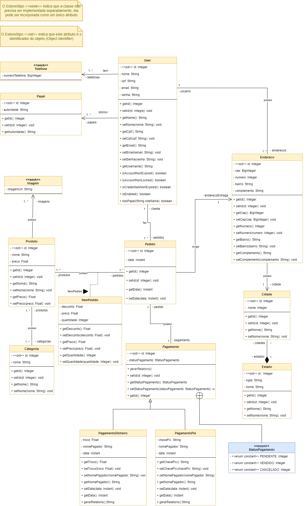

  <figcaption style="text-align: center !important">
    Fonte: Próprio autor 
    
  </figcaption>
</figure>

## Diagrama de Pacotes
<figure>
  <figcaption style="text-align: center !important">
    Diagrama de classes Pacotes v2
  </figcaption>

  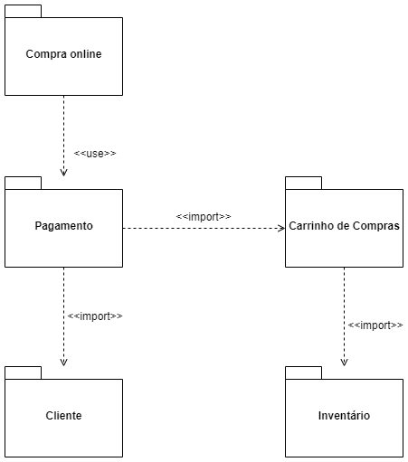

  <figcaption style="text-align: center !important">
    Fonte: Próprio autor 
    
  </figcaption>
</figure>

# Visão de processos

## Diagrama de Colaboração/Comunicação
<figure>
  <figcaption style="text-align: center !important">
    Diagrama de Comunicação do Projeto 
  </figcaption>

  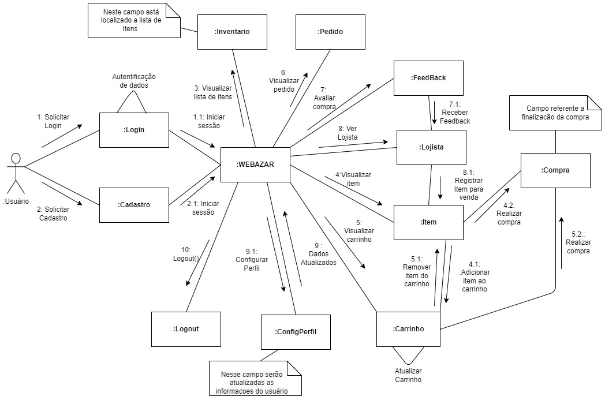

  <figcaption style="text-align: center !important">
    Fonte: Próprio autor
  </figcaption>
</figure>

## Diagrama de Atividades
#### Comprar Produtos

Representa o processo de compra de produtos dentro da plataforma. Faz referência à US01,US02,US08,US09,US11,US12,US13 e US14.

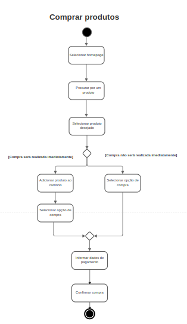

### 2.1.2.2 Diagramação relativa à WEBazar (funcionários)

#### Gerenciar Estoque

Representa o processo no qual o funcionário avalia a presença  ou não de produtos em estoque para, assim, realizar o cadastro destes ou torná-los indisponíveis na plataforma. Faz referência à US20 e US21.

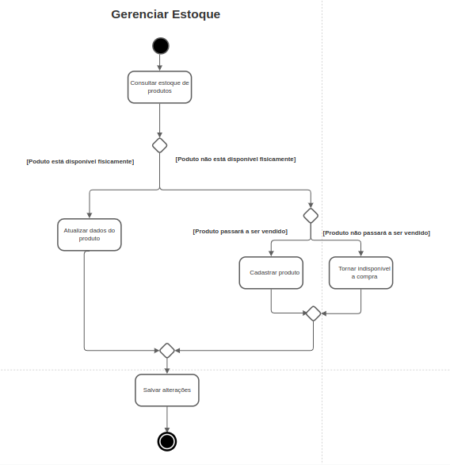

### 2.1.2.3 Diagramação não específica

#### Realizar cadastro

Representa o processo no qual o cliente/funcionário realiza seu cadastro na plataforma. Faz referência à US01.

#### Realizar Login

Representa o processo no qual o cliente/funcionário realiza seu login na plataforma. 

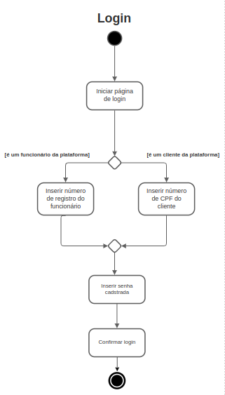

#### Gerenciar Perfil

Representa o processo no qual o cliente/funcionário realiza o gerenciamento de seu perfil na plataforma. Faz referência à US03 e US04.

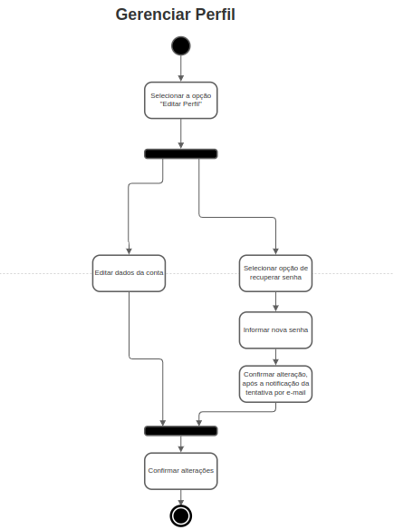

## Diagramas de Sequência

###  Rotinas de gerenciamento de dados
<figure>

  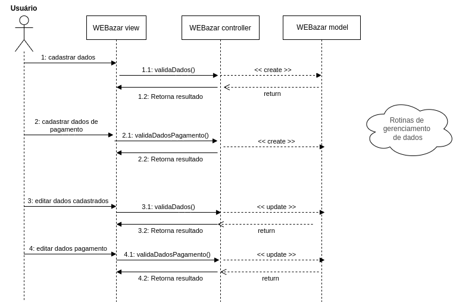

  <figcaption style="text-align: center !important">
    Fonte: Próprio autor
  </figcaption>
</figure>

###  Rotinas de gerenciamento do pedido (usuário e vendedor)
<figure>

  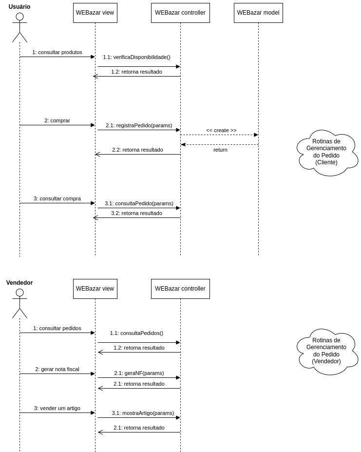
  <figcaption style="text-align: center !important">
    Fonte: Próprio autor
  </figcaption>
</figure>

###  Rotinas de gerenciamento de produto
<figure>

  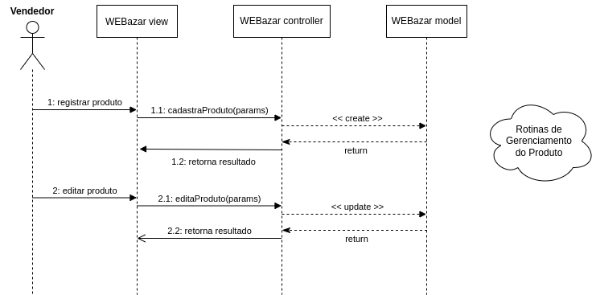
  <figcaption style="text-align: center !important">
    Fonte: Próprio autor
  </figcaption>
</figure>

# Visão de Implementação

# Visão de Implantação

# Visão de Casos de Uso

# Visão de Dados

## Diagrama Entidade Relacionamento (DE-R)
<figure>
  <figcaption style="text-align: center !important">
    Figura 1: Diagrama Entidade-Relacionamento (DER)
  </figcaption>

  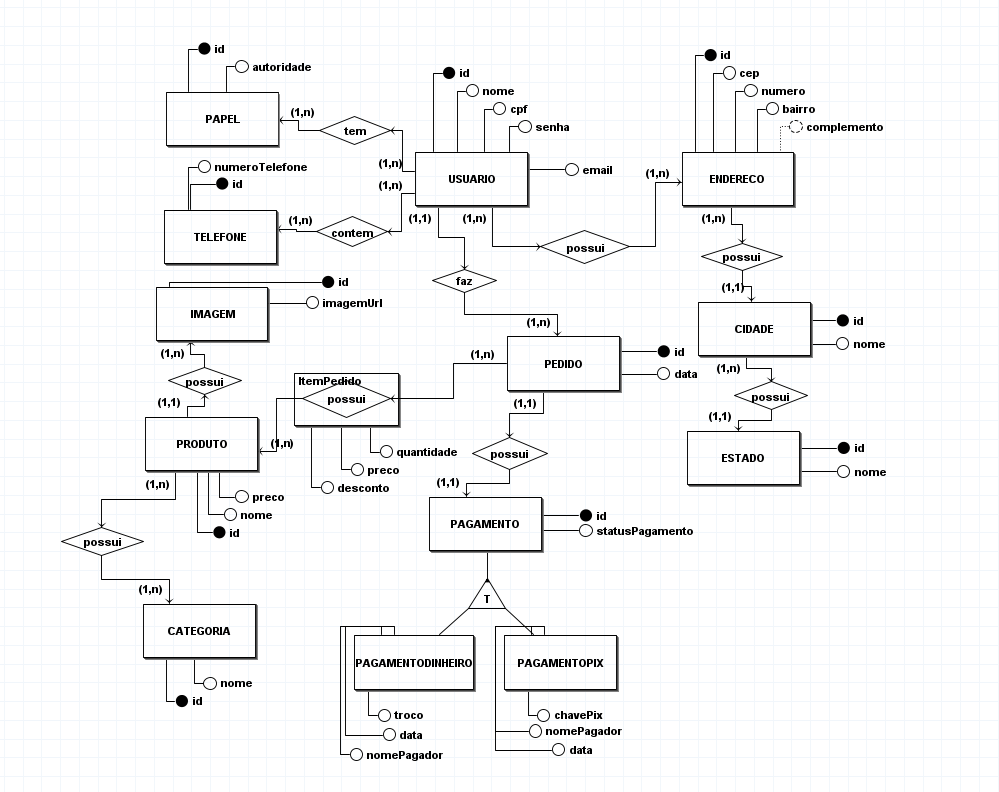

  <figcaption style="text-align: center !important">
    Fonte: Próprio autor 
    <a href="../../docs/img/Diagramas/DiagramaEntidadeRelacionamento.brM3" download>Baixe o arquivo aqui</a> e abra no BrModelo
  </figcaption>
</figure>

## Diagrama Lógico de Dados (DLD)

<figure>
  <figcaption style="text-align: center !important">
    Figura 2: Diagrama Lógico de Dados (DLD)
  </figcaption>

  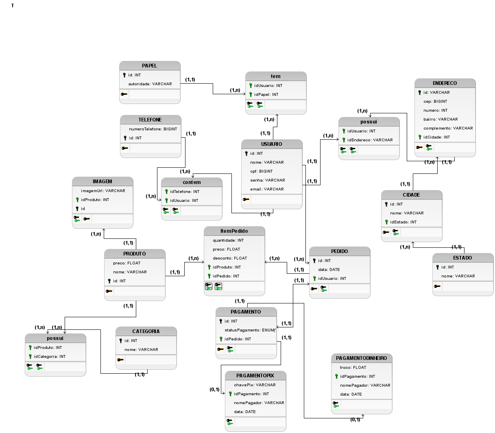

  <figcaption style="text-align: center !important">
    Fonte: Próprio autor 
    <a href="../../docs/img/Diagramas/DiagramaLogicoDados.brM3" download>Baixe o arquivo aqui</a> e abra no BrModelo
  </figcaption>
</figure>

## Dicionário de Dados

### USUARIO
| Atributos | Tipo |Restrição  | Descrição| 
|:----:|:------:|:---------:|:--------:|
| id | int |Chave primária |Identificador único do usuário | 
| nome | varchar |Obrigatório |Nome do usuário | 
| email | varchar |Obrigatório|Email que será usado no login| 
| senha | varchar | Obrigatório|Senha que será usada no login | 
| cpf | bigint | |CPF do usuário| 

### PAPEL
| Atributos | Tipo |Restrição  | Descrição| 
|:----:|:------:|:---------:|:--------:|
| id | int |Chave primária |Identificador único do papel | 
| autoridade | varchar |Obrigatório |Representa autoridade dentro do site |

### TELEFONE
| Atributos | Tipo |Restrição  | Descrição| 
|:----:|:------:|:---------:|:--------:|
| id | int |Chave primária |Identificador único do telefone| 
| numeroTelefone | bigint | |Número de telefone|

### ENDERECO
| Atributos | Tipo |Restrição  | Descrição| 
|:----:|:------:|:---------:|:--------:|
| id | INT |Chave primária |Identificador único do endereço | 
| cep | bigint |Obrigatório |cep do usuário | 
| numero | int |Obrigatório|número do endereço do usuário| 
| bairro | varchar | Obrigatório|bairro do usuário | 
| complemento | varchar | |Complemento do endereço| 
| idCidade | int | |Representa a chave estrangeira de cidade| 

### CIDADE
| Atributos | Tipo |Restrição  | Descrição| 
|:----:|:------:|:---------:|:--------:|
| id | int |Chave primária |Identificador único da cidade| 
| nome | varchar | |Nome da cidade|
| idEstado | int | |Chave estrangeira de estado|

### ESTADO
| Atributos | Tipo |Restrição  | Descrição| 
|:----:|:------:|:---------:|:--------:|
| id | int |Chave primária |Identificador único de estado| 
| nome | varchar | |Nome do estado|

### PRODUTO
| Atributos | Tipo |Restrição  | Descrição| 
|:----:|:------:|:---------:|:--------:|
| id | int |Chave primária |Identificador único de produto| 
| nome | varchar |Obrigatório |Nome do produto|
| preco | float | Obrigatório|Preço do produto|

### IMAGEM
| Atributos | Tipo |Restrição  | Descrição| 
|:----:|:------:|:---------:|:--------:|
| imagemUrl | varchar | |URL da imagem| 
| idProduto | int | Obrigatório|Chave estrangeira de produto|

### CATEGORIA
| Atributos | Tipo |Restrição  | Descrição| 
|:----:|:------:|:---------:|:--------:|
| id | int |Chave primária |Identificador único de estado| 
| nome | varchar | |Nome da categoria

### PEDIDO
| Atributos | Tipo |Restrição  | Descrição| 
|:----:|:------:|:---------:|:--------:|
| id | int |Chave primária |Identificador único de pedido| 
| data | date | Obrigatório|Data do pedido|
| idUsuario | date |Obrigatório |Data do pedido|

### ITEMPEDIDO
| Atributos | Tipo |Restrição  | Descrição| 
|:----:|:------:|:---------:|:--------:|
| quantidade | int |Obrigatório|Quantidade do item| 
| preco | float |Obrigatório|Preço do item|
| desconto | float | |Desconto em itens|
| idProduto | int | Obrigatório|Chave estrangeira do Produto|
| idPedido| int | Obrigatório|Chave estrangeira do Pedido|

### PAGAMENTO
| Atributos | Tipo |Restrição  | Descrição| 
|:----:|:------:|:---------:|:--------:|
| id | int |Obrigatório|Quantidade do item| 
| statusPagamento | ENUM('Pendente', 'Pago')|Obrigatório|Status do pagamento do pedido|
| idPedido | int |Obrigatório |Chave estrangeira de pedido|

### PAGAMENTOPIX
| Atributos | Tipo |Restrição  | Descrição| 
|:----:|:------:|:---------:|:--------:|
| chavePix | varchar |Obrigatório|Chave pix do pagador| 
| idPagamento | int | Obrigatório |Chave estrangeira de pagamento|
| data | date | Obrigatório |data do pagamento|
| nomePagador | varchar | Obrigatório |Nome do pagador|

### PAGAMENTODINHEIRO
| Atributos | Tipo |Restrição  | Descrição| 
|:----:|:------:|:---------:|:--------:|
| troco | float |  |Troco dado pelo vendedor na compra| 
| idPagamento | int | Obrigatório |Chave estrangeira de pagamento|
| data | date | Obrigatório |data do pagamento|
| nomePagador | varchar |  |Nome do pagador|

## Versionamento 

| Data | Versão | Descrição | Autor(es)|Revisor(es)|
|:----:|:------:|:---------:|:--------:|:--------:|
| 05/09/22 | 1.0 | Criação do Documento e adição de visão de dados| [Bianca Sofia](https://github.com/biancasofia), [Ugor](htts://github.com/ubrando)| |
| 05/09/22 | 1.1 | Criação de dicionário de dados| [Bianca Sofia](https://github.com/biancasofia), [Gabriel](htts://github.com/GabrielCostaDeOliveira)| |
| 08/09/22 | 1.2 |Adição de visão lógica| [Bianca Sofia](https://github.com/biancasofia), [Laís Portela](https://github.com/laispa), [Douglas](https://github.com/DouglasMonteles), [Ugor](https://github.com/ubrando)| |
| 08/09/22 | 1.3|Adição de visão de processos| [Bianca Sofia](https://github.com/biancasofia), [Arthur Talles](https://github.com/art1505) | |
|08/09/22 | 1.4|  Introdução e novo diagrama de pacotes |[Laís Portela](https://github.com/laispa), [Eduardo](https://github.com/EduardoGurgel) e [Iago](https://github.com/iagoomr)|
