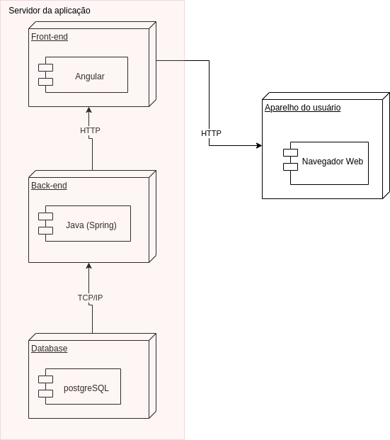

# 4.1. Módulo Estilos e Padrões Arquiteturais

# Introdução
Na arquitetura de software temos documentações que facilitam o entendimento e desenvolvimento de um aplicativo. Nesses documentos existe diversos diagramas que especificam uma parte de sua arquitetura: visão lógica, visão de implementação, visão de processo, visão de implatação e a visão dos casos de uso. Esse documento mostrará a visão arquitetural do nosso aplicativo WebBazar

# Propósito

O documento tem a finalidade de descrever as características gerais da arquitetura do projeto. Consequentemente, serão descritas  as decisões tomadas pela equipe ao longo do projeto, e também os padrões adotados no desenvolvimento do WEBazar.

# Escopo 

Nesse documento são apresentadas as visões gerais de arquitetura, ele será composto por representações arquitetônicas e pelo dicionário de dados. Além disso, o objetivo desse documento é descrever tecnicamente as soluções adotadas, com fácil manutenibilidade e padrões adotados no desenvolvimento para facilitar o entendimento do projeto como um todo.

# Representação Arquitetural
Aqui são apresentadas as tecnologias envolvidas na aplicação além de realizar um modelo que representa os serviços implementados e as interações estabelecidas entre esses serviços, bem como a natureza desses serviços. 

## Tecnologias 
### Front-End
* Angular 
Angular (comumente referido como "Angular 2+" ou "Angular 2") é uma plataforma de aplicações web de código-fonte aberto e front-end baseado em TypeScript liderado pela Equipe Angular do Google e por uma comunidade de indivíduos e corporações. Angular é uma reescrita completa do AngularJS, feito pela mesma equipe que o construiu.

### Back-End 
* Spring 
O Spring é um framework Java criado com o objetivo de facilitar o desenvolvimento de aplicações, explorando, para isso, os conceitos de Inversão de Controle e Injeção de Dependências. Dessa forma, ao adotá-lo, temos à nossa disposição uma tecnologia que nos fornece não apenas recursos necessários à grande parte das aplicações, como módulos para persistência de dados, integração, segurança, testes, desenvolvimento web, como também um conceito a seguir que nos permite criar soluções menos acopladas, mais coesas e, consequentemente, mais fáceis de compreender e manter.
### Banco de Dados
* PostgreSQL
PostgreSQL é um SGBD(Sistema Gerenciador de Banco de Dados) relacional, desenvolvido como um projeto de código aberto, que já conta com mais de 30 anos de desenvolvimento ativo. É um sistema muito conhecido por sua forte reputação de confiabilidade e recursos de desempenho.

### Outros
* Heroku
Trata-se de uma PaaS (Plataforma como um Serviço) que permite hospedagem, configuração, testagem e publicação de projetos virtuais na nuvem. Entre outras funções, ele facilita o trabalho dos desenvolvedores na configuração da infraestrutura para o deploy, ou seja, a implantação das aplicações.

* Netlify
A Netlify é uma empresa de computação em nuvem remota que oferece uma plataforma de desenvolvimento que inclui serviços de criação, implantação e back-end sem servidor para aplicativos da Web e sites dinâmicos.

## Diagrama de Contexto
O Diagrama de contexto representa de uma forma de mais alto nível a comunicação estabelecida entre as tecnologias, bem como o projeto em um contexto geral.

<figure>
  <figcaption style="text-align: center !important">
    Figura 1: Diagrama do Diagrama de Cotexto.
  </figcaption>

  

  <figcaption style="text-align: center !important">
    Fonte: Próprio autor 
    
  </figcaption>
</figure>

 # Objetivos Arquiteturais e Restrições

| **Objetivo** | **Descrição**                                                               |
|--------------|-----------------------------------------------------------------------------|
| Segurança    | A aplicação deve tratar de forma de segura os dados sensíveis dos usuários. |
| Usabilidade  | A aplicação deve ser intuitiva e interativa.                                |
| Deploy       | A aplicação deve possuir deploy automatizado                                |

| **Restrição** | **Descrição**                                                                   |
|---------------|---------------------------------------------------------------------------------|
| Conectividade | É necessário ter conexão com internet para acessar a aplicação                  |
| Linguagem     | A linguagem padrão da aplicação é a Língua Portuguesa do Brasil                 |
| Plataforma    | É necessário o uso de um navegador tanto em dispositivos desktop, quanto mobile |
| Público       | Brasileiros que desejam adquirir e/ou realizar vendas de produtos.              |
| Prazo         | A aplicação há de ser finalizada até o fim da disciplina                        |
| Equipe        | A equipe possui 10 integrantes                                                  |

# Visão Lógica
A visão lógica tem o objetivo de fornecer uma base para compreender a estrutura, a organização do design do sistema e representar a visão conceitual do projeto por meio de camadas. Existe somente uma visão lógica do sistema que ilustra as principais realizações de caso de uso, subsistemas, pacotes e classes. Também pode ser considerada a visão arquitetural com as classes de design mais importantes.

A partir disso, elaboramos os diagrama de classes e também o de pacotes para nossa aplicação que foi desenvolvida em Java e no ecossistema Spring.
## Diagrama de Classes
<figure>
  <figcaption style="text-align: center !important">
    Diagrama de classes v2
  </figcaption>

  

  <figcaption style="text-align: center !important">
    Fonte: Próprio autor 
    
  </figcaption>
</figure>

## Diagrama de Pacotes
<figure>
  <figcaption style="text-align: center !important">
    Diagrama de classes Pacotes v2
  </figcaption>

  

  <figcaption style="text-align: center !important">
    Fonte: Próprio autor 
    
  </figcaption>
</figure>

# Visão de processos

## Diagrama de Colaboração/Comunicação
<figure>
  <figcaption style="text-align: center !important">
    Diagrama de Comunicação do Projeto 
  </figcaption>

  

  <figcaption style="text-align: center !important">
    Fonte: Próprio autor
  </figcaption>
</figure>

## Diagrama de Atividades
#### Comprar Produtos

Representa o processo de compra de produtos dentro da plataforma. Faz referência à US01,US02,US08,US09,US11,US12,US13 e US14.
<figure>

  
  <figcaption style="text-align: justify !important">
    Fonte: Próprio autor
  </figcaption>
</figure>

#### Avaliar compra

Representa o processo de avaliação da compra de produtos dentro da plataforma. Faz referência à US07.
<figure>

  
  <figcaption style="text-align: justify !important">
    Fonte: Próprio autor
  </figcaption>
</figure>

#### Informar-se com um vendedor

Representa o processo de comunicação com os responsáveis pela venda a fim de resolver eventuais problemas. Faz referência à US06.

<figure>

  
  <figcaption style="text-align: justify !important">
    Fonte: Próprio autor
  </figcaption>
</figure>

### 2.1.2.2 Diagramação relativa à WEBazar (funcionários)

#### Gerenciar Estoque

Representa o processo no qual o funcionário avalia a presença  ou não de produtos em estoque para, assim, realizar o cadastro destes ou torná-los indisponíveis na plataforma. Faz referência à US20 e US21.

<figure>

  
  <figcaption style="text-align: justify !important">
    Fonte: Próprio autor
  </figcaption>
</figure>

### 2.1.2.3 Diagramação não específica

#### Realizar cadastro

Representa o processo no qual o cliente/funcionário realiza seu cadastro na plataforma. Faz referência à US01.

<figure>

  
  <figcaption style="text-align: justify !important">
    Fonte: Próprio autor
  </figcaption>
</figure>

#### Realizar Login

Representa o processo no qual o cliente/funcionário realiza seu login na plataforma. 

<figure>

  
  <figcaption style="text-align: justify !important">
    Fonte: Próprio autor
  </figcaption>
</figure>

#### Gerenciar Perfil

Representa o processo no qual o cliente/funcionário realiza o gerenciamento de seu perfil na plataforma. Faz referência à US03 e US04.

<figure>

  

  <figcaption style="text-align: justify !important">
    Fonte: Próprio autor
  </figcaption>
</figure>

## Diagramas de Sequência

###  Rotinas de gerenciamento de dados
<figure>

  

  <figcaption style="text-align: center !important">
    Fonte: Próprio autor
  </figcaption>
</figure>

###  Rotinas de gerenciamento do pedido (usuário e vendedor)
<figure>

  
  <figcaption style="text-align: center !important">
    Fonte: Próprio autor
  </figcaption>
</figure>

###  Rotinas de gerenciamento de produto
<figure>

  
  <figcaption style="text-align: center !important">
    Fonte: Próprio autor
  </figcaption>
</figure>

# Visão de Implementação

Esta visão diz respeito a uma perspectiva geral relacionada ao processo de implementação do produto de software, bem como sua organização em termos de módulos (compostos essencialmente por pacotes e camadas).
Pacotes e classes, presentes na Visão Lógica, podem ser eventualmente alocados aos pacotes e módulos da Visão de Implementação. Para isso, devem ser devidamnente descritos e tratam-se de um subconjunto do modelo de implementação.

## Diagrama de Componentes

Este diagrama apresenta uma visão estática de como o sistema está implementado e quais são os seus módulos de software: componentes.

Desta forma, este tipo de diagramação é extremamente importante para se construir e entender o processo de implementação.

Segue abaixo o Diagrama de Componentes do WEBazar: 

<figure>

  

  <figcaption style="text-align: justify !important">
    Fonte: Próprio autor
  </figcaption>
</figure>

# Visão de Implantação
O diagrama de implementação possui a estrutura de camadas, em que na aplicação Webzar é dividida em frontend e backend, no qual as requisições são feitas ao backend e realiza as atividades necessárias consultando a base de dados. 

A visão de implantação (ou visão física) contém o mapaeamento entre o software e o hardware, descrevendo como elas interagem entre si.

## Diagrama de implantação

<figure>
  <figcaption style="text-align: center !important">
    Figura 1: Diagrama Entidade-Relacionamento (DER)
  </figcaption>

  

  <figcaption style="text-align: center !important">
    Fonte: Próprio autor 
    <a href="../../docs/img/Diagramas/DiagramaEntidadeRelacionamento.brM3" download>Baixe o arquivo aqui</a> e abra no BrModelo
  </figcaption>
</figure>

# Visão de Casos de Uso
Nessa parte, a visão de casos de uso são utilizados para a modelagem da visão estática do sistema, em que é uma representação visual mais aproximada do usuário. Essa visão proporciona suporte principalmente para o comportamento de um sistema.

<figure>
  <figcaption style="text-align: center !important">
    Figura 2: Visão de Casos de Uso
  </figcaption>

  <iframe 
    frameborder="1"
    style="width:100%;height:920px;" 
    src="https://viewer.diagrams.net/?tags=%7B%7D&highlight=0000ff&edit=_blank&layers=1&nav=1&title=casos%20de%20uso#Uhttps%3A%2F%2Fdrive.google.com%2Fuc%3Fid%3D1nroiZIAaX1w_5ZCdDHx1tlXEl39wIbLK%26export%3Ddownload"
  ></iframe>

  <figcaption style="text-align: center !important">
    Fonte: Próprio autor
  </figcaption>
</figure>

# Visão de Dados

## Diagrama Entidade Relacionamento (DE-R)
<figure>
  <figcaption style="text-align: center !important">
    Figura 1: Diagrama Entidade-Relacionamento (DER)
  </figcaption>

  

  <figcaption style="text-align: center !important">
    Fonte: Próprio autor 
    <a href="../../docs/img/Diagramas/DiagramaEntidadeRelacionamento.brM3" download>Baixe o arquivo aqui</a> e abra no BrModelo
  </figcaption>
</figure>

## Diagrama Lógico de Dados (DLD)

<figure>
  <figcaption style="text-align: center !important">
    Figura 2: Diagrama Lógico de Dados (DLD)
  </figcaption>

  

  <figcaption style="text-align: center !important">
    Fonte: Próprio autor 
    <a href="../../docs/img/Diagramas/DiagramaLogicoDados.brM3" download>Baixe o arquivo aqui</a> e abra no BrModelo
  </figcaption>
</figure>

## Dicionário de Dados

### USUARIO
| Atributos | Tipo |Restrição  | Descrição| 
|:----:|:------:|:---------:|:--------:|
| id | int |Chave primária |Identificador único do usuário | 
| nome | varchar |Obrigatório |Nome do usuário | 
| email | varchar |Obrigatório|Email que será usado no login| 
| senha | varchar | Obrigatório|Senha que será usada no login | 
| cpf | bigint | |CPF do usuário| 

### PAPEL
| Atributos | Tipo |Restrição  | Descrição| 
|:----:|:------:|:---------:|:--------:|
| id | int |Chave primária |Identificador único do papel | 
| autoridade | varchar |Obrigatório |Representa autoridade dentro do site |

### TELEFONE
| Atributos | Tipo |Restrição  | Descrição| 
|:----:|:------:|:---------:|:--------:|
| id | int |Chave primária |Identificador único do telefone| 
| numeroTelefone | bigint | |Número de telefone|

### ENDERECO
| Atributos | Tipo |Restrição  | Descrição| 
|:----:|:------:|:---------:|:--------:|
| id | INT |Chave primária |Identificador único do endereço | 
| cep | bigint |Obrigatório |cep do usuário | 
| numero | int |Obrigatório|número do endereço do usuário| 
| bairro | varchar | Obrigatório|bairro do usuário | 
| complemento | varchar | |Complemento do endereço| 
| idCidade | int | |Representa a chave estrangeira de cidade| 

### CIDADE
| Atributos | Tipo |Restrição  | Descrição| 
|:----:|:------:|:---------:|:--------:|
| id | int |Chave primária |Identificador único da cidade| 
| nome | varchar | |Nome da cidade|
| idEstado | int | |Chave estrangeira de estado|

### ESTADO
| Atributos | Tipo |Restrição  | Descrição| 
|:----:|:------:|:---------:|:--------:|
| id | int |Chave primária |Identificador único de estado| 
| nome | varchar | |Nome do estado|

### PRODUTO
| Atributos | Tipo |Restrição  | Descrição| 
|:----:|:------:|:---------:|:--------:|
| id | int |Chave primária |Identificador único de produto| 
| nome | varchar |Obrigatório |Nome do produto|
| preco | float | Obrigatório|Preço do produto|

### IMAGEM
| Atributos | Tipo |Restrição  | Descrição| 
|:----:|:------:|:---------:|:--------:|
| imagemUrl | varchar | |URL da imagem| 
| idProduto | int | Obrigatório|Chave estrangeira de produto|

### CATEGORIA
| Atributos | Tipo |Restrição  | Descrição| 
|:----:|:------:|:---------:|:--------:|
| id | int |Chave primária |Identificador único de estado| 
| nome | varchar | |Nome da categoria

### PEDIDO
| Atributos | Tipo |Restrição  | Descrição| 
|:----:|:------:|:---------:|:--------:|
| id | int |Chave primária |Identificador único de pedido| 
| data | date | Obrigatório|Data do pedido|
| idUsuario | date |Obrigatório |Data do pedido|

### ITEMPEDIDO
| Atributos | Tipo |Restrição  | Descrição| 
|:----:|:------:|:---------:|:--------:|
| quantidade | int |Obrigatório|Quantidade do item| 
| preco | float |Obrigatório|Preço do item|
| desconto | float | |Desconto em itens|
| idProduto | int | Obrigatório|Chave estrangeira do Produto|
| idPedido| int | Obrigatório|Chave estrangeira do Pedido|

### PAGAMENTO
| Atributos | Tipo |Restrição  | Descrição| 
|:----:|:------:|:---------:|:--------:|
| id | int |Obrigatório|Quantidade do item| 
| statusPagamento | ENUM('Pendente', 'Pago')|Obrigatório|Status do pagamento do pedido|
| idPedido | int |Obrigatório |Chave estrangeira de pedido|

### PAGAMENTOPIX
| Atributos | Tipo |Restrição  | Descrição| 
|:----:|:------:|:---------:|:--------:|
| chavePix | varchar |Obrigatório|Chave pix do pagador| 
| idPagamento | int | Obrigatório |Chave estrangeira de pagamento|
| data | date | Obrigatório |data do pagamento|
| nomePagador | varchar | Obrigatório |Nome do pagador|

### PAGAMENTODINHEIRO
| Atributos | Tipo |Restrição  | Descrição| 
|:----:|:------:|:---------:|:--------:|
| troco | float |  |Troco dado pelo vendedor na compra| 
| idPagamento | int | Obrigatório |Chave estrangeira de pagamento|
| data | date | Obrigatório |data do pagamento|
| nomePagador | varchar |  |Nome do pagador|

## Versionamento 

| Data | Versão | Descrição | Autor(es)|Revisor(es)|
|:----:|:------:|:---------:|:--------:|:--------:|
| 05/09/22 | 1.0 | Criação do Documento e adição de visão de dados| [Bianca Sofia](https://github.com/biancasofia), [Ugor](htts://github.com/ubrando)| |
| 05/09/22 | 1.1 | Criação de dicionário de dados| [Bianca Sofia](https://github.com/biancasofia), [Gabriel](htts://github.com/GabrielCostaDeOliveira)| |
| 08/09/22 | 1.2 |Adição de visão lógica| [Bianca Sofia](https://github.com/biancasofia), [Laís Portela](https://github.com/laispa), [Douglas](https://github.com/DouglasMonteles), [Ugor](https://github.com/ubrando)| |
| 08/09/22 | 1.3|Adição de visão de processos| [Bianca Sofia](https://github.com/biancasofia), [Arthur Talles](https://github.com/art1505) | |
|08/09/22 | 1.4|  Introdução e novo diagrama de pacotes |[Laís Portela](https://github.com/laispa), [Eduardo](https://github.com/EduardoGurgel) e [Iago](https://github.com/iagoomr)|
|09/09/22 | 1.5|  Visão da implantação |[Kevin](https://github.com/k3vin-batista) e [Iago](https://github.com/iagoomr)|
| 09/09/22 | 1.6 |Adição Representação Arquitetural, Restrções e Objetivos | [Gabriel](htts://github.com/GabrielCostaDeOliveira), [Ugor](htts://github.com/ubrando)| |
| 09/09/22 | 1.7 |Adição da primeira versão da Visão de Implementação | [Arthur Talles](https://github.com/art1505), [Iago](https://github.com/iagoomr) e [Eduardo](https://github.com/EduardoGurgel)| |
