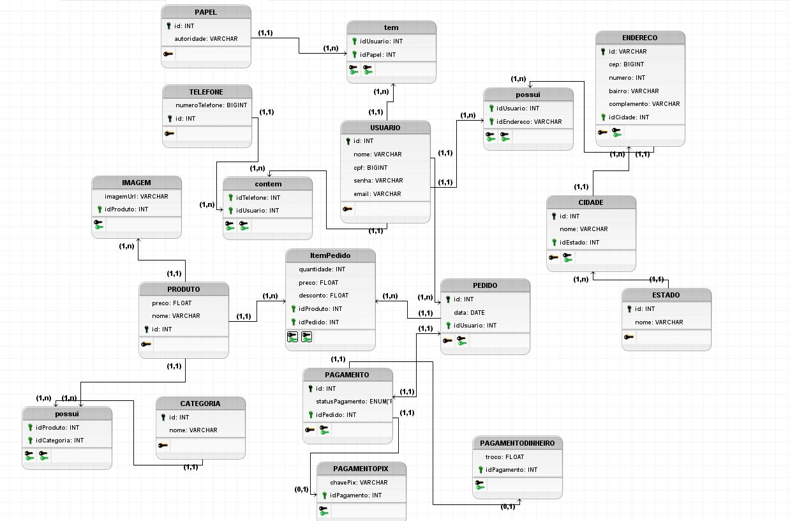

# 4.1. Módulo Estilos e Padrões Arquiteturais

**Foco_01:** Documento de Arquitetura.

Entrega Mínina: DAS, com as visões: Lógica, Implementação,
Implantação, e Dados (caso tenha camada de persistência).

Apresentação (em sala) explicando o Documento de Arquitetura (DAS), com: (i) rastro claro aos membros participantes; (ii) justificativas & senso crítico sobre esse artefato, em especial detalhando os estilos e padrões arquiteturais estabelecidos ao projeto; (iii) breve apresentação pelo menos das visões: Lógica, Implementação, Implantação, e Dados (caso tenha camada de persistência), e (iv) comentários gerais sobre iniciativas extras. Tempo da Apresentação: +/- 10min. Recomendação: Apresentar diretamente via Wiki ou GitPages do Projeto.

A Wiki ou GitPages do Projeto deve conter um tópico dedicado ao Módulo Estilos e Padrões Arquiteturais, com DAS, histórico de versões, referências, vídeo de entrega, e demais detalhamentos gerados pela equipe nesse escopo.

Lembrando, trata-se da ENTREGA FINAL DO PROJETO. Então, o DAS (portanto, a apresentação em sala de aula) deve abordar os artefatos elaborados ao longo do semestre como um todo, organizando-os em cada Visão.

Demais orientações disponíveis nas Diretrizes (vide Moodle).

# Introdução

# Representação Arquitetural

# Visão Lógica

# Visão de Implementação

# Visão de Implantação

# Visão de Casos de Uso

# Visão de Dados

## Diagrama Entidade Relacionamento (DE-R)
<figure>
  <figcaption style="text-align: center !important">
    Figura 1: Diagrama Entidade-Relacionamento (DER)
  </figcaption>

  

  <figcaption style="text-align: center !important">
    Fonte: Próprio autor 
    <a href="../../docs/img/Diagramas/DiagramaEntidadeRelacionamento.brM3" download>Baixe o arquivo aqui</a> e abra no BrModelo
  </figcaption>
</figure>

## Diagrama Lógico de Dados (DLD)

<figure>
  <figcaption style="text-align: center !important">
    Figura 2: Diagrama Lógico de Dados (DLD)
  </figcaption>

  

  <figcaption style="text-align: center !important">
    Fonte: Próprio autor 
    <a href="../../docs/img/Diagramas/DiagramaLogicoDados.brM3" download>Baixe o arquivo aqui</a> e abra no BrModelo
  </figcaption>
</figure>

## Dicionário de Dados

## Versionamento 

| Data | Versão | Descrição | Autor(es)|Revisor(es)|
|:----:|:------:|:---------:|:--------:|:--------:|
| 05/09/22 | 1.0 | Criação do Documento e adição de visão de dados| [Bianca Sofia](https://github.com/biancasofia), [Ugor](htts://github.com/ubrando)| |
