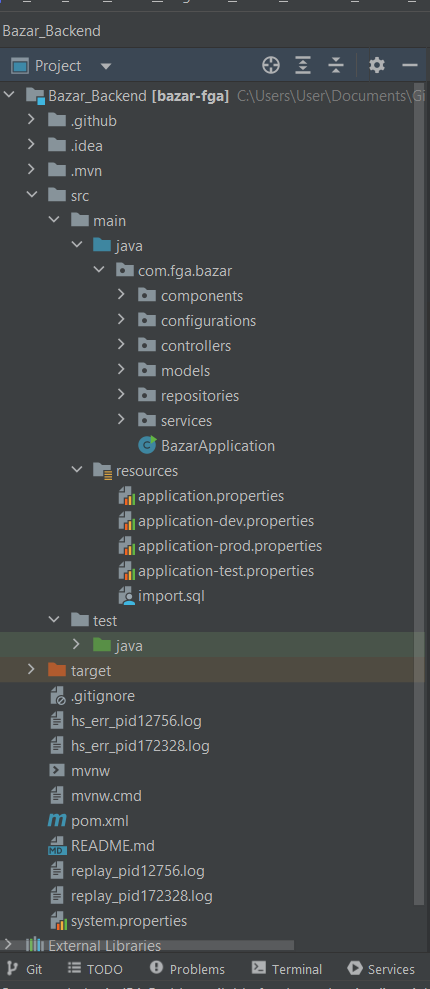

# 4.2. Módulo Reutilização de Software

**Foco_02:** Reutilização de Software.

Entrega Mínina: Breve análise sobre a possibilidade de ser desenvolvido um nível de reutilização no projeto, evidenciando os candidatos a pontos fixos e flexíveis.

Apresentação (em sala) conferindo reflexões sobre reutilização de software no escopo do projeto, com: (i) rastro claro aos membros participantes; (ii) justificativas & senso crítico sobre pontos candidatos a hotspots e frozenspots; (iii) breve análise sobre a possibilidade de ser desenvolvido um nível de reutilização, seja biblioteca, plugin, serviço, framework ou outro no escopo do projeto, e (iv) comentários gerais sobre iniciativas extras. Tempo da Apresentação: +/- 5min. Recomendação: Apresentar diretamente via Wiki ou GitPages do Projeto.

A Wiki ou GitPages do Projeto deve conter um tópico dedicado ao Módulo Reutilização de Software, com reflexões sobre reutilização de software, histórico de versões, referências, vídeo de entrega, e demais detalhamentos gerados pela equipe nesse escopo.

Lembrando, trata-se da ENTREGA FINAL DO PROJETO. Então, o artefato na Wiki (portanto, a apresentação também) deve demonstrar o software rodando (+/- 10min de apresentação), apontando os principais pontos de reutilização de software.

Mesmo que o grupo não tenha obtido um software rodando em sua plenitude, deve-se demonstrar o que consta rodando – até o momento – via apresentação.

Demais orientações disponíveis nas Diretrizes (vide Moodle).

# Introdução

A reutilização de software consiste na utilização de soluções, produtos e conceitos previamente elencados e obtidos a fim de criar-se um novo software. Este processo visa, principalmente, gerar melhorias significativas para um projeto, no que diz respeito a aspectos como qualidade e produtividade.

Em resumo, o processo de reutilização consiste na capacidade de reaplicação de artefatos de um sistema já definido em outros semelhantes. Tais artefatos podem ser especificações, módulos de um projeto, arquitetura e código fonte.

Como principal benefício desta prática encontra-se a prevenção de retrabalho. Desta forma, ganha-se tempo que poderia estar sendo mal gasto com uma atividade já realizada completa ou parcialmente.

# Reutilização no Back-end
 O Spring Boot é um framework que é open source e usado no desenvolvimento de aplicações em Java, facilitando diversas configurações no projeto. Assim, ele também traz o conceito de injeção de dependência e é muito utilizado na criação de microserviços, já que diminui as tarefas na produção dos mesmos baseados em REST. Esse framework  atua como um mediador entre as diferentes classes da aplicação e gerencia as dependências do projeto, trazendo consigo diversos benefícios, como: facilidade na criação de aplicações, se configura automaticamente, traz a integração de dependências automaticamente, inicia a aplicação por meio de uma classe SpringApplication e entre outros. Dessa forma, o Spring usa a convenção sobre configuração, porém também permite que o usuário configure como queira.

<figure>
  <figcaption style="text-align: center !important">
    Figura:  Estrutura do BackEnd utilizando o framework Spring Boot.
  </figcaption>

  

  <figcaption style="text-align: center !important">
    Fonte: Próprio autor 
  </figcaption>
</figure>

# Bibliografia

> Spring Boot: o que é e como usar: O guia inicial!. Disponível em: <https://blog.betrybe.com/framework-de-programacao/spring-boot-tudo-sobre/>. Acesso em: 08 SET. 2022.

> GUTIERREZ, F. Pro Spring Boot. [S.l.]: Springer, 2016.

> DevMedia. Reutilização de Software - Revista Engenharia de Software Magazine 39. Disponível em: <https://www.devmedia.com.br/reutilizacao-de-software-revista-engenharia-de-software-magazine-39/21956>. Acesso em: 09 SET. 2022

| Data | Versão | Descrição | Autor(es)|Revisor(es)|
|:----:|:------:|:---------:|:--------:|:--------:|
| 08/09/22 | 1.0 | Criação do Documento e adição de reutilização no Back-end| [Bianca Sofia](https://github.com/biancasofia), [Douglas](https://github.com/DouglasMonteles)| |
| 09/09/22 | 1.1 | Adição da Introdução| [art1505](https://github.com/art1505)| |