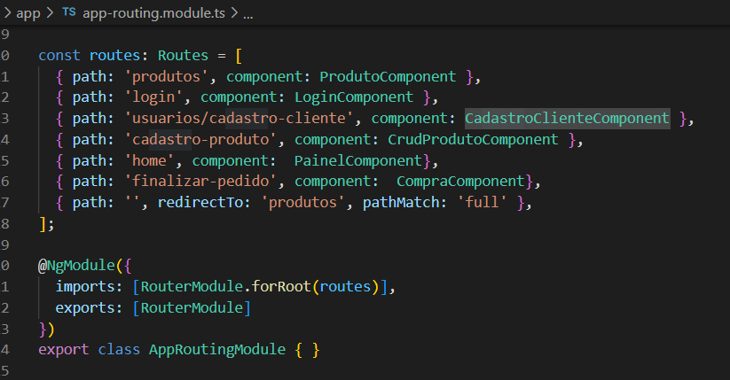

# 4.2. Módulo Reutilização de Software

**Foco_02:** Reutilização de Software.

# Introdução

A reutilização de software consiste na utilização de soluções, produtos e conceitos previamente elencados e obtidos a fim de criar-se um novo software. Este processo visa, principalmente, gerar melhorias significativas para um projeto, no que diz respeito a aspectos como qualidade e produtividade.

Em resumo, o processo de reutilização consiste na capacidade de reaplicação de artefatos de um sistema já definido em outros semelhantes. Tais artefatos podem ser especificações, módulos de um projeto, arquitetura e código fonte.

Como principal benefício desta prática encontra-se a prevenção de retrabalho. Desta forma, ganha-se tempo que poderia estar sendo mal gasto com uma atividade já realizada completa ou parcialmente.

# Reutilização no Back-end
 O Spring Boot é um framework que é open source e usado no desenvolvimento de aplicações em Java, facilitando diversas configurações no projeto. Assim, ele também traz o conceito de injeção de dependência e é muito utilizado na criação de microserviços, já que diminui as tarefas na produção dos mesmos baseados em REST. Esse framework  atua como um mediador entre as diferentes classes da aplicação e gerencia as dependências do projeto, trazendo consigo diversos benefícios, como: facilidade na criação de aplicações, se configura automaticamente, traz a integração de dependências automaticamente, inicia a aplicação por meio de uma classe SpringApplication e entre outros. Dessa forma, o Spring usa a convenção sobre configuração, porém também permite que o usuário configure como queira.

<figure>
  <figcaption style="text-align: center !important">
    Figura:  Estrutura do BackEnd utilizando o framework Spring Boot.
  </figcaption>

  

  <figcaption style="text-align: center !important">
    Fonte: Próprio autor 
  </figcaption>
</figure>

# Reutilização no Front-end

## Bootstrap
Bootstrap é um framework front-end que fornece estruturas de CSS para a criação de sites e aplicações responsivas de forma rápida e simples. Além disso, pode lidar com sites de desktop e páginas de dispositivos móveis da mesma forma. Originalmente, o Bootstrap foi desenvolvido para o Twitter por um grupo de desenvolvedores liderados por Mark Otto e Jacob Thornton Logo e se tornou uma das estruturas de front-end e projetos de código aberto mais populares do mundo.

## Angular
Angular liberta você de se preocupar se algo é um componente, serviço, ou qualquer outro tipo de código, já que os organiza em caixas separadas e arrumadas. Em seguida, ele as apresenta como módulos. Estes módulos facilitam a estruturação da funcionalidade do seu aplicativo, separando elementos em características e peças reutilizáveis.  

## Principais bibliotecas do angular

A estrutura do Angular é formada por um pequeno núcleo, que contém as funções principais do framework, e uma biblioteca de componentes que, ao serem agregados à aplicação, permitem a execução de inúmeros recursos adicionais.

Para estruturar a utilização dos componentes, a arquitetura do Angular faz a organização por meio da diretriz NgModules, que deve ser declarada no arquivo principal da aplicação, que é o AppComponent.ts.

Portanto, a aplicação deve conter ao menos um módulo raiz, que é responsável por agrupar os componentes utilizados, tanto os disponíveis pelo próprio framework quanto os desenvolvidos para a necessidade da aplicação. Confira, a seguir, alguns dos principais componentes disponíveis na linguagem Angular.

### Router

<figure>

  

  <figcaption style="text-align: center !important">
    Fonte: Próprio autor 
  </figcaption>
</figure>

### Forms 

<figure>

  

  <figcaption style="text-align: center !important">
    Fonte: Próprio autor 
  </figcaption>
</figure>

### Http

<figure>

  

  <figcaption style="text-align: center !important">
    Fonte: Próprio autor 
  </figcaption>
</figure>

### NgModule

<figure>

  

  <figcaption style="text-align: center !important">
    Fonte: Próprio autor 
  </figcaption>
</figure>

## Shared
Ao trabalhar-se com projetos complexos, uma grande quantidade de módulos de recursos acaba surgindo. Para que o número desses módulos fosse minimizado, fizemos uso do Angular, que permite que módulos e diretivas comuns possam ser colocados juntos, que ficam normalmente em um pacote chamado "shared".

Tais módulos são locais ideais para a declaração de componentes e, assim, torná-los reutilizáveis. Isso se dá pelo fato de não ser mais necessário reimportar os mesmos componentes em cada módulo, mas sim apenas importar o módulo compartilhado.

<figure>

  

  <figcaption style="text-align: center !important">
    Fonte: Próprio autor 
  </figcaption>

</figure>

<figure>

  

  <figcaption style="text-align: center !important">
    Fonte: Próprio autor 
  </figcaption>
</figure>

<figure>

  

  <figcaption style="text-align: center !important">
    Fonte: Próprio autor 
  </figcaption>
</figure>

angular.json: que traz propriedades sobre o projeto, entre elas qual é o caminho do arquivo principal main.ts;
main.ts: contém configurações sobre o ambiente que são necessárias para a inicialização da aplicação;
app.module.ts: consta a declaração dos módulos utilizados na aplicação;
app.components.ts: relaciona os componentes utilizados no projeto;
index.html: a página principal para a exibição no navegador.

A arquitetura do Angular é baseada em componentes, que funcionam como blocos de construção adicionados conforme a necessidade de utilização. Isso torna o desenvolvimento da aplicação mais flexível, pois facilita a reutilização de códigos sem a necessidade de escrevê-los novamente. Além da configuração do ambiente, a ferramenta Angular CLI também permite executar diversas atividades no ciclo de desenvolvimento, entre elas:

fazer a compilação da aplicação;
adicionar módulos para os componentes;
preparar a aplicação para o servidor;
gerar o pacote final com os arquivos minificados e otimizados.

# Bibliografia

> Spring Boot: o que é e como usar: O guia inicial!. Disponível em: <https://blog.betrybe.com/framework-de-programacao/spring-boot-tudo-sobre/>. Acesso em: 08 SET. 2022.

> GUTIERREZ, F. Pro Spring Boot. [S.l.]: Springer, 2016.

> DevMedia. Reutilização de Software - Revista Engenharia de Software Magazine 39. Disponível em: <https://www.devmedia.com.br/reutilizacao-de-software-revista-engenharia-de-software-magazine-39/21956>. Acesso em: 09 SET. 2022

> Singhal G. Usando módulos compartilhados em Angula. Disponível em: <https://www.pluralsight.com/guides/using-shared-modules-in-angular>. Acesso em: 09 SET. 2022

| Data | Versão | Descrição | Autor(es)|Revisor(es)|
|:----:|:------:|:---------:|:--------:|:--------:|
| 08/09/22 | 1.0 | Criação do Documento e adição de reutilização no Back-end| [Bianca Sofia](https://github.com/biancasofia), [Douglas](https://github.com/DouglasMonteles)| |
| 09/09/22 | 1.1 | Adição da Introdução| [Arthur](https://github.com/art1505)| |
| |
| 09/09/22 | 1.2 | Adição de reutilização no Front-end| [Arthur](https://github.com/art1505) e [Ugor](https://github.com/ubrando)| |
| 09/09/22 | 1.2 | Complementando reutilização no Front-end com exemplos| [Lais](https://github.com/laispa)| |