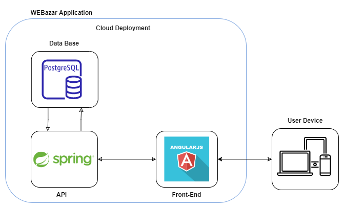

# 4.1. Descrição Arquitetural

# Introdução 
Este documento tem como finalidade realizar descrição da arquitetura do aplicação WEBazar desenvolvida na disciplina Arquitetura e Desenho de Software, na Universidade de Brasília.

# Representação Arquitetural 
Aqui são apresentadas as tecnologias envolvidas na aplicaçção além de realizar um modelo que representa os serviços implementados e as interações estabelecidas entre esses serviços, bem como a natureza desses serviços. 

## Tecnologias 
### Front-End
* Angular 
Angular (comumente referido como "Angular 2+" ou "Angular 2") é uma plataforma de aplicações web de código-fonte aberto e front-end baseado em TypeScript liderado pela Equipe Angular do Google e por uma comunidade de indivíduos e corporações. Angular é uma reescrita completa do AngularJS, feito pela mesma equipe que o construiu.

### Back-End 
* Spring 
O Spring é um framework Java criado com o objetivo de facilitar o desenvolvimento de aplicações, explorando, para isso, os conceitos de Inversão de Controle e Injeção de Dependências. Dessa forma, ao adotá-lo, temos à nossa disposição uma tecnologia que nos fornece não apenas recursos necessários à grande parte das aplicações, como módulos para persistência de dados, integração, segurança, testes, desenvolvimento web, como também um conceito a seguir que nos permite criar soluções menos acopladas, mais coesas e, consequentemente, mais fáceis de compreender e manter.
### Banco de Dados
* PostgreSQL
PostgreSQL é um SGBD(Sistema Gerenciador de Banco de Dados) relacional, desenvolvido como um projeto de código aberto, que já conta com mais de 30 anos de desenvolvimento ativo. É um sistema muito conhecido por sua forte reputação de confiabilidade e recursos de desempenho.

## Abordagem arquitetural

## Diagrama de Contexto

<figure>
  <figcaption style="text-align: center !important">
    Figura 1: Diagrama do Diagrama de Cotexto.
  </figcaption>

  

  <figcaption style="text-align: center !important">
    Fonte: Próprio autor 
    
  </figcaption>
</figure>

## 5. Bibliografia
> Contribuidores da Wikipédia. (2021, 9 septiembre). Angular (framework). Recuperado 8 de septiembre de 2022, de https://pt.wikipedia.org/wiki/Angular_(framework)
> Descrição Arquitetural - Tá Na Mesa. (s. f.). Recuperado 8 de septiembre de 2022, de https://unbarqdsw2021-1.github.io/2021.1_G02_TaNaMesa_docs/2-Modelagem/extras/arquitetura/
> Contribuidores da Wikipédia. (2022, 2 enero). Spring Framework. Recuperado 8 de septiembre de 2022, de https://pt.wikipedia.org/wiki/Spring_Framework

## Versionamento 

| Data | Versão | Descrição | Autor(es)|Revisor(es)|
|:----:|:------:|:---------:|:--------:|:--------:|
| 05/09/22 | 1.0 | Criação do Documento e adição de visão de dados| [Gabriel Costa](https://github.com/GabrielCostaDeOliveira), [Ugor](htts://github.com/ubrando)| |