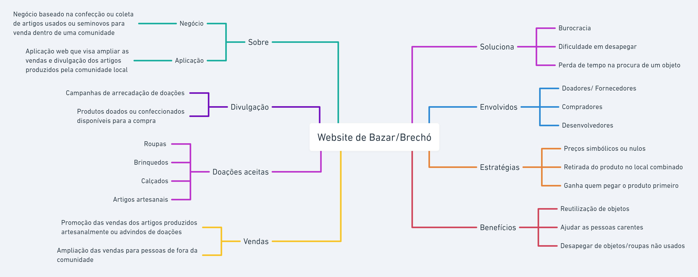

# 1.1 Módulo Projeto Não Orientado a Abordagens Específicas

Estudar o domínio de aplicações similares, e realizar Design Sprint para levantamento dos principais artefatos e requisitos.

Foco_1: Técnicas de Elicitação, Artefatos Independentes de Metodologia e Esboço da Baseline de Requisitos (Priorizada)

Entrega Mínina: Design Sprint, 5W2H, Mapa Mental, Diagrama Causa-Efeito, Rich Picture, Léxico (ou Glossário) e Planos de Risco, Custo e Tempo.

Apresentação (em sala) explicando passo a passo a Design Sprint realizada, com: (i) rastro claro aos membros participantes; (ii) justificativas & senso crítico sobre o trabalho realizado; (iii) breve apresentação dos artefatos
elaborados, e (iv) comentários gerais sobre iniciativas extras. Tempo da Apresentação: +/- 10min. Recomendação: Apresentar diretamente via Wiki ou GitPages do Projeto.

A Wiki ou GitPages do Projeto deve conter um tópico dedicado ao Módulo Projeto Não Orientado a Abordagens Específicas, com artefatos, histórico de versões, referências, e demais detalhamentos gerados pela equipe nesse escopo.

Demais orientações disponíveis nas Diretrizes (vide Moodle).

## 1.2  Introdução

## 1.3 Design Sprint
A Design Sprint é um processo constituído por cinco etapas desenvolvido pela Google Ventures, que utiliza o design thinking com o objetivo de reduzir o risco ao elaborar um novo produto.

### Unpack - (20/06/2022)
Para realizar a definição, a equipe decidiu fazer a reunião via Teams, em que foi designado para cada membro uma tarefa a ser realizada. Também foi decidido que todos os membros elaborariam o 5W2H, e em um encontro posterior seria escolhido o melhor artefato.

### Sketch - (23/06/2022)
Na parte do Sketch a equipe definiu que o desenho do Rich Picture seria realizado por todos os membros e que seria definido posteriormente o design que mais se adequasse ao projeto.

### Decision - (23/06/2022)
A decisão de escolha do melhor desenho foi realizada por meio de apresentação dos rich pictures de cada membro, e logo em seguida foi escolhido o desenho mais completo por meio de uma votação.

### Prototype

<iframe style="border: 1px solid rgba(0, 0, 0, 0.1);" width="800" height="450" src="https://www.figma.com/embed?embed_host=share&url=https%3A%2F%2Fwww.figma.com%2Ffile%2F5CQDrmcQww616VqRvCMM4A%2FUntitled%3Fnode-id%3D0%253A1" allowfullscreen></iframe>

###

## 1.4 5W2H

## 1.5 Mapa Mental
Mapa mental é um diagrama que trabalha os aspectos e características de um tema principal escolhido, usando conceitos
,items e tarefas para tentar entender melhor a ideia destacada através de ramificações que partem da ideia central. Dessa forma, é uma ferramenta de pensamento visual 
que ajuda a estruturar informações para melhor analisar, entender, lembrar e gerar ideias novas, já que “uma linguagem abstrata de sinais e símbolos é privativa da espécie humana.
Com ela, os seres humanos construíram mundos mentais para se relacionarem entre si e
com a realidade externa”. (TUAN, 1980, p.15).

 Esse mapa mental foi elaborado através de um brainstorming, com a finalidade de entender o escopo do projeto e seus benefícios.

link https://whimsical.com/mapa-mental-Y372R4Jv9bXWx2oFFAbgg

## 1.6  Diagrama Causa-Efeito

## 1.6.1 ESTIMATIVAS DE CUSTO DE SOFTWARE

## 1.6.1.1 Introdução

A Estimativa de Custo de Software é o processo de previsão de esforço, tempo e gastos de insumos envolvidos na produção de um determinado projeto ou produto de software (Filho, 2014; Obilor et. al., 2021). A estimativa é um processo inicial no ciclo de vida de um software e de suma importância na tomada de decisões pelo PO, no gerenciamento de grandes projetos e no envolvimento de questões complexas de desenvolvimento, afim de evitar atrasos e obter sucesso na produção. O custo pode ser entendido como tudo aquilo que é inerente ao software e que de alguma forma gera "prejuízo" ou "perda" de algum recurso na construção do software, seja ele financeiro, tempo, dentre outros.

A partir da Estimativa de Custo Software, o gerente de projeto terá informações suficientes sobre as  estimativas  de  tempo  e  custos  do  projeto, o que possibilita um melhor controle acerca do cronograma e do orçamento previstos. Isso facilita na tomada de decisões e em possíveis ajustes no Plan de Desenvolvimento de Software (Tetila et. al., 2011). 

Este documento apresenta o **MODELO DE CUSTO CONSTRUTIVO (CONSTRUCTIVE COST MODEL - COCOMO)**, que será utilizado para estimar os custos da produção do software. Vale lembrar que o processo de estimativa de custo leva em consideração o processo de produção do software, e não o seu ciclo de vida. Os custos envolvidos geralmente são de **Custos de Matéria-Prima**, **Custos de Mão-de-Obra Direta** e **Custos Indiretos de Fabricação**.

## 1.6.2 MODELO DE CUSTO CONSTRUTIVO (CONSTRUCTIVE COST MODEL - COCOMO)

COCOMO ou Modelo de Custo Construtivo "é um dos modelos de estimativa mais sofisticados que permitem chegar a
estimativas razoavelmente precisas e razoáveis" (Obilor et. al., 2021). O COCOMO é um modelo de custo de software algorítmico e foi proposto por Boehm (2010).

O COCOMO tem a seguinte hierarquia, onde sua utilização depende do software que está sendo construído e do grau de confiabilidade que se busca chegar com base nas estimativas:

- **COCOMO Básico (Basic):** computa o esforço e custo de desenvolvimento em função do tamanho do programa mensurado em linhas de código estimadas. A fórmula utilizada para esse modelo é: Esforço = a\*(KLOC)b, onde KLOC denota o tamanho do código e as constantes a e b dependem do tipo do projeto.

- **COCOMO Intermediário (Intermediate):** além de levar em consideração o esforço e cronograma do COCOMO básico como ponto de partida, ele leva em consideração fatores como confiabilidade necessária do produto, tamanho do banco de dados, restrição de execução e armazenamento, atributos de pessoal e uso de ferramentas de software. A fórmula utilizada para esse modelo é: Esforço = a.(KLOC).b.EAF. O fator de ajuste de esforço é representado pela sigla EAF.

- **COCOMO Detalhado (Detailed):** além das características do COCOMO intermediário, inclui uma avaliação do impacto dos direcionadores de custo sobre cada etapa do desenvolvimento (Meller, 2002).

**O modelo COCOMO pode ser aplicado em três classes de projetos:**

* **Modo Orgânico:** projetos simples, pequenos, com requisitos flexíveis, em equipes pequenas e experientes.
* **Modo Semidestacado:** projetos medianos (em tamanho e complexidade), com alguns requisitos rígidos e outros não tão rígidos, com níveis experientes e não experientes nas equipes.
* **Modo Embutido:** projetos com conjunto rígido de restrições operacionais, tanto de hardware, quanto de software.

Dado as características do software que será desenvolvido, no caso um aplicativo para facilitar e agilizar o cadastro de possíveis monitores em disciplinas, o projeto se encaixa na classe de **Semidestacado**, pois ele exige certos requisitos rígidos, como confiabilidade na identificação dos dados corretos de monitores, há normas internas a FGA no processo de monitoria, entre outros requisitos que não são considerados triviais. Além do projeto ser composto por vários alunos que não fazem parte de uma equipe fixa, e que possuem níveis mistos de experiência tanto nas questões tecnológicas quanto no entendimento dos processos de monitoria.

Com base nas características do software que será desenvolvido, o COCOMO Intermediário se apresenta como o mais adequado, já que a construção do software vai além da quantidade de linhas, sendo necessário recursos de hardware, humanos e de demais atributos do projeto. Quanto a classe do projeto, o modo Semidestacado parece ser o mais adequado, já que pode ser considerado um projeto mediano, onde a elicitação de requisitos serão rígidos e outros flexíveis, e principalmente quando falamos dos níveis de experiência da equipe, onde alguns já possuem experiências profissionais, experiência no uso da linguagem de programação e outros não. 

Neste modelo, o COCOMO Básico é ampliado com a finalidade de levar em consideração um conjunto de atributos direcionadores do custo que são agrupados em quatro categorias:

* **Atributos do produto:**
  * confiabilidade exigida do software;
  * tamanho do banco de dados;
  * complexidade do produto.

* **Atributos do hardware:**
  * restrições ao tempo de execução;
  * restrições de memória;
  * volatilidade do ambiente de máquina virtual;
  * tempo de turnaround (tempo para completar o ciclo) exigido.

* **Atributos de pessoal:**
  * capacidade do analista;
  * experiência em aplicações;
  * capacidade do programador;
  * experiência em máquina virtual;
  * experiência com a linguagem de programação.

* **Atributos de projeto:**
  * uso de práticas modernas de programação;
  * uso de ferramentas de software;
  * cronograma exigido de desenvolvimento.

Cada um desses atributos deve ser classificado de acordo com uma escala que varia de “muito baixo” a “extremamente elevado” (em importância e valor). A partir desta classificação determina-se o Multiplicador de Esforço (considerando a Tabela publicada por Boehm (1981)). O produto de todos os resultados de Multiplicadores de Esforços é chamado de Fator de Ajustamento de Esforço.

<table>
    <thead>
        <tr bgcolor="#6c6f73">
            <th>Direcionadores de Custo</th>
            <th>Muito Baixo</th>
            <th>Baixo</th>
            <th>Normal</th>
            <th>Elevado</th>
            <th>Muito Elevado</th>
            <th>Extremamente Elevado</th>
        </tr>
    </thead>
    <tbody>
        <tr>
            <td bgcolor="#9ea0a3" align="center" colspan=7>ATRIBUTOS DO PRODUTO</td>
        </tr>
        <tr>
            <td>Confiabilidade exigida do software</td>
            <td>0.75</td>
            <td>0.88</td>
            <td>1.00</td>
            <td>1.15</td>
            <td>1.40</td>
            <td>-</td>
        </tr>
        <tr>
            <td>Tamanho do banco de dados</td>
            <td>-</td>
            <td>0.94</td>
            <td>1.00</td>
            <td>1.08</td>
            <td>1.16</td>
            <td>-</td>
        </tr>
        <tr>
            <td>Complexidade do produto</td>
            <td>0.70</td>
            <td>0.85</td>
            <td>1.00</td>
            <td>1.15</td>
            <td>1.30</td>
            <td>1.65</td>
        </tr>
        <tr>
            <td bgcolor="#9ea0a3" align="center" colspan=7>ATRIBUTOS DO HARDWARE</td>
        </tr>
        <tr>
            <td>Restrições ao tempo de execução</td>
            <td>-</td>
            <td>-</td>
            <td>1.00</td>
            <td>1.11</td>
            <td>1.30</td>
            <td>1.66</td>
        </tr>
        <tr>
            <td>Restrições de memória</td>
            <td>-</td>
            <td>-</td>
            <td>1.00</td>
            <td>1.06</td>
            <td>1.21</td>
            <td>1.56</td>
        </tr>
        <tr>
            <td>Volatilidade do ambiente de máquina</td>
            <td>-</td>
            <td>0.87</td>
            <td>1.00</td>
            <td>1.15</td>
            <td>1.30</td>
            <td>-</td>
        </tr>
        <tr>
            <td>Tempo de turnaround (tempo para completar o ciclo) exigido</td>
            <td>-</td>
            <td>0.87</td>
            <td>1.00</td>
            <td>1.07</td>
            <td>1.15</td>
            <td>-</td>
        </tr>
        <tr>
            <td bgcolor="#9ea0a3" align="center" colspan=7>ATRIBUTOS DE PESSOAL</td>
        </tr>
        <tr>
            <td>Capacidade do analista</td>
            <td>1.46</td>
            <td>1.19</td>
            <td>1.00</td>
            <td>0.86</td>
            <td>0.71</td>
            <td>-</td>
        </tr>
        <tr>
            <td>Experiência em aplicações</td>
            <td>1.29</td>
            <td>1.13</td>
            <td>1.00</td>
            <td>0.91</td>
            <td>0.82</td>
            <td>-</td>
        </tr>
        <tr>
            <td>Capacidade do programador</td>
            <td>1.42</td>
            <td>1.17</td>
            <td>1.00</td>
            <td>0.86</td>
            <td>0.70</td>
            <td>-</td>
        </tr>
        <tr>
            <td>Experiência em Máquina Virtual</td>
            <td>1.21</td>
            <td>1.10</td>
            <td>1.00</td>
            <td>0.90</td>
            <td>-</td>
            <td>-</td>
        </tr>
        <tr>
            <td>Experiência com a linguagem de programação</td>
            <td>1.14</td>
            <td>1.07</td>
            <td>1.00</td>
            <td>0.95</td>
            <td>-</td>
            <td>-</td>
        </tr>
        <tr>
            <td bgcolor="#9ea0a3" align="center" colspan=7>ATRIBUTO DE PROJETO</td>
        </tr>
        <tr>
            <td>Uso de práticas modernas de programação</td>
            <td>1.24</td>
            <td>1.10</td>
            <td>1.00</td>
            <td>0.91</td>
            <td>0.82</td>
            <td>-</td>
        </tr>
        <tr>
            <td>Uso de ferramentas de software</td>
            <td>1.24</td>
            <td>1.10</td>
            <td>1.00</td>
            <td>0.91</td>
            <td>0.83</td>
            <td>-</td>
        </tr>
        <tr>
            <td>Cronograma exigido de desenvolvimento</td>
            <td>1.23</td>
            <td>1.08</td>
            <td>1.00</td>
            <td>1.04</td>
            <td>1.10</td>
            <td>-</td>
        </tr>
    </tbody>
</table>

#### 1.6.3 Calculo da Estimativa do Esforço

O resultado do esforço representa o valor de **Pessoas/Mês**
O modelo COCOMO Intermediário usa a seguinte equação para a estimativa do esforço:

    E = a x S^b x fae

onde:

* **E:** é o esforço aplicado (em pessoas-mês).
* **S:** é o número (estimado) de linhas de código para o projeto (em milhares).
* **a:** é um coeficiente fornecido pela Tabela.
* **b:** é um expoente fornecido pela Tabela.
* **fae:** é o Fator de Ajustamento do Esforço (multiplicação de cada um dos Multiplicadores de Esforço fornecidos pela Tabela).

Tabela para os valores dos coeficientes "a" e "b" de acordo com o tipo do projeto, a mesma tabela utilizada no COCOMO básico:

| Projeto de Software | a | b | c | d |
|:-------------------:|:--|:-:|:-:|:-:|
| Orgânico            | 2.40 | 1.05 | 2.50 | 0.38 |
| Semidestacado       | 3.00 | 1.12 | 2.50 | 0.35 |
| Embutido            | 3.60 | 1.20 | 2.50 | 0.32 |

Como dito na introdução, nosso projeto é do tipo Semidestacado, portanto os valores serão **a = 3.00** e **b = 1.12**.

#### 1.6.4 Calculo da Estimativa do Tempo

Representa a **quantidade de meses prevista para a conclusão do projeto**:

    T = c x E^d

onde:

* **E:** é o esforço aplicado (em pessoas-mês).
* **T:** é o tempo de desenvolvimento (em meses cronológicos).
* **S:** é o número estimado de linhas de código em milhares (KLOC)* .
* **a:** é um coeficiente fornecido pela Tabela.
* **b:** é um expoente fornecido pela Tabela.
* **c:** é um coeficiente fornecido pela Tabela.
* **d:** é um expoente fornecido pela Tabela.

### 1.6.5 Resultados

#### Estimativa de Quantidade de Linhas de Códigos

As linhas do código foram baseadas no projeto de Requisitos de Software, feito no segundo semestre de 2021 na UnB. O nome dado ao projeto foi Pousada Animal. Foram contadas com a utilização da ferramenta chamada Cloc.

#### 1.6.6 Estimativa de Esforço

Para 3Kloc
    E = a x S^b x fae

    E = 6,35 x 3.0^1,12 * (0,52)

    E = 11,30 pessoas/mes

Pesos atribuidos a cada atributo através de uma reunião em grupo para a convergência em cada esforço de cada atributo:

<table>
    <thead>
        <tr bgcolor="#6c6f73">
            <th>Direcionadores de Custo</th>
            <th>Muito Baixo</th>
            <th>Baixo</th>
            <th>Normal</th>
            <th>Elevado</th>
            <th>Muito Elevado</th>
            <th>Extremamente Elevado</th>
        </tr>
    </thead>
    <tbody>
        <tr>
            <td bgcolor="#9ea0a3" align="center" colspan=7>ATRIBUTOS DO PRODUTO</td>
        </tr>
        <tr>
            <td>Confiabilidade exigida do software</td>
            <td>0.75</td>
            <td>0.88</td>
            <td bgcolor="#AAAAAA">1.00</td>
            <td>1.15</td>
            <td>1.40</td>
            <td>-</td>
        </tr>
        <tr>
            <td>Tamanho do banco de dados</td>
            <td>-</td>
            <td>0.94</td>
            <td>1.00</td>
            <td bgcolor="#AAAAAA">1.08</td>
            <td>1.16</td>
            <td>-</td>
        </tr>
        <tr>
            <td>Complexidade do produto</td>
            <td>0.70</td>
            <td>0.85</td>
            <td bgcolor="#AAAAAA">1.00</td>
            <td >1.15</td>
            <td>1.30</td>
            <td>1.65</td>
        </tr>
        <tr>
            <td bgcolor="#9ea0a3" align="center" colspan=7>ATRIBUTOS DO HARDWARE</td>
        </tr>
        <tr>
            <td>Restrições ao tempo de execução</td>
            <td>-</td>
            <td>-</td>
            <td bgcolor="#AAAAAA">1.00</td>
            <td>1.11</td>
            <td>1.30</td>
            <td>1.66</td>
        </tr>
        <tr>
            <td>Restrições de memória</td>
            <td>-</td>
            <td>-</td>
            <td bgcolor="#AAAAAA">1.00</td>
            <td>1.06</td>
            <td>1.21</td>
            <td>1.56</td>
        </tr>
        <tr>
            <td>Volatilidade do ambiente de máquina</td>
            <td>-</td>
            <td bgcolor="#AAAAAA">0.87</td>
            <td>1.00</td>
            <td>1.15</td>
            <td>1.30</td>
            <td>-</td>
        </tr>
        <tr>
            <td>Tempo de turnaround (tempo para completar o ciclo) exigido</td>
            <td>-</td>
            <td>0.87</td>
            <td bgcolor="#AAAAAA">1.00</td>
            <td>1.07</td>
            <td>1.15</td>
            <td>-</td>
        </tr>
        <tr>
            <td bgcolor="#9ea0a3" align="center" colspan=7>ATRIBUTOS DE PESSOAL</td>
        </tr>
        <tr>
            <td>Capacidade do analista</td>
            <td>1.46</td>
            <td>1.19</td>
            <td>1.00</td>
            <td bgcolor="#AAAAAA">0.86</td>
            <td>0.71</td>
            <td>-</td>
        </tr>
        <tr>
            <td>Experiência em aplicações</td>
            <td>1.29</td>
            <td>1.13</td>
            <td>1.00</td>
            <td bgcolor="#AAAAAA">0.91</td>
            <td>0.82</td>
            <td>-</td>
        </tr>
        <tr>
            <td>Capacidade do programador</td>
            <td>1.42</td>
            <td>1.17</td>
            <td>1.00</td>
            <td bgcolor="#1980b0">0.86</td>
            <td>0.70</td>
            <td>-</td>
        </tr>
        <tr>
            <td>Experiência em Máquina Virtual</td>
            <td>1.21</td>
            <td>1.10</td>
            <td bgcolor="#AAAAAA">1.00</td>
            <td>0.90</td>
            <td>-</td>
            <td>-</td>
        </tr>
        <tr>
            <td>Experiência com a linguagem de programação</td>
            <td>1.14</td>
            <td>1.07</td>
            <td>1.00</td>
            <td bgcolor="#AAAAAA">0.95</td>
            <td>-</td>
            <td>-</td>
        </tr>
        <tr>
            <td bgcolor="#9ea0a3" align="center" colspan=7>ATRIBUTO DE PROJETO</td>
        </tr>
        <tr>
            <td>Uso de práticas modernas de programação</td>
            <td>1.24</td>
            <td>1.10</td>
            <td>1.00</td>
            <td bgcolor="#AAAAAA">0.91</td>
            <td>0.82</td>
            <td>-</td>
        </tr>
        <tr>
            <td>Uso de ferramentas de software</td>
            <td>1.24</td>
            <td>1.10</td>
            <td>1.00</td>
            <td bgcolor="#AAAAAA">0.91</td>
            <td>0.83</td>
            <td>-</td>
        </tr>
        <tr>
            <td>Cronograma exigido de desenvolvimento</td>
            <td>1.23</td>
            <td>1.08</td>
            <td bgcolor="#AAAAAA">1.00</td>
            <td>1.04</td>
            <td>1.10</td>
            <td>-</td>
        </tr>
    </tbody>
</table>

#### 1.6.7 Estimativa de Tempo

Utiliza o resultado calculado do esforço para calcular o tempo, pois estão diretamente relacionados, também utiliza o coeficiente **c = 2.50** e **d = 0.35** da tabela:

Para 6,35Kloc

    T = c x E^d

    T = 2.50 x 11.30^0.35

    T = 5.84 meses

## 1.6.8 Referências

[^1] Filho, Antonio Mendes Silva. **Estimativa De Custo De Software: Roteiro E Dicas Para Estimativas De Projeto.** Revista Espaço Acadêmico 13.156 - 2014 - Disponível em: <https://periodicos.uem.br/ojs/index.php/EspacoAcademico/article/download/23850/12975/>

[^2] Meller, Maristela Corrêa. **Modelos Para Estimar Custos De Software: Estudo Comparativo Com Softwares De Pequeno Porte.** 2002. Disponível em: <https://repositorio.ufsc.br/xmlui/handle/123456789/82351>

[^3] Tetila, Everton & Costa, Ivanir & Spinola, Mauro & Tetila, J.Q.S.. (2011). **Processo de Estimativa de Software com a Métrica Use Case Points, PMBOK e RUP.** Iberoamerican Journal of Industrial Engineering. 3. 249-264. 10.13084/2175-8018.v03n05a16. Disponível em: <https://www.researchgate.net/publication/275561878_Processo_de_Estimativa_de_Software_com_a_Metrica_Use_Case_Points_PMBOK_e_RUP>

[^4] Obilor, Njoku & Onyekachi, Agbakwuru & B.C, Amanze & Njoku, Donatus. (2021). **Constructive Cost Model II Metrics for Estimating Cost of Indigenous Software. International Journal of Advanced Science and Technology.** 8. 2456-1908. 10.22161/ijaers.87.26. 

[^5] Boehm, B. W. (2010). **Cost Models for Future Software Life Cycle Processes: COCOMO 2.0.** Anals of Software Engineering Special Volume on Software Process and Product Measurement, Science Publishers, Amsterdam, Netherlands, 1(3), 45-60.

## 1.6.9 Histórico de revisão

| Data | Versão | Descrição | Autor(es)|Revisor(es)|
|:----:|:------:|:---------:|:--------:|:--------:|
| 23/06/22 | 1.0 | Adição de Introdução e Definição | [Ailton Aires](https://github.com/ailtonaires) | [Ailton Aires](https://github.com/ailtonaires)|
| 26/06/22 | 1.1 | Cálculo e Término do documento | [Ailton Aires](https://github.com/ailtonaires) | [Ailton Aires](https://github.com/ailtonaires)|

## 1.7 Rich Picture

### 1.7.1 Introdução

Um Rich Picture é um artefato utilizado a fim de demonstrar, através de um desenho, os elementos relacionados ao fluxo do processo descrito, que pode inclusive, vir a demonstrar problemas que devem ser solucionados. Neste desenho deve conter os principais elementos e relacionamentos, para auxiliar a representação do sistema.

  
### 1.7.2. Versões do Rich Picture

#### 2.1 Ugor Marcilio Brandão Costa

 <figcaption>Fonte: Próprio autor</figcaption>
 
#### 2.2 Bianca Sofia Brasil de Oliveira

 <figcaption>Fonte: Próprio autor</figcaption>
 
#### 2.3 Douglas da Silva Monteles

 <figcaption>Fonte: Próprio autor</figcaption>
 
#### 2.4 Gabriel Costa de Oliveira

 <figcaption>Fonte: Próprio autor</figcaption>

#### 2.5 Eduardo Gurgel

 <figcaption>Fonte: Próprio autor</figcaption>
 
### 1.7.3 Rich Picture Escolhido

 

  Após uma discussão sobre os rich pictures desenvolvidos pelo grupo, foi então selecionado o Rich Picture abaixo, onde foram feitas algumas alterações se comparado ao modelo proposto originalmente.

#### 3.1 Douglas da Silva Monteles

## 1.7.4 Referências

> MANK, Andrew; HOWARD, Steve. The Rich Picture: A Tool for Reasoning About Work Context. Oxford, 1998.

> REVADI, Chindy. CTEC2402 Rich Picture Guidelines. 

## 1.8 Léxico (ou Glossário) 

## 1.9 Planos de Risco, Custo e Tempo

## 2.0 Versionamento
 
|Versão|Data de modificação|Descrição da modificação|Autor(es)|Revisor(es)|
|-|-|-|-|-|
|1.0|25/06/2022|Criação e adição do Mapa Mental|[Douglas Monteles](https://github.com/douglasmonteles), [Bianca Sofia](https://github.com/biancasofia) | [Eduardo Gurgel](https://github.com/EduardoGurgel) |
|1.1|25/06/2022|Adição dos Rich Pictures|[Bianca Sofia](https://github.com/biancasofia), [Douglas Monteles](https://github.com/douglasmonteles)| [Eduardo Gurgel](https://github.com/EduardoGurgel) |
|1.2| 25/06/2022 | Adição Design Sprint | [Eduardo Gurgel](https://github.com/EduardoGurgel), [Arthur Thales](https://github.com/art1505)  | |
