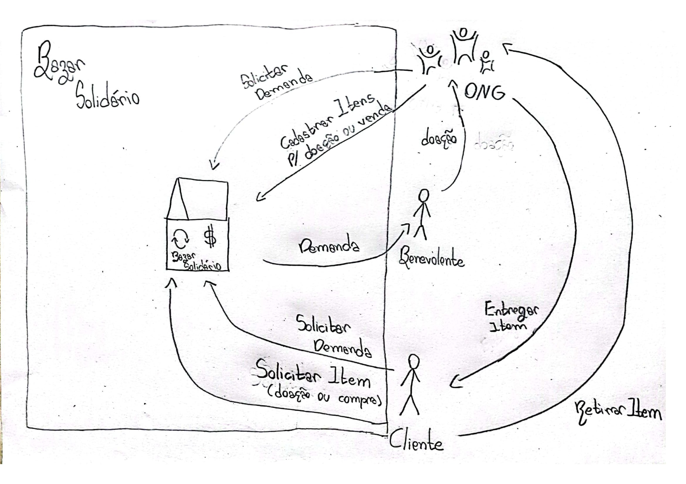

# 1.1 Módulo Projeto Não Orientado a Abordagens Específicas

Estudar o domínio de aplicações similares, e realizar Design Sprint para levantamento dos principais artefatos e requisitos.

Foco_1: Técnicas de Elicitação, Artefatos Independentes de Metodologia e Esboço da Baseline de Requisitos (Priorizada)

Entrega Mínina: Design Sprint, 5W2H, Mapa Mental, Diagrama Causa-Efeito, Rich Picture, Léxico (ou Glossário) e Planos de Risco, Custo e Tempo.

Apresentação (em sala) explicando passo a passo a Design Sprint realizada, com: (i) rastro claro aos membros participantes; (ii) justificativas & senso crítico sobre o trabalho realizado; (iii) breve apresentação dos artefatos
elaborados, e (iv) comentários gerais sobre iniciativas extras. Tempo da Apresentação: +/- 10min. Recomendação: Apresentar diretamente via Wiki ou GitPages do Projeto.

A Wiki ou GitPages do Projeto deve conter um tópico dedicado ao Módulo Projeto Não Orientado a Abordagens Específicas, com artefatos, histórico de versões, referências, e demais detalhamentos gerados pela equipe nesse escopo.

Demais orientações disponíveis nas Diretrizes (vide Moodle).

## 1.2  Introdução

## 1.3 Design Sprint
A Design Sprint é um processo constituído por cinco etapas desenvolvido pela Google Ventures, que utiliza o design thinking com o objetivo de reduzir o risco ao elaborar um novo produto.

### Unpack - (20/06/2022)
Para realizar a definição, a equipe decidiu fazer a reunião via Teams, em que foi designado para cada membro uma tarefa a ser realizada. Também foi decidido que todos os membros elaborariam o 5W2H, e em um encontro posterior seria escolhido o melhor artefato.

### Sketch - (23/06/2022)
Na parte do Sketch a equipe definiu que o desenho do Rich Picture seria realizado por todos os membros e que seria definido posteriormente o design que mais se adequasse ao projeto.

### Decision - (23/06/2022)
A decisão de escolha do melhor desenho foi realizada por meio de apresentação dos rich pictures de cada membro, e logo em seguida foi escolhido o desenho mais completo por meio de uma votação.

### Prototype

<iframe style="border: 1px solid rgba(0, 0, 0, 0.1);" width="800" height="450" src="https://www.figma.com/embed?embed_host=share&url=https%3A%2F%2Fwww.figma.com%2Ffile%2F5CQDrmcQww616VqRvCMM4A%2FUntitled%3Fnode-id%3D0%253A1" allowfullscreen></iframe>

###

## 1.4 5W2H

## 1.5 Mapa Mental
Mapa mental é um diagrama que trabalha os aspectos e características de um tema principal escolhido, usando conceitos
,items e tarefas para tentar entender melhor a ideia destacada através de ramificações que partem da ideia central. Dessa forma, é uma ferramenta de pensamento visual 
que ajuda a estruturar informações para melhor analisar, entender, lembrar e gerar ideias novas, já que “uma linguagem abstrata de sinais e símbolos é privativa da espécie humana.
Com ela, os seres humanos construíram mundos mentais para se relacionarem entre si e
com a realidade externa”. (TUAN, 1980, p.15).

 Esse mapa mental foi elaborado através de um brainstorming, com a finalidade de entender o escopo do projeto e seus benefícios.

link https://whimsical.com/mapa-mental-Y372R4Jv9bXWx2oFFAbgg

## 1.6  Diagrama Causa-Efeito

## 1.7 Rich Picture

### 1.7.1 Introdução

Um Rich Picture é um artefato utilizado a fim de demonstrar, através de um desenho, os elementos relacionados ao fluxo do processo descrito, que pode inclusive, vir a demonstrar problemas que devem ser solucionados. Neste desenho deve conter os principais elementos e relacionamentos, para auxiliar a representação do sistema.

  
### 1.7.2. Versões do Rich Picture

#### 2.1 Ugor Marcilio Brandão Costa

#### 2.2 Bianca Sofia Brasil de Oliveira

#### 2.3 Douglas da Silva Monteles

#### 2.4 Gabriel Costa de Oliveira
<<<<<<< Updated upstream

<figure>
    <figcaption>Figura 4: Rich Picture feito pelo estudante</figcaption>
      
    <figcaption>Fonte: Próprio autor</figcaption>
  </figure>

=======

>>>>>>> Stashed changes

#### 2.5 Eduardo Gurgel

### 1.7.3 Rich Picture Escolhido

 

  Após uma discussão sobre os rich pictures desenvolvidos pelo grupo, foi então selecionado o Rich Picture abaixo, onde foram feitas algumas alterações se comparado ao modelo proposto originalmente.

#### 3.1 Douglas da Silva Monteles

## 1.7.4 Referências

> MANK, Andrew; HOWARD, Steve. The Rich Picture: A Tool for Reasoning About Work Context. Oxford, 1998.

> REVADI, Chindy. CTEC2402 Rich Picture Guidelines. 

## 1.8 Léxico (ou Glossário) 

## 1.9 Planos de Risco, Custo e Tempo
