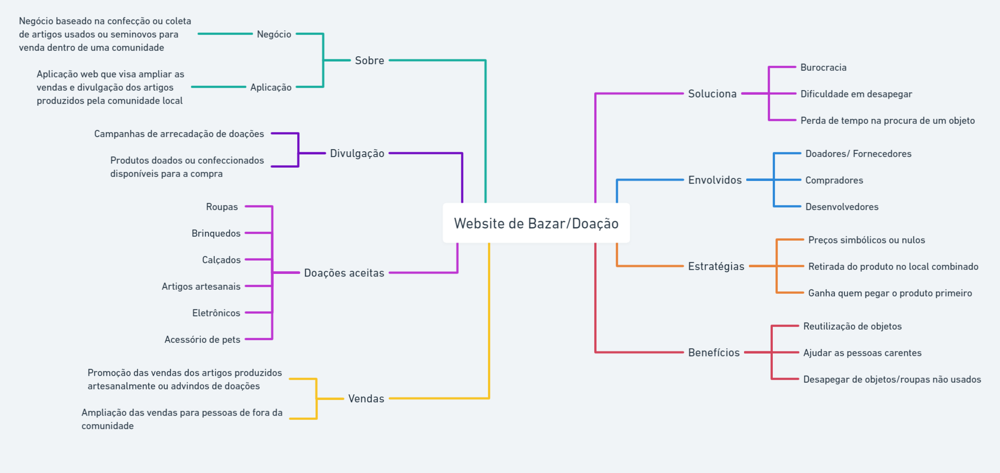
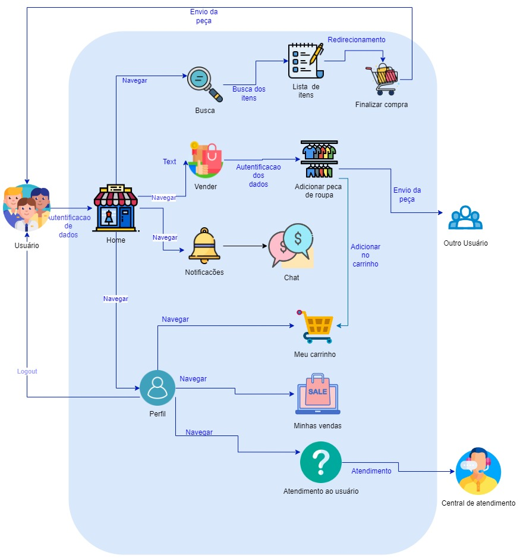
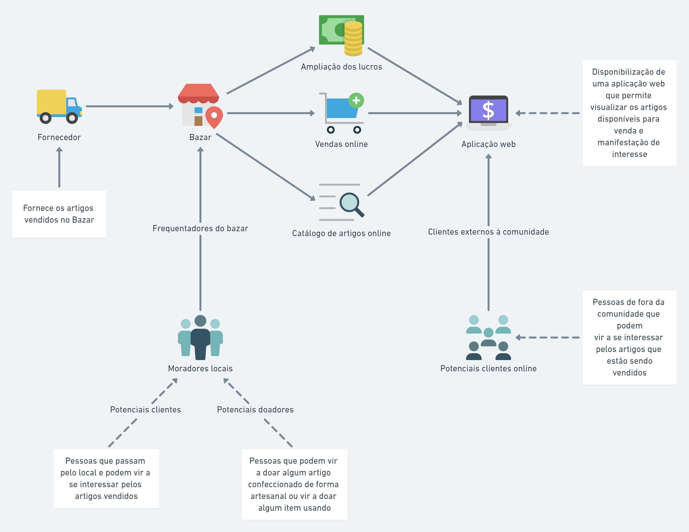

# 1.1 Módulo Projeto Não Orientado a Abordagens Específicas

Estudar o domínio de aplicações similares, e realizar Design Sprint para levantamento dos principais artefatos e requisitos.

Foco_1: Técnicas de Elicitação, Artefatos Independentes de Metodologia e Esboço da Baseline de Requisitos (Priorizada)

Entrega Mínina: Design Sprint, 5W2H, Mapa Mental, Diagrama Causa-Efeito, Rich Picture, Léxico (ou Glossário) e Planos de Risco, Custo e Tempo.

Apresentação (em sala) explicando passo a passo a Design Sprint realizada, com: (i) rastro claro aos membros participantes; (ii) justificativas & senso crítico sobre o trabalho realizado; (iii) breve apresentação dos artefatos
elaborados, e (iv) comentários gerais sobre iniciativas extras. Tempo da Apresentação: +/- 10min. Recomendação: Apresentar diretamente via Wiki ou GitPages do Projeto.

A Wiki ou GitPages do Projeto deve conter um tópico dedicado ao Módulo Projeto Não Orientado a Abordagens Específicas, com artefatos, histórico de versões, referências, e demais detalhamentos gerados pela equipe nesse escopo.

Demais orientações disponíveis nas Diretrizes (vide Moodle).

## 1.2  Introdução

## 1.3 Design Sprint
A Design Sprint é um processo constituído por cinco etapas desenvolvido pela Google Ventures, que utiliza o design thinking com o objetivo de reduzir o risco ao elaborar um novo produto.

Neste processo, estima-se que suas atividades sejam realizadas em um período de 5 dias. A grande vantagem em relação às demais metodologias é que ao invés de esperar o lançamento de um MVP (Minimum Viable Product), atividade que pode durar meses, o Design Sprint foca especificamente na validação da ideia com usuários e encurta o processo para 40 horas de trabalho (5 dias, com 8 horas semanais).

Dentro desse período, são distribuídas e realizadas atividades diárias: Unpack, Sketch, Decision, Prototype e Tet. A configuração para o nosso trabalho, tendo em vista as viabilidades, se deu da seguinte maneira:

### Unpack - (20/06/2022)
Para realizar a definição, a equipe decidiu fazer a reunião via Teams, em que foi designado para cada membro uma tarefa a ser realizada. Também foi decidido que todos os membros elaborariam o 5W2H, e em um encontro posterior seria escolhido o melhor artefato.

Conforme será mostrado mais adiante, a equipe também realizou nesta atividade, por meio da técnica de brainstorming, um mapa mental com o objetivo de produzir um levantamento razoável do escopo da solução.

### Sketch - (23/06/2022)
Na parte do Sketch, cada membro da equipe apresentou, de acordo com seu entendimento e ponto de vista a respeito da solução, um desenho do Rich Picture por eles realizado a fim de que fosse posteriormente definido o design que mais se adequasse ao projeto.

### Decision - (23/06/2022)
A escolha do melhor desenho foi realizada por meio de apresentação dos rich pictures de cada membro, e, logo em seguida, foi escolhido o desenho mais completo por meio de uma votação. Tal desenho será apresentado adiante com maior riqueza de detalhes.

Decidiu-se também a respeito da storyboarding que serviria como suporte para o processo de prototipação.

Aqui está o resultado:

### Prototype

###

## 1.4 5W2H

## 1.5 Mapa Mental
Mapa mental é um diagrama que trabalha os aspectos e características de um tema principal escolhido, usando conceitos
,items e tarefas para tentar entender melhor a ideia destacada através de ramificações que partem da ideia central. Dessa forma, é uma ferramenta de pensamento visual 
que ajuda a estruturar informações para melhor analisar, entender, lembrar e gerar ideias novas, já que “uma linguagem abstrata de sinais e símbolos é privativa da espécie humana.
Com ela, os seres humanos construíram mundos mentais para se relacionarem entre si e
com a realidade externa”. (TUAN, 1980, p.15).

 Esse mapa mental foi elaborado através de um brainstorming, com a finalidade de entender o escopo do projeto e seus benefícios.

link https://whimsical.com/mapa-mental-Y372R4Jv9bXWx2oFFAbgg

## 1.6  Diagrama Causa-Efeito

## 1.7 Rich Picture

### 1.7.1 Introdução

Um Rich Picture é um artefato utilizado a fim de demonstrar, através de um desenho, os elementos relacionados ao fluxo do processo descrito, que pode inclusive, vir a demonstrar problemas que devem ser solucionados. Neste desenho deve conter os principais elementos e relacionamentos, para auxiliar a representação do sistema.

  
### 1.7.2. Versões do Rich Picture

#### 2.1 Ugor Marcilio Brandão Costa

  <figure>
    <figcaption>Figura 1: Rich Picture feito pelo estudante</figcaption>
    
    <figcaption>Fonte: Próprio autor</figcaption>
  </figure>

#### 2.2 Bianca Sofia Brasil de Oliveira

  <figure>
    <figcaption>Figura 2: Rich Picture feito pelo estudante</figcaption>
      
    <figcaption>Fonte: Próprio autor</figcaption>
  </figure>

#### 2.3 Douglas da Silva Monteles

<figure>
    <figcaption>Figura 3: Rich Picture feito pelo estudante</figcaption>
      
    <figcaption>Fonte: Próprio autor</figcaption>
  </figure>

#### 2.4 Gabriel Costa de Oliveira

<figure>
    <figcaption>Figura 4: Rich Picture feito pelo estudante</figcaption>
      
    <figcaption>Fonte: Próprio autor</figcaption>
  </figure>

#### 2.5 Eduardo Gurgel

<figure>
    <figcaption>Figura 5: Rich Picture feito pelo estudante</figcaption>
      
    <figcaption>Fonte: Próprio autor</figcaption>
  </figure>

### 1.7.3 Rich Picture Escolhido

 

  Após uma discussão sobre os rich pictures desenvolvidos pelo grupo, foi então selecionado o Rich Picture abaixo, onde foram feitas algumas alterações se comparado ao modelo proposto originalmente.

#### 3.1 Douglas da Silva Monteles

<figure>
    <figcaption>Figura 1: Rich Picture feito pelo estudante</figcaption>
      
    <figcaption>Fonte: Próprio autor</figcaption>
  </figure>

 

## 1.7.4 Referências

> MANK, Andrew; HOWARD, Steve. The Rich Picture: A Tool for Reasoning About Work Context. Oxford, 1998.

> REVADI, Chindy. CTEC2402 Rich Picture Guidelines. 

## 1.8 Léxico (ou Glossário) 

## 1.9 Planos de Risco, Custo e Tempo
