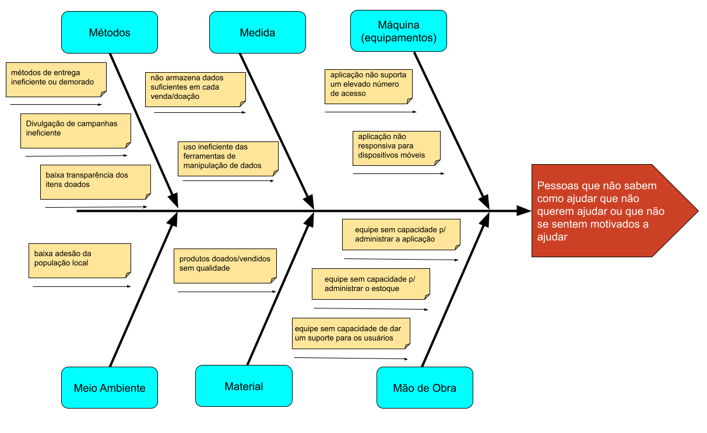
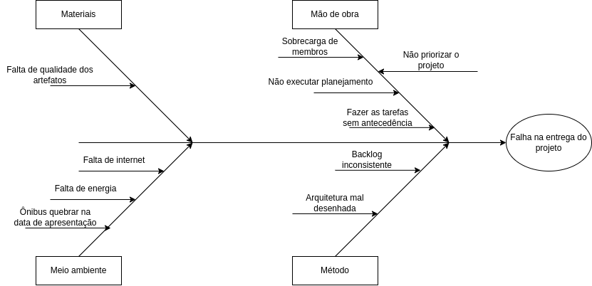

##  Diagrama Causa-Efeito

### 1. Introdução

O Diagrama de Ishikawa, também conhecido como Diagrama de Causa e Efeito ou Diagrama Espinha de peixe, é um gráfico cuja finalidade é de representar a relação entre um “efeito” e suas possíveis “causas”. 

As espinhas principais representam as causas primárias (macro-causas) do problema e as ramificações dessas espinhas representam as causas secundárias.A ideia é que, no final da espinha, chegamos às micro causas reais e específicas do que está causando aquele efeito 

Quando aplicada a metodologia 6M, podemos classificar as causas do problema em 6 categorias 

1. Método 
1. Material 
1. Mão-de-obra 
1. Máquina 
1. Medida 
1. Meio ambiente 

### 2. Metodologia

O diagrama Ishikawa se adaptado pode ser aplicado em diversos problemas.Desta forma, modificamos algumas causas primária para que ele pode ser utilizado não só no processo de engenharia de software como também a da análise do produto em si.

A ferramenta escolhida para a criação dos modelos foi o google drawing.

### 3. Diagramas

#### 3.1

  <figure>
    <figcaption>Figura 1: Diagrma Causa-Efeito - Análise do Produto</figcaption>
      
    <figcaption>Fonte: Próprio autor</figcaption>
  </figure>

#### 3.2

  <figure>
    <figcaption>Figura 2: Diagrma Causa-Efeito - Análise do Projeto</figcaption>
      
    <figcaption>Fonte: Próprio autor</figcaption>
  </figure>

### 4. Versionamento
|Versão|Data de modificação|Descrição da modificação|Autor(es)|Revisor(es)|
|-|-|-|-|-|
|1.0| 25/06/2022 | Criação do documento com introdução, metodologia e figura 1 | [Gabriel Costa](https://github.com/GabrielCostaDeOliveira)   |[Kevin Batista](https://github.com/k3vin-batista) |
|2.0| 26/06/2022 | Adição da figura 2  | [Kevin Batista](https://github.com/k3vin-batista)  |  |