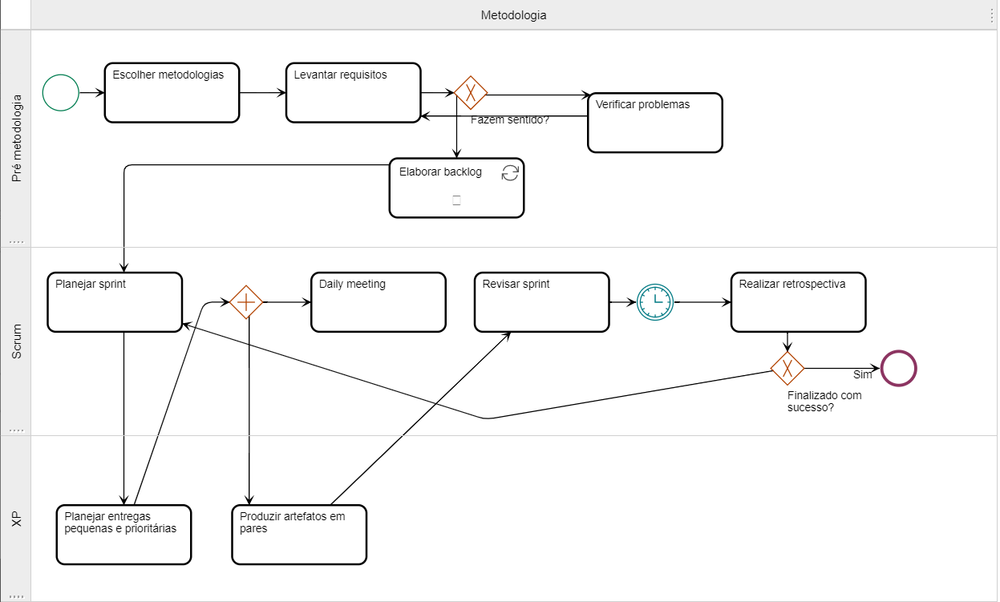

# 1.2. Módulo Processos/Metodologias/Abordagens

Foco_2: Metodologia (Escolhas Metodológicas & Modelagem BPMN)

Entrega Mínina: Documento sobre as escolhas metodológicas,
justificando-as adequadamente, e modelagem BPMN.

Apresentação (em sala) explicando o detalhamento metodológico
desenhado, com: (i) rastro claro aos membros participantes; (ii) justificativas & senso crítico sobre as escolhas metodológicas adotadas para o projeto; (iii) breve apresentação do(s) artefato(s) de modelagem em BPMN, e (iv) comentários gerais sobre iniciativas extras. Tempo da Apresentação: +/- 10min. Recomendação: Apresentar diretamente via Wiki ou GitPages do Projeto.

A Wiki ou GitPages do Projeto deve conter um tópico dedicado ao Módulo Processos/Metodologias/Abordagens, com artefatos, histórico de versões, referências, vídeo de entrega, e demais detalhamentos gerados pela equipe nesse escopo.

Demais orientações disponíveis nas Diretrizes (vide Moodle).

## 1.2.1 Introdução

## 1.2.2 BPMN de metodologias

<figure>
    <figcaption>Figura 1: BPMN feito pelo estudante</figcaption>
      
    <figcaption>Fonte: Próprio autor</figcaption>
  </figure>

s 

## 1.2.3 BPMN de processo do WEBazar

