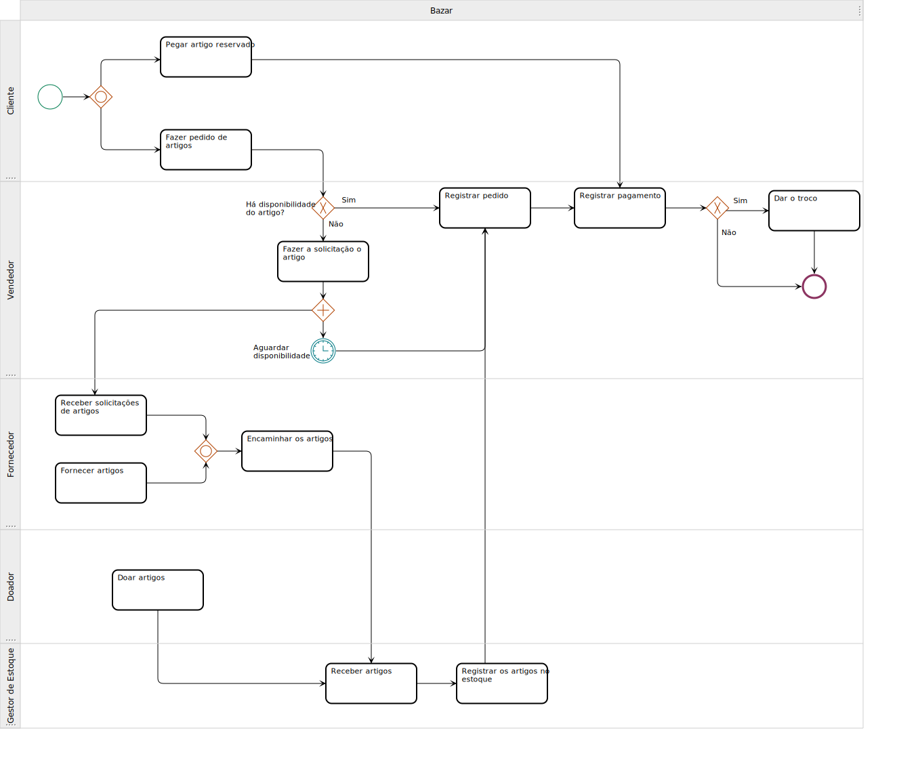
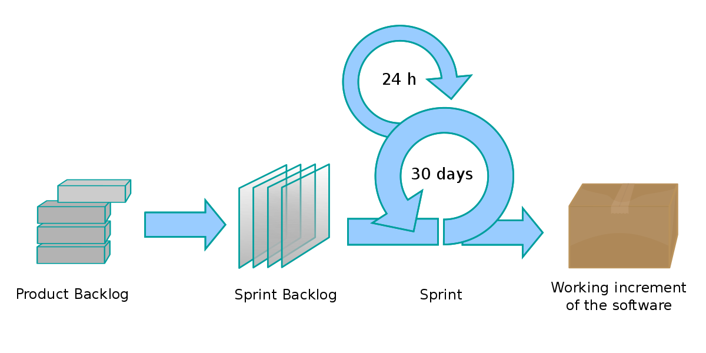

# 1.2. Módulo Processos/Metodologias/Abordagens
 

## 1.2.1 Introdução
O Business Process Modeling Notation (BPMN) é o novo padrão para modelar
fluxos de processos de negócios e serviços web. Criado pelo BPMI, o primeiro objetivo do BPMN é fornecer uma notação que seja
compreensível por todos os usuários.
Dessa forma usamos o BPMN para detalhar as escolhas metodológicas e detalhar os fluxos de atividades dos stakeholders. Foram escolhidas as metodologias Scrum e Xp, pois se encaixam melhor
no contexto do grupo e do projeto, usando práticas do scrum (reuniões) e práticas do XP (programação em pares e planejamento de pequenas entregas).
 
## 1.2.2 BPMN de metodologias
 

  <figure>
    <figcaption>Figura 1: BPMN da Metodologia</figcaption>
  </figure>

 

 

  <figure>
    <figcaption>Fonte: Próprio autor</figcaption>
  </figure>

 
## 1.2.3 BPMN de processo do WEBazar
 

  <figure>
    <figcaption>Figura 2: BPMN do Processo de compra no Bazar</figcaption>
  </figure>

 

 

  <figure>
    <figcaption>Fonte: Próprio autor</figcaption>
  </figure>

 
## 1.2.4 Scrum
 
Scrum é uma das mais populares metódologias ageis para gestão e planejamento de um produto de software, podendo ser usada em outros âmbitos profissionais por possuir bases que agilizam o trabalho, como o autogerenciamento.
 
No Scrum, existe a divisão do projeto em ciclos, denominada Sprint, estes ciclos costumam durar cerca de um mês, mas podem ser menores, como quinzenais ou semanais.
 
No início de cada ciclo será realizado um **Sprint Planning**, onde serão priorizados alguns dos itens do **Product Backlog** e definida quais serão as implementações  a serem feitas pelo time na Sprint.
 
Durantes os ciclos serão feitas reuniões diárias entre o time, denominadas de **daily**, que podem ser feitas presencialmente ou por outros meios.
 
No fim das Sprints serão entregues versões incrementais do projeto que serão apresentadas na **Review Meeting**, e depois será feita a **Sprint Retrospective** onde será identificada possíveis melhorias. Ao final dessas reuniões, o ciclo se reinicia.
 
 

  <figure>
    <figcaption>Figura 3: Etapas do Scrum</figcaption>
  </figure>

 

 

  <figure>
    <figcaption>Fonte: WIKIPÉDIA</figcaption>
  </figure>

 
## 1.2.5 XP
 
O XP, ou Extreme Programming é uma metodologia ágil  com valores e princípios que são fundamentados por um conjunto de práticas. Ela é comumente usada de forma complementar ao Scrum.
 
Dessa metodologia será usada a prática de **programação em pares**, onde dois desenvolvedores trabalharão na programação de uma mesma funcionalidade usando um único computador, diminuindo o risco de falhas. Essa prática também permite o compartilhamento de aprendizado entre um programador e outro.
 
Por último, será feito o planejamento de pequenas entregas, que é uma prática bastante relacionada com a metodologia Scrum. Nela, a programação é feita em iterações, onde é realizado o chamado jogo de planejamento, definindo qual história de usuário será priorizada e trabalhada, podendo até dividir em partes caso seja muito grande para uma única iteração.
 
 
## 1.2.4 Referências
 
Owen, Martin, and Jog Raj. "BPMN and business process management." Introduction to the new business process modeling standard (2003): 1-27.

SCRUM. **Desenvolvimento ágil**, 2014. Disponível [aqui](https://www.desenvolvimentoagil.com.br/scrum/). Acesso em 25 de jun. de 2022.
 
GUEDES, Marylene. O que é XP - Extreme Programming? **Treina Web**, 2020. Disponível [aqui](https://www.treinaweb.com.br/blog/o-que-e-xp-extreme-programming). Acesso em 25 de jun. de 2022.

 
## 1.2.5 Versionamento
 
|Versão|Data de modificação|Descrição da modificação|Autor(es)|Revisor(es)|
|-|-|-|-|-|
|1.0|25/06/2022|Criação e adição de BPMN|[Bianca Sofia](https://github.com/biancasofia)| Eduardo Gurgel |
|1.1|25/06/2022|Adição do BPMN dp Bazar|[Bianca Sofia](https://github.com/biancasofia), [Douglas Monteles](https://github.com/douglasmonteles)| Eduardo Gurgel |
|1.2| 25/06/2022 | Detalhamento das metodologias utilizadas| [Laís Portela](https://github.com/laispa) | Eduardo Gurgel |
 
 
 
 
 
 
 
 
 
 

