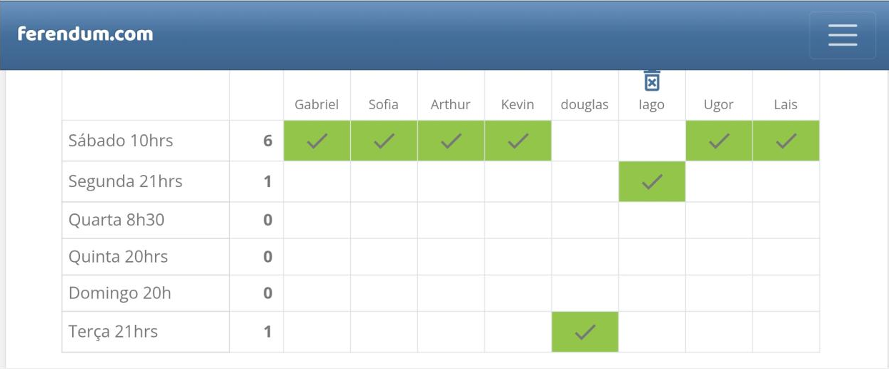

## Reunião realizada no dia 26/07

### Tópicos levantados na reunião:  
- *Definição do dia e horário da planning.*  
Foi decidido através de uma votação pelo site "ferendum.com", e como uma das opções ganhou 6 votos, a sprint planning realizada semanalmente todo sábado às 10:00.  
 

- *Definição do Scrum Master.*  
Foi definido um Scrum Master para uma melhor organização do grupo de forma geral, e após uma discussão foi escolhido o [Iago Oliveira](https://github.com/iagoomr) para essa função.

- *Definição do horario da daily no EXCEL.*  
Após uma conversa e analisando a disponibilidade dos integrantes, foi decidido que a daily será realizada em uma planilha do EXCEL diariamente e será atualizada qualquer hora do dia de acordo com a disponibilidade de cada um.

### Histórico de revisão

| Data | Versão | Descrição | Autor(es)|Revisor(es)|
|:----:|:------:|:---------:|:--------:|:--------:|
| 25/06/22 | 1.0 | Criação do Documento | [Iago Oliveira](https://github.com/iagoomr) |---- |
