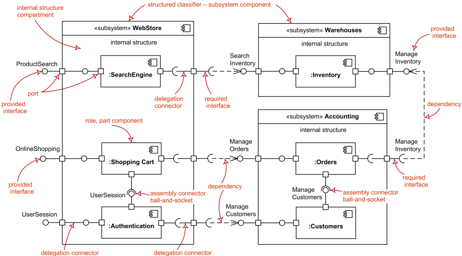

# Diagrama de Componentes

## 1. Introdução
O Diagrama de Componentes é um dos diagramas com notação UML, o seu objetivo principal é mostrar as relações estruturais entre os componentes de um sistema. Logo, esse diagrama apresenta componentes, interfaces fornecidas e necessárias, portas e relacionamentos entre eles.

## 2. Objetivo

O objetivo desse diagrama é especificar o comportamento do software de um ponto de vista funcional. Ele define os aspectos executáveis e reutilizáveis do sistema, pode revelar problemas de configuração de software através de relacionamentos de dependência e pode ser também útil de outras formas.  

### 2.1 Exemplo Base Diagrama de Componentes
<figure>
  <figcaption style="text-align: center !important">
    Figura 1: Diagrama de Componentes detalhado
  </figcaption>

  

  <figcaption style="text-align: center !important">
    Fonte: https://www.uml-diagrams.org/
  </figcaption>
</figure>

### 2.2 Diagrama de Componentes

<figure>
  <figcaption style="text-align: center !important">
    Figura 2: Diagrama de Componentes
  </figcaption>

  

  <figcaption style="text-align: center !important">
    Fonte: Próprio autor
  </figcaption>
</figure>

## 4. Bibliografia

> UML Component Diagrams. Disponível em: <https://www.uml-diagrams.org/component-diagrams.html>. Acesso em 14 de julho de 2022.

> The component diagram. Disponível em: <https://developer.ibm.com/articles/the-component-diagram/>. Acesso em 14 de julho de 2022.

> Diagramas de Componentes. Disponível em: <https://www.ibm.com/docs/pt-br/rsas/7.5.0?topic=services-component-diagrams>. Acesso em 14 de julho de 2022.

## 5. Histórico de versão
| Data | Versão | Autor | Descrição | Revisor |
| :-: | :-: | :-: | :-: | :-: |
| 15/07/2022 | 1.0 | [Iago Oliveira](https://github.com/iagoomr) | Criação do artefato: Diagrama de Componentes| [Gabriel Costa](https://github.com/GabrielCostaDeOliveira)|
