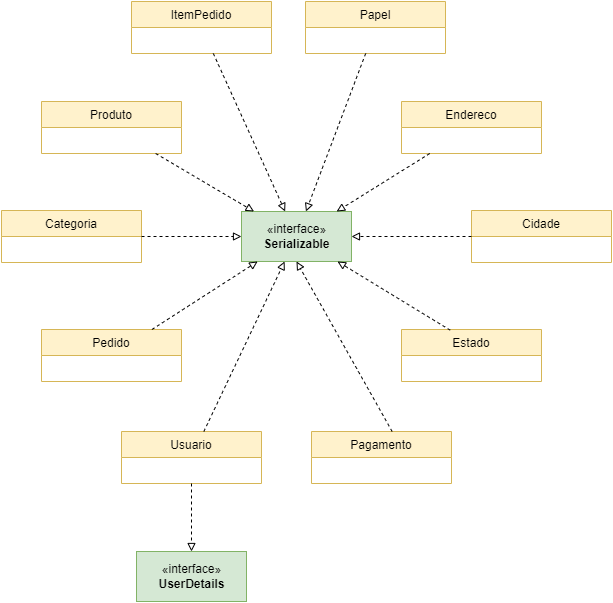

# Diagrama de Classes

## 1. Introdução
O Diagrama de classes reúne todas as classes que devem ser implementadas para que o sistema funcione e atenda aos esperado, isto é, aos requisitos levantados. Também evidencia as relações existentes entre as classes, seus atributos e métodos.

## 2. Metologia
O diagrama de classes demonstra a estrutura estática das classes de um sistema onde estas representam as "coisas" que são gerenciadas pela aplicação modelada. Classes podem se relacionar com outras através de diversas maneiras: 

- Associação (conectadas entre si), 
- Dependência (uma classe depende ou usa outra classe), 
- Especialização (uma classe é uma especialização de outra classe), ou em pacotes (classes agrupadas por características similares). 

### 2.1 Diagrama de Classes (Simplificado)

<figure>
  <figcaption style="text-align: center !important">
    Figura 1: Diagrama de Classes com foco nas interfaces
  </figcaption>

  

  <figcaption style="text-align: center !important">
    Fonte: Próprio autor
  </figcaption>
</figure>

### 2.2 Diagrama de Classes

<figure>
  <figcaption style="text-align: center !important">
    Figura 2: Diagrama de Classes
  </figcaption>

  <iframe 
    frameborder="1" 
    style="width:100%;height:920px;" 
    src="https://viewer.diagrams.net/?tags=%7B%7D&highlight=0000ff&edit=_blank&layers=1&nav=1&title=Diagrama%20de%20classes.drawio#Uhttps%3A%2F%2Fdrive.google.com%2Fuc%3Fid%3D1VjtLXhHSFiQK09SLmGKA78z0az77kkfR%26export%3Ddownload"
  ></iframe>

  <figcaption style="text-align: center !important">
    Fonte: Próprio autor
  </figcaption>
</figure>

## 3. Conclusão
Todos estes relacionamentos são mostrados no diagrama de classes juntamente com as suas estruturas internas, que são os atributos e operações. O diagrama de classes é considerado estático já que a estrutura descrita é sempre válida em qualquer ponto do ciclo de vida do sistema. Um sistema normalmente possui alguns diagramas de classes, já que não são todas as classes que estão inseridas em um único diagrama e uma certa classes pode participar de vários diagramas de classes.

## 4. Bibliografia

> Linguagem de Modelagem Unificada - UML. Disponível em: <http://www.etelg.com.br/paginaete/downloads/informatica/apostila_uml.pdf>. Acesso em 14 de julho de 2022.

> O que é estereótipo UML? Como Defini-lo?. 02 de fevereiro de 2016. Disponível em: <https://www.visual-paradigm.com/tutorials/how-to-create-stereotyped-model-element.jsp>. Acesso em 14 de julho de 2022.

## 5. Histórico de versão
| Data | Versão | Autor | Descrição | Revisor |
| :-: | :-: | :-: | :-: | :-: |
| 14/07/2022 | 1.0 | [Douglas Monteles](https://github.com/DouglasMonteles) e [Gabriel Costa](https://github.com/GabrielCostaDeOliveira) | Criação do artefato: Diagrama de Classes | [Kevin Batista](https://github.com/k3vin-batista) e [Ugor Brandão](https://github.com/ubrando) |
| 15/07/2022 | 1.1 | [Douglas Monteles](https://github.com/DouglasMonteles) | Atualizando as imagens dos diagramas | [Kevin Batista](https://github.com/k3vin-batista) e [Ugor Brandão](https://github.com/ubrando) |
