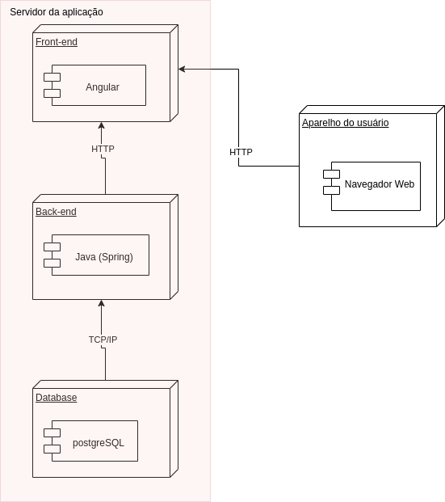

# Diagrama de Implantação

## 1. Introdução

O diagrama de implantação descreve a implementação física de informações geradas pelo programa de software em componentes de hardware.

## 2. Objetivo

Os diagramas de implementação mostram os relacionamentos entre os componentes de software e hardware no sistema e a distribuição física do processamento. Caminhos de comunicação e relacionamentos de implementação modelam as conexões do sistema.

## 3. Diagrama de Implantação do Projeto 

<figure>

  

  

  <figcaption style="text-align: center !important">
    Fonte: Próprio autor
  </figcaption>
</figure>

## 4. Referencia bibliográfica

> [IBM](https://www.ibm.com/docs/pt-br/rsas/7.5.0?topic=topologies-deployment-diagrams) - Acesso em: 14/07/2022 23:26

## 5. Histórico de versões
| Data | Versão | Autor | Descrição | Revisor |
| :-: | :-: | :-: | :-: | :-: |
| 14/07/2022 | 1.0 | [Kevin Batista](https://github.com/k3vin-batista)| Criação do artefato: Diagrama de Sequência | [Ailton Aires](https://github.com/ailtonaires) |
