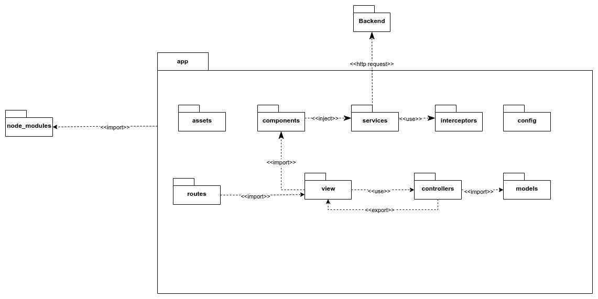
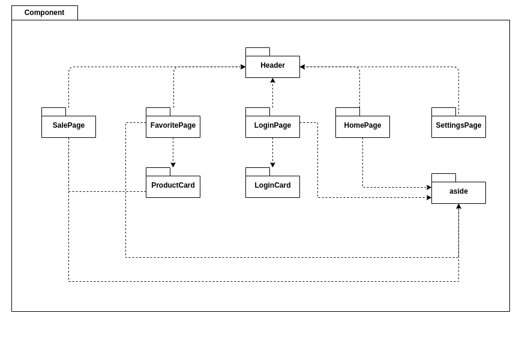
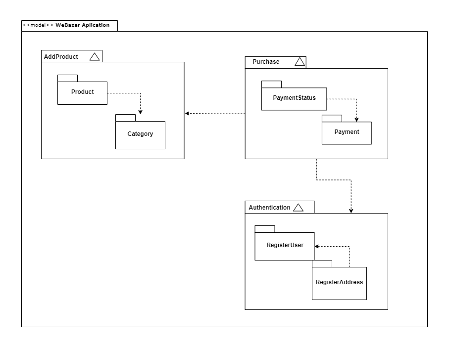
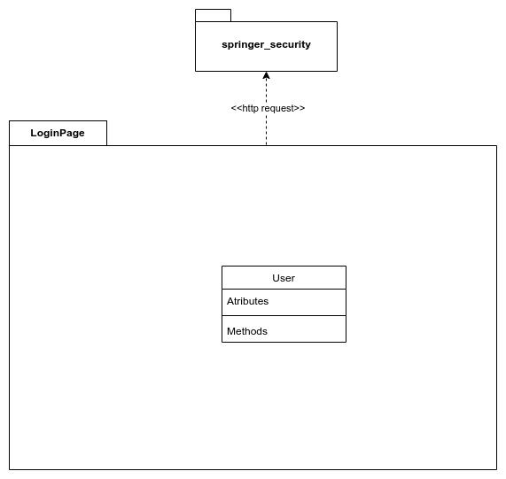

# Diagrama de Pacotes

## 1. Introdução
Pacote é um mecanismo de agrupamento, onde todos os modelos de elementos podem ser
agrupados. Em UML, um pacote é definido como: "Um mecanismo de propósito geral para organizar elementos semanticamente relacionados em grupos." Todos os modelos de elementos que são ligados ou referenciados por um pacote são chamados de "Conteúdo do pacote". Um pacote possui vários modelos de elementos, e isto significa que estes não podem ser incluídos em outros pacotes.

## 2. Metodologia
Um diagrama de pacotes é comumente usado para organizar os egitlementos de um sistema de alto nível, para que os pacotes possam ser usados ​​na organização do sistema, contendo documentos, diagramas e outros.

- Um diagrama de pacotes pode ser usado para simplificar diagramas complexos de classe e organizar as classes em pacotes.
- Ele também pode ser usado para definir os agrupamentos entre pacotes e outros pacotes ou objetos.
- Transformar estruturas complexas de tecnologia, educação e outros campos em pacotes simplificados.

### 2.1 Diagrama de Pacote - App

<figure>
  <figcaption style="text-align: center !important">
    Figura 1: Diagrama de Pacote App
  </figcaption>

  

  <figcaption style="text-align: center !important">
    Fonte: Próprio autor
  </figcaption>
</figure>

### 2.2 Diagrama de Pacote dos componentes

<figure>
  <figcaption style="text-align: center !important">
    Figura 2: Diagrama de Pacote dos componetes
  </figcaption>

  

  <figcaption style="text-align: center !important">
    Fonte: Próprio autor
  </figcaption>
</figure>

### 2.3 Diagrama de Pacote - Funcionalidades

<figure>
  <figcaption style="text-align: center !important">
    Figura 2: Diagrama de funcionalidade
  </figcaption>

  

  <figcaption style="text-align: center !important">
    Fonte: Próprio autor
  </figcaption>
</figure>

O diagrama foi criado com base no diagrama de classes, e foi dividido por funcionalidades. Temos a adição de produtos, do qual existem dois pacotes, o produto e a categoria. O produto depende da categoria, pois todo produto está vinculado a uma. Na compra (purchase, o pacote de status do pagamento depende do de pagamento. Na autenticação existe o pacote de registro de usuário e o de registro de endereço, para cadastrar o endereço do usuário é necessário que antes haja o cadastro do mesmo.

### 2.4 Diagrama de Pacote LoginPage

<figure>
  <figcaption style="text-align: center !important">
    Figura 4: Diagrama de Pacote LoginPage
  </figcaption>

  

  <figcaption style="text-align: center !important">
    Fonte: Próprio autor
  </figcaption>
</figure>

## 3. Conclusão
Usando um diagrama de pacotes, é possível organizar grandes modelos, elementos relacionados a grupos e separar objetos. Nesse sentido, aplicados neste artefato o levantamento dos pacotes que irão compor o frontend web, que utilizará o framework Angular. 

## 4. Bibliografia

> Linguagem de Modelagem Unificada - UML. Disponível em: <http://www.etelg.com.br/paginaete/downloads/informatica/apostila_uml.pdf>. Acesso em 14 de julho de 2022.

> Diagrama de Pacotes: Definição, Componentes e Exemplos. Green, Daniel. Publicado em 23 junho de 2021. Disponível em: <https://gitmind.com/pt/diagrama-de-pacotes.htm>. Acesso em 14 de julho de 2022.

> Diagrama de Pacotes: Definição, Componentes e Exemplos. Green, Daniel. Publicado em 23 junho de 2021. Disponível em: <https://gitmind.com/pt/diagrama-de-pacotes.htm>. Acesso em 14 de julho de 2022.

>Tudo sobre diagramas de pacotes UML. Disponível em: <https://www.lucidchart.com/pages/pt/diagrama-de-pacotes-uml>. Acesso em 11 de julho de 2022

## 5. Histórico de versão
| Data | Versão | Autor | Descrição | Revisor |
| :-: | :-: | :-: | :-: | :-: |
| 14/07/2022 | 1.0 | [Ailton Aires](https://github.com/ailtonaires), [Douglas Monteles](https://github.com/DouglasMonteles) e [Gabriel Costa](https://github.com/GabrielCostaDeOliveira) | Criação do artefato: Diagrama de Pacotes - FrontEnd | [Kevin Batista](https://github.com/k3vin-batista) |
| 15/07/2022 | 1.1 | [Douglas Monteles](https://github.com/DouglasMonteles) | Adicionando o conteúdo dos tópicos que compõem este artefato  | [Kevin Batista](https://github.com/k3vin-batista) |
|15/07/2022|1.2| [Laís Portela](https://github.com/laispa)|Ajustando documento e adicionando diagrama de pacotes - funcionalidades| 
| 15/07/2022 | 1.2 | [Gabriel Costa](https://github.com/GabrielCostaDeOliveira) | Adicionando diagrama de Pacote dos componentes  | |
