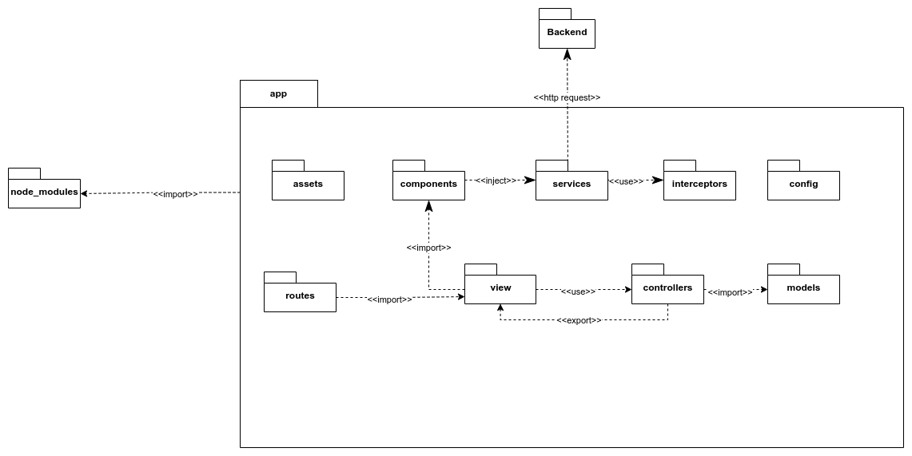

## 1. Introdução

## 2. Metologia

### 2.1 Diagramas de Pacotes

  <figure>
    <figcaption>Figura 1: Diagrama de Pacotes FrontEnd (App) </figcaption>
      
    <figcaption>
      Fonte: Próprio autor</figcaption>
  </figure>

  

  <figure>
    <figcaption>Figura 2: Diagrama de Pacotes FrontEnd (LoginPage) </figcaption>
      
    <figcaption>Fonte: Próprio autor</figcaption>
  </figure>

## 3. Conclusão

## 4. Bibliografia

> Linguagem de Modelagem Unificada - UML. Disponível em: <http://www.etelg.com.br/paginaete/downloads/informatica/apostila_uml.pdf>. Acesso em 14 de julho de 2022.

> O que é estereótipo UML? Como Defini-lo?. 02 de fevereiro de 2016. Disponível em: <https://www.visual-paradigm.com/tutorials/how-to-create-stereotyped-model-element.jsp>. Acesso em 14 de julho de 2022.

## 5. Histórico de versão
 
|Versão|Data de modificação|Descrição da modificação|Autor(es)|Revisor(es)|
|-|-|-|-|-|
|1.0|14/07/2022|Criação e adição do diagrama de pacote do FrontEnd|[Ailton Aires](https://github.com/ailtonaires), [Douglas Monteles](https://github.com/douglasmonteles), [Gabriel Costa](https://github.com/GabrielCostaDeOliveira)|
