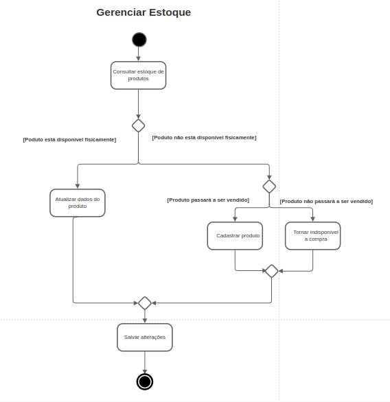
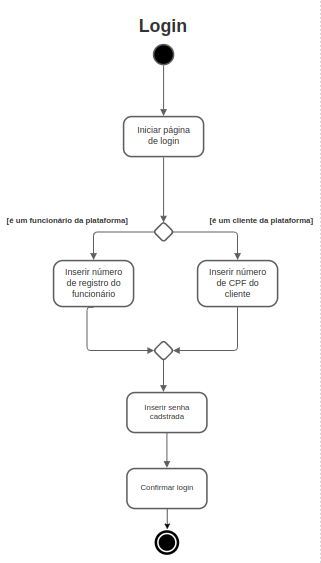

# 2.1.2 Diagrama de Atividades

Um diagrama de atividades é, em sua essência, um fluxograma que representa as atividades realizadas por um sistema. Este diagrama apresenta, dando ênfase à sequência, o fluxo de objetos a partir de um nível mais alto de abstração.

Os elementos que compõem esse diagrama são os retângulos, que representam as etapas (ou ações) do fluxo, e também os elementos de controle de execução, que podem ser de decisão, pontos de união, junção e bifurcação.

## 2.1.2.1 Diagramação relativa a clientes

### Comprar Produtos

Representa o processo de compra de produtos dentro da plataforma. Faz referência à US01,US02,US08,US09,US11,US12,US13 e US14.

### Avaliar compra

Representa o processo de avaliação da compra de produtos dentro da plataforma. Faz referência à US07.

### Informar-se com um vendedor

Representa o processo de comunicação com os responsáveis pela venda a fim de resolver eventuais problemas. Faz referência à US06.

## 2.1.2.2 Diagramação relativa à WEBazar (funcionários)

### Gerenciar Estoque

Representa o processo no qual o funcionário avalia a presença  ou não de produtos em estoque para, assim, realizar o cadastro destes ou torná-los indisponíveis na plataforma. Faz referência à US20 e US21.

## 2.1.2.3 Diagramação não específica

### Realizar cadastro

Representa o processo no qual o cliente/funcionário realiza seu cadastro na plataforma. Faz referência à US01.

### Realizar Login

Representa o processo no qual o cliente/funcionário realiza seu login na plataforma. 

### Gerenciar Perfil

Representa o processo no qual o cliente/funcionário realiza o gerenciamento de seu perfil na plataforma. Faz referência à US03 e US04.

