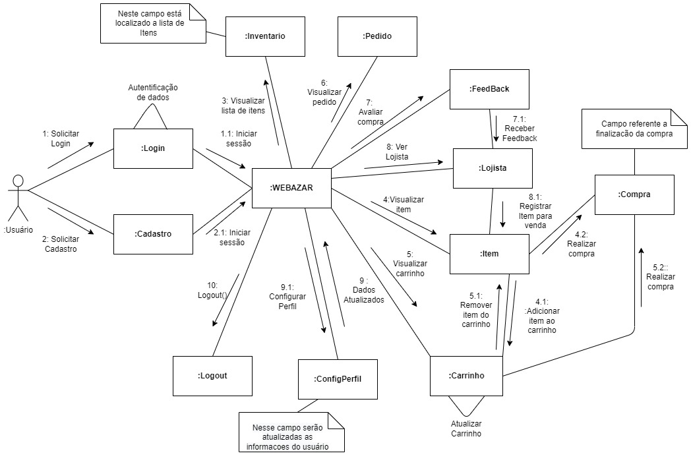

# Diagrama de Comunicação

## 1. Introdução
Diagrama de comunicação é um tipo de diagrama de interação UML que mostra interações entre objetos e/ou partes (representadas como linhas de vida ) usando mensagens sequenciadas em um arranjo de forma livre.

## 2. Metologia
O diagrama de comunicação corresponde (ou seja, pode ser convertido de/para ou substituído por) a um diagrama de seqüência simples sem mecanismos de estruturação, como usos de interação e fragmentos combinados. Assume-se também que a ultrapassagem de mensagens (ou seja, a ordem das recepções é diferente da ordem de envio de um determinado conjunto de mensagens) não ocorrerá ou é irrelevante.
Alguns elementos säo comumente encontrados:

- Frame, 
- Lifeline, 
- Message. 

### 2.1 Diagrama de Comunicação do Projeto 

<figure>
  <figcaption style="text-align: center !important">
    Figura 1: Diagrama de Comunicação do Projeto 
  </figcaption>

  

  <figcaption style="text-align: center !important">
    Fonte: Próprio autor
  </figcaption>
</figure>

## 3. Conclusão
Com a construção do Diagrama de Comunicação é possivel termos mais uma visão sobre a fase de modelagem de forma sequencial além de perceber se está em conformidades com os outros diagramas produzidos a fim de alinhar o escopo do projeto.

## 4. Bibliografia

> Visão geral dos diagramas de comunicação UML - notações gráficas para linha de vida, mensagem, etc. Disponível em: <https://www.uml-diagrams.org/communication-diagrams.html>. Acesso em: 14 jul. 2022.

## 5. Histórico de versão
| Data | Versão | Autor | Descrição | Revisor |
| :-: | :-: | :-: | :-: | :-: |
| 14/07/2022 | 1.0 | [Ugor Brandão](https://github.com/ubrando) | Criação do artefato: Diagrama de Comunicação | Revisor |

