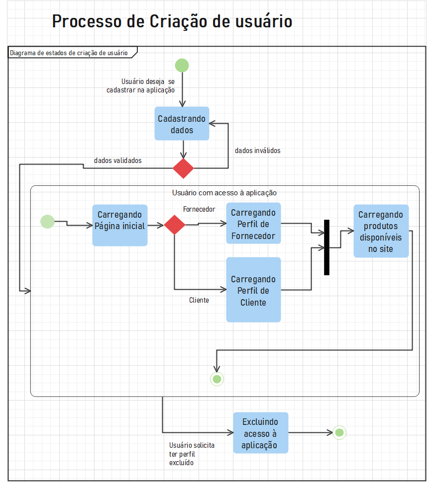

## 1. Introdução

Um diagrama de estado ou diagrama de máquina de estado, 
é um diagrama de aspecto dinâmico na Unified Modeling Language (UML), sendo que permite a descrição dos
eventos e transições de estados aos quais ele está sujeito. Dessa forma, os estados são representados por retângulos com
arredondamento nas bordas e as mudanças de estados (transições) pelas setas. Assim, serão descritos os processos de cadastro de
usuário, compra de produtos e cadastro de produtos.

## 2. Diagramas de Estado

#### 2.1. Diagrama de Estados de Cadastro

    
    <figcaption align='center'>
        <b>Figura 1: Diagrama de Estados de Cadastro de Usuário</b>
         
        <small>Autor: Bianca Sofia.</small>
    </figcaption>

#### 2.2. Diagrama de Compra de Produtos

    
    <figcaption align='center'>
        <b>Figura 1: Diagrama de Compra de Produtos</b>
         
        <small>Autor: Bianca Sofia.</small>
    </figcaption>

### Histórico de revisão

| Data | Versão | Descrição | Autor(es)|Revisor(es)|
|:----:|:------:|:---------:|:--------:|:--------:|
| 14/07/22 | 1.0 | Criação do Documento | Bianca Sofia | |
| 14/07/22 | 1.1 | Adição de diagramas de estados | Bianca Sofia | |

## Bibliografia
- [1] MASSOLLAR, Jobson; CONTE, Tayana; TRAVASSOS, Guilherme Horta. Modelagem de Sistemas com UML.
