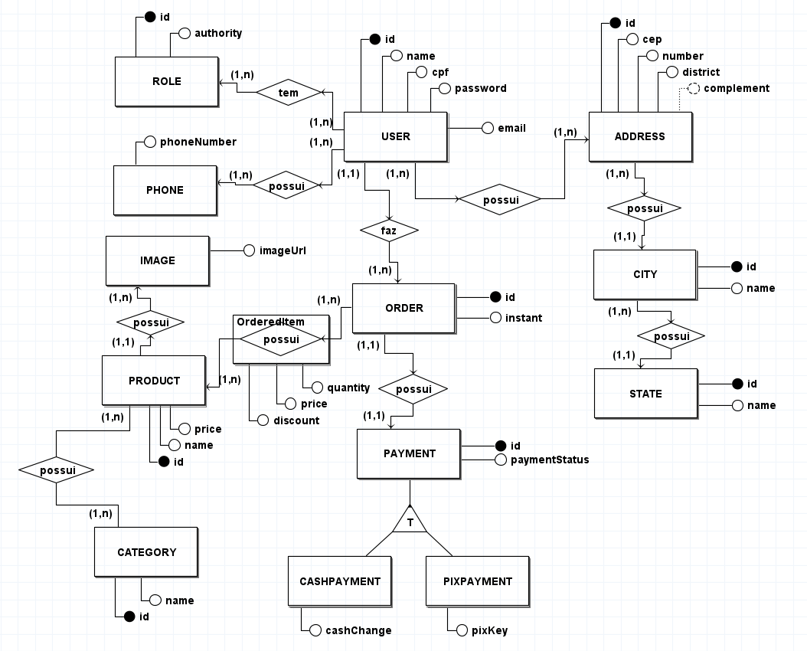
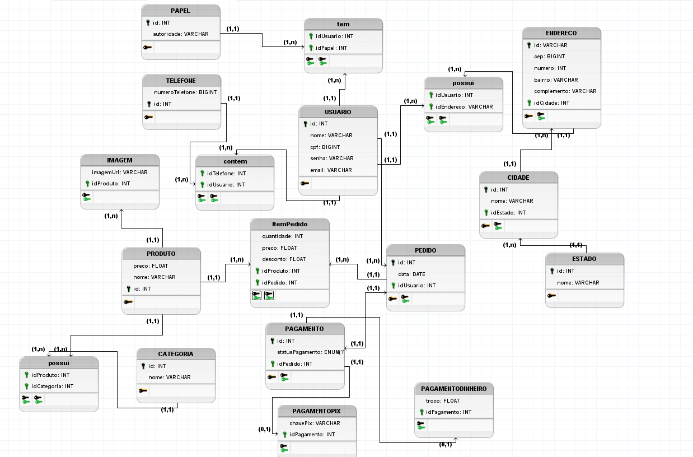

# Modelagem de Dados

## 1. Introdução
Modelagem de dados é o ato de explorar estruturas orientadas a dados. Como outros artefatos de modelagem, modelos de dados podem ser usados para uma variedade de propósitos, desde modelos conceituais de alto nível até modelos físicos de dados. Do ponto de vista de um desenvolvedor atuando no paradigma orientado a objetos, modelagem de dados é conceitualmente similar à modelagem de classes [1].

## 2. Metologia
Embora as questões de metodologias sejam abordadas depois, precisamos discutir como modelos de dados podem ser usados na prática para melhor entendê-los. Provavelmente, iremos nos deparar a três estilos básicos de modelos de dados:

- Modelos de dados conceituais: esses modelos, algumas vezes chamados modelos de domínio, são tipicamente usados para explorar conceitos do domínio com os envolvidos no projeto.
  
- Modelos Lógico de Dados (MLDs): MLDs são usados para explorar os conceitos do domínio e seus relacionados. Isso pode ser feito para o escopo de um simples projeto ou para uma empresa inteira. 

- Modelos Físicos de Dados (MFDs): MFDs são usados para projetar o esquema interno de um banco de dados, descrevendo as tabelas de dados, as colunas de dados das tabelas e o relacionamento entre as tabelas. 

### 2.1 Modelo Entidade-Relacionamento
  
#### Entidades

USUARIO
 
PAPEL
 
TELEFONE
 
ENDERECO
 
CIDADE
 
ESTADO
 
PEDIDO
 
PAGAMENTO
 
PAGAMENTODIHEIRO
 
PAGAMENTOPIX
 
ItemPedido
 
PRODUTO
 
CATEGORIA
 
IMAGEM

#### Atributos

USUARIO(<u>id</u>  , nome, cpf, senha, email)
 
PAPEL(<u>id</u> , autoridade)
 
TELEFONE(<u>id</u> , numeroTelefone)
 
ENDERECO(<u>id</u> , cep, numero, bairro, complemento, idCidade)
 
CIDADE(<u>id</u> , nome, idEstado)
 
ESTADO(<u>id</u> , nome)
 
PEDIDO(<u>id</u> , data, idUsuario)
 
PAGAMENTO(<u>id</u> , statusPagamento, idPedido)
 
PAGAMENTODIHEIRO(troco,idPagamento)
 
PAGAMENTOPIX(chavePix, idPagamento)
 
ItemPedido(quantidade, preco, desconto, idProduto, idPedido)
 
PRODUTO(<u>id</u> , data, idUsuario)
 
CATEGORIA(<u>id</u> , nome)
 
IMAGEM(imagemUrl, idProduto)
 

#### Relacionamento

-> USUARIO - tem - PAPEL
 
Um usuário pode possuir um ou mais papéis, e um papel pode ser de várias pessoas.
 
Cardinalidade n:m
 
-> USUARIO - contem - TELEFONE
 
Um usuário pode possuir um ou mais telefones, e um telefone pode pertencer a mais de uma pessoa. ex: Mãe usar o telefone da filha
 
Cardinalidade n:m
 
-> USUARIO - possui - ENDERECO
 
Um usuário pode possuir um ou mais endereços, e um endereço pode ser de vários usuários.
 
Cardinalidade n:m
 
-> ENDERECO-possui-CIDADE
 
Um endereço só pertence à uma cidade, e uma cidade possui vários endereços.
Obs: Optamos por essa modelagem de cidade como entidade e não atributo para poder limitar as cidades que acontecem
os bazares e para os usuários não escreverem a mesma cidade com nomenclaturas diferentes.
 
Cardinalidade n:1
 
-> CIDADE - possui - ESTADO
 
Uma cidade possui um estado e um estado pode possuir várias cidades
 
Cardinalidade n:1
 
-> USUARIO - faz - PEDIDO
 
Um usuário faz um ou muitos pedidos, e um pedido só pode pertencer à um  usuário
 
Cardinalidade 1:n
 
-> PEDIDO - possui - PAGAMENTO
 
Um pedido possui apenas um pagamento e um pagamento pertence a apenas um pedido. 
 
Cardinalidade 1:1
 
-> PEDIDO - possui - PRODUTO
 
Um pedido possui um ou muitos produtos, e um modelo de produto pode estar em varios pedidos, se existir em maior quantidade.
 
Cardinalidade n:m
 
-> PRODUTO - possui - CATEGORIA
 
Um produto pode possuir uma ou mais categorias, e uma categoria pertence à um ou muitos produtos. OBS: 
Um produto pode ser um artigo artesanal ao mesmo tempo que é um acessório de PET.
Cardinalidade: n:m
 
-> PRODUTO - possui - IMAGEM
 
Um produto possui uma ou mais imagens e uma imagem só pertence à um produto.
 
Cardinalidade 1:n

### 2.2 Diagrama Entidade-Relacionamento

<figure>
  <figcaption style="text-align: center !important">
    Figura 2: Diagrama Entidade-Relacionamento (DER)
  </figcaption>

  

  <figcaption style="text-align: center !important">
    Fonte: Próprio autor 
    <a href="../../docs/img/Diagramas/DiagramaEntidadeRelacionamento.brM3" download>Baixe o arquivo aqui</a> e abra no BrModelo
  </figcaption>
</figure>

### 2.3 Diagrama Lógico de Dados
<figure>
  <figcaption style="text-align: center !important">
    Figura 2: Diagrama Entidade-Relacionamento (DER)
  </figcaption>

  

  <figcaption style="text-align: center !important">
    Fonte: Próprio autor 
    <a href="../../docs/img/Diagramas/DiagramaLogicoDados.brM3" download>Baixe o arquivo aqui</a> e abra no BrModelo
  </figcaption>
</figure>

## 3. Bibliografia

> [1] Modelagem de Dados Tutorial. Disponível em: <https://www.devmedia.com.br/modelagem-de-dados-tutorial/20398>. Acesso em 14 de julho de 2022.

## 4. Histórico de versão
| Data | Versão | Autor | Descrição | Revisor |
| :-: | :-: | :-: | :-: | :-: |
| 14/07/2022 | 1.0 | [Douglas Monteles](https://github.com/DouglasMonteles) e [Gabriel Costa](https://github.com/GabrielCostaDeOliveira) | Criação do documento de modelagem de dados |Bianca Sofia |
| 15/07/2022 | 1.1 | [Bianca Sofia](https://github.com/biancasofia)| Criação DLD, adaptando DER para PT | A definir |
| 15/07/2022 | 1.2 | [Bianca Sofia](https://github.com/biancasofia)| Adicionando MER | A definir |