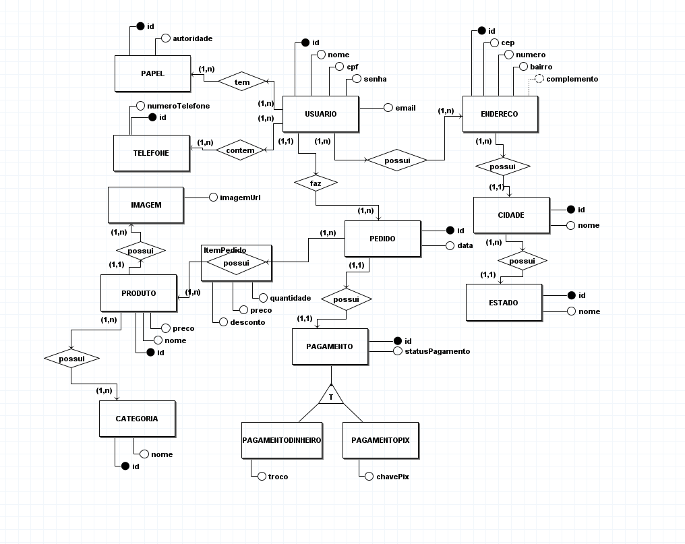

# Modelagem de Dados

## 1. Introdução
Modelagem de dados é o ato de explorar estruturas orientadas a dados. Como outros artefatos de modelagem, modelos de dados podem ser usados para uma variedade de propósitos, desde modelos conceituais de alto nível até modelos físicos de dados. Do ponto de vista de um desenvolvedor atuando no paradigma orientado a objetos, modelagem de dados é conceitualmente similar à modelagem de classes [1].

## 2. Metologia
Embora as questões de metodologias sejam abordadas depois, precisamos discutir como modelos de dados podem ser usados na prática para melhor entendê-los. Provavelmente, iremos nos deparar a três estilos básicos de modelos de dados:

- Modelos de dados conceituais: esses modelos, algumas vezes chamados modelos de domínio, são tipicamente usados para explorar conceitos do domínio com os envolvidos no projeto.
  
- Modelos Lógico de Dados (MLDs): MLDs são usados para explorar os conceitos do domínio e seus relacionados. Isso pode ser feito para o escopo de um simples projeto ou para uma empresa inteira. 

- Modelos Físicos de Dados (MFDs): MFDs são usados para projetar o esquema interno de um banco de dados, descrevendo as tabelas de dados, as colunas de dados das tabelas e o relacionamento entre as tabelas. 

### 2.1 Modelo Entidade-Relacionamento

### 2.2 Diagrama Entidade-Relacionamento

<figure>
  <figcaption style="text-align: center !important">
    Figura 2: Diagrama Entidade-Relacionamento (DER)
  </figcaption>

  

  <figcaption style="text-align: center !important">
    Fonte: Próprio autor 
    <a href="../../docs/img/Diagramas/DiagramaEntidadeRelacionamento.brM3" download>Baixe o arquivo aqui</a> e abra no BrModelo
  </figcaption>
</figure>

### 2.3 Diagrama Lógico de Dados

## 3. Conclusao
Fusce at mi tellus. Duis sit amet imperdiet ipsum, volutpat porta ex. 
Suspendisse sagittis lectus a libero iaculis hendrerit. Phasellus porta ligula at tellus consectetur consequat.

## 3. Bibliografia

> [1] Modelagem de Dados Tutorial. Disponível em: <https://www.devmedia.com.br/modelagem-de-dados-tutorial/20398>. Acesso em 14 de julho de 2022.

## 4. Histórico de versão
| Data | Versão | Autor | Descrição | Revisor |
| :-: | :-: | :-: | :-: | :-: |
| 14/07/2022 | 1.0 | [Douglas Monteles](https://github.com/DouglasMonteles) e [Gabriel Costa](https://github.com/GabrielCostaDeOliveira) | Criação do documento de modelagem de dados | A definir |
