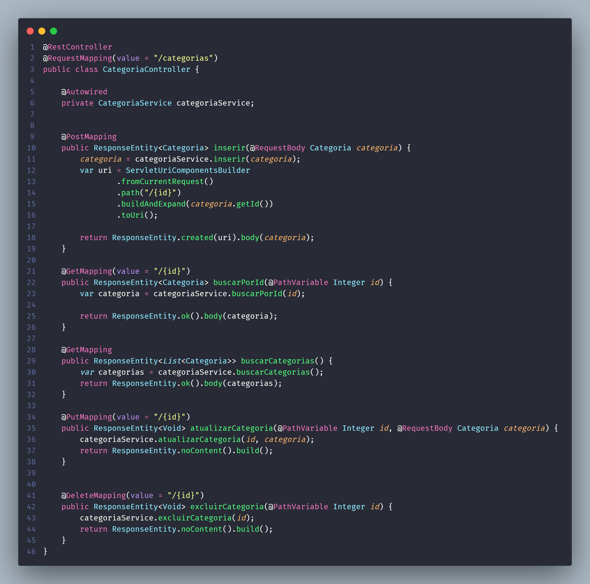

# GRASP Controller

## 1. Introdução
Lorem ipsum dolor sit amet, consectetur adipiscing elit. Pellentesque gravida enim eget egestas maximus. Praesent euismod condimentum neque eget interdum. Duis at fermentum diam, a vulputate purus. Quisque a dolor augue. Nam et tristique nisl. Duis sollicitudin metus sit amet turpis sodales iaculis. 
Proin ipsum urna, laoreet in justo sed, vulputate pellentesque felis. Ut mollis rutrum facilisis. Phasellus ut faucibus sapien, a venenatis velit.

## 2. Metologia
Morbi pretium libero lectus, 
nec ornare quam condimentum vitae. Nunc lectus nunc, efficitur eget massa et, laoreet consequat leo. Ut ut purus vulputate massa aliquam suscipit eu nec mi.

## 3. Exemplos
Abaixo, os exemplos das classes controladoras que foram implementadas no nosso projeto, na parte do backend com o ecossistema Spring.

<figure>
  <figcaption>Figura 1: REST Controller de </figcaption>

  

  <figcaption>Fonte: Próprio autor</figcaption>
</figure>

## 4. Conclusao
Fusce at mi tellus. Duis sit amet imperdiet ipsum, volutpat porta ex. 
Suspendisse sagittis lectus a libero iaculis hendrerit. Phasellus porta ligula at tellus consectetur consequat.

## 5. Bibliografia

> Spring Controller - Spring MVC Controller. Publicado em 03 Agosto 2022. Acesso em: 05 Agosto 2022. Disponível em: <https://www.digitalocean.com/community/tutorials/spring-controller-spring-mvc-controller>.

## 6. Histórico de versão
| Data | Versão | Autor | Descrição | Revisor |
| :-: | :-: | :-: | :-: | :-: |
| 03/08/2022 | 1.0 | [Arthur Talles](https://github.com/art1505), [Iago Oliveira](https://github.com/iagoomr), [Eduardo Gurgel](https://github.com/EduardoGurgel) e [Douglas Monteles](https://github.com/DouglasMonteles) | Criação do template do documento do GRASP de Controlador | Revisor |
| 05/08/2022 | 1.1 | [Douglas Monteles](https://github.com/DouglasMonteles) | Adicionando exemplo de controlador de Categoria | Revisor |
