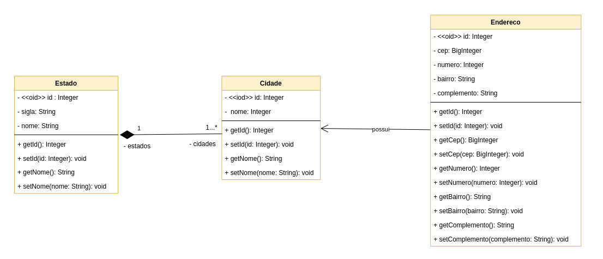
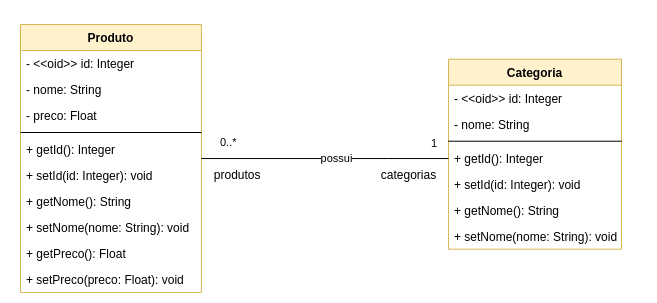

# GRASP Criador

## 1. Introdução
Os padrões GRASP fornecem uma abordagem
sistemática para a atribuição de responsabilidades às
classes do projeto

Tenta resolver o problema de quem é responsável por criar uma nova instancia de uma classe. Analisamos as classes cidade, estado e endereço. 

[1] O criador determina qual classe deve ser responsável pela criação certos objetos. Atribua à classe B a responsabilidade de criar uma instância de A se pelo menos um desses for verdadeiro:

 - B contém ou agrega A, 
 - B registra a existência de A, 
 - B usa A,
 - B tem os dados necessários para a inicialização de A que serão passados ao construtor de A.

## 2. Metodologia
  [1] Ao analisar o Diagrama de Classes produzido para o projeto, a analise sobre reponsbilidade de criação foi feita sobre cada classe a fim designar o papel criador:
- A propria classe se cria,
- A classe seria criada por outra classe.
Ao analisar o Diagrama de classes foram identidicadas duas relacöes em que o padáo se encontrava:
- A relacão de Estado com Cidade em que Estado cria uma lista de cidades associadas a ele e,
- A relacão de Produto com Categoria onde Produto só pode ser criado incorporando a lista de categorias existentes.

## 3.  Exemplos

  <figure>
    <figcaption>Figura 1: Exemplo GRASP criador - Cidade Estado</figcaption>
  </figure>

  <figure>
    <figcaption>Figura 2: Exemplo GRASP criador - Produto Categoria</figcaption>
  </figure>

  <figure>
    <figcaption>Figura 3: Exemplo GRASP criador - Estado Cidade</figcaption>
  </figure>

## Conclusão
Com as reflexões acerca do padrão GRASP Criador, foi possivel repensar as cardinalidades originalmente presentes no drigrama de classes o que gerou um segunda versão do mesmo. 

## Bibliografia
> Padrões GRASP. Disponível em: http://www.facom.ufu.br/~bacala/ESOF/05a-Padr%C3%B5es%20GRASP.pdf
> Understanding the GRASP Design Patterns. Disponível em: https://medium.com/@ReganKoopmans/understanding-the-grasp-design-patterns-2cab23c7226e

### Histórico de revisão

| Data | Vers�o | Descrição | Autor(es)|Revisor(es)|
|:----:|:------:|:---------:|:--------:|:--------:|
| 06/08/22 | 1.0 | Criação do Documento e adição de contendo| [Ugor Brandão](https://github.com/ubrando), [Laís Portela](https://github.com/laispa), [Gabriel Costa](https://github.com/GabrielCostaDeOliveira)| |
| 07/08/22 | 1.1 | Adição dos exemplos| [Ugor Brandão](https://github.com/ubrando), [Laís Portela](https://github.com/laispa), [Gabriel Costa](https://github.com/GabrielCostaDeOliveira)| |
| 12/08/22 | 1.2 | Trocando foto do exemplo|[Gabriel Costa](https://github.com/GabrielCostaDeOliveira)| |
