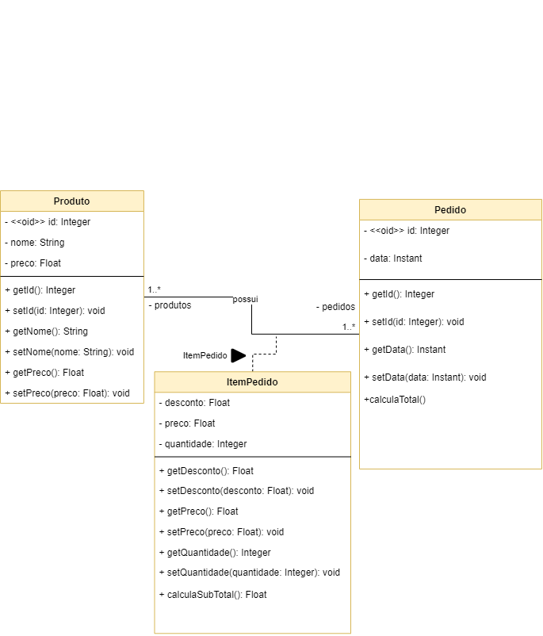

# GRASPs - Especialista

## 1. Introdução

 O padrão especialista envolve a distribuição consistente de responsabilidades entre as classes, ou seja,
tem como objetivo atribuir a responsabilidade de algo para uma classe específica. Dessa forma, é possível tornar o código mais elegante, facilitando
também o entendimento e a manutenção.

 Nesse contexto, temos o baixo acoplamento e um melhor encapsulamento das informações como vantagens do padrão. Assim, é possível identificar no projeto 
situações em que uma classe é a especialista, como a classe que melhor implementar o cálculo da compra final do usuário.

 Esse é o padrão mais utilizado para atribuir responsabilidades dentro do contexto de classes. Geralmente a informação necessária para a
implementação das responsabilidades frequentemente está associada a vários objetos diferentes, e é por isso que consideramos a existência de alguns experts
parciais.   

## 2. Metodologia

 O padrão especialista escolhe como distribuir as responsabilidades entre objetos (ou classes) e é crucial para um bom projeto.
Esse padrão identifica as responsabilidades e obrigações de uma classe, ou seja, um método de uma classe nada mais é que uma obrigação de fazer algo.
No exemplo mais a frente, será percebido que existe um método dentro da classe "Pedido" responsável por gerar o valor final do pedido. Isso faz com
que a classe pedido seja especialista no método supracitado. Pode-se perceber que o método que gera o valor final do produto utiliza informações de outras classes (Produto e ItemPedido), o que torna elas especialistas parciais.

Quanto a granularidade, no Grasp especialista, uma responsabilidade pode envolver um único método (ou poucos) ou dezenas de classes e métodos.
Vale ressaltar que uma responsabilidade não é igual a um método, mas métodos são usados para implementar responsabilidades.

## 3.  Exemplos
Dessa forma, no projeto bazar em que existem vendas, é possível delegar funções específicas para cada classe na hora do cálculo, sendo que a classe "Produto"
informa apenas o preço do produto, a 'ItemPedido' descreve a quantidade de produtos, assim como o subtotal, sobrando então para a classe "Pedido"
apenas o valor final da compra, ao invés de fazer o cálculo completo da venda.

<figure>

  
  <figcaption style="text-align: center !important">
    Fonte: Próprio autor
  </figcaption>
  
</figure>

## Bibliografia

### Histórico de revisão

| Data | Versão | Descrição | Autor(es)|Revisor(es)|
|:----:|:------:|:---------:|:--------:|:--------:|
| 04/08/22 | 1.0 | Criação do Documento e adição de contendo| [Bianca Sofia](https://github.com/biancasofia), [Kevin Batista](https://github.com/k3vin-batista), [Ailton Aires](https://github.com/ailtonaires), Arthur  | |
| 09/08/22 | 1.1 | Criação da modelagem| [Bianca Sofia](https://github.com/biancasofia), [Ailton Aires](https://github.com/ailtonaires) | |
| 09/08/22 | 1.2 | Metodologia e complemento do documento| [Bianca Sofia](https://github.com/biancasofia), [Kevin Batista](https://github.com/k3vin-batista), [Ailton Aires](https://github.com/ailtonaires) | |
