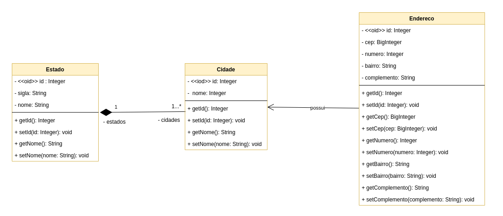
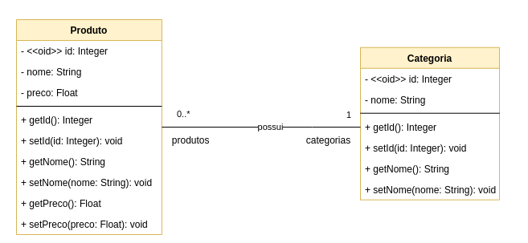

# GRASPs - Criacionais

## 1. Introdução

 Determina qual classe deve ser responsável pela criação certos objetos. Atribua à classe B a responsabilidade de criar uma instância de A se pelo menos um desses for verdadeiro:
 - B contém ou agrega A, 
 - B registra a existência de A, 
 - B usa A,
 - B tem os dados necessários para a inicialização de A que serão passados ao construtor de A.

## 2. Metodologia
   
 Ao analisar o Diagrama de Classes produzido para o projeto, a analise sobre reponsbilidade de criação foi feita sobre cada classe a fim designar o papel criador:
   - A propria classe se cria,
   - A classe seria criada por outra classe.
   

## 3.  Exemplos

  <figure>
    <figcaption>Figura 1: Exemplo GRASP criador - Cidade Estado</figcaption>
      
    <figcaption>Fonte: Próprio autor</figcaption>
  </figure>

  <figure>
    <figcaption>Figura 2: Exemplo GRASP criador - Produto Categoria</figcaption>
      
    <figcaption>Fonte: Próprio autor</figcaption>
  </figure>

## Bibliografia
> Padrões GRASP. Disponível em: http://www.facom.ufu.br/~bacala/ESOF/05a-Padr%C3%B5es%20GRASP.pdf
> Understanding the GRASP Design Patterns. Disponível em: https://medium.com/@ReganKoopmans/understanding-the-grasp-design-patterns-2cab23c7226e

### Histórico de revisão

| Data | Vers�o | Descrição | Autor(es)|Revisor(es)|
|:----:|:------:|:---------:|:--------:|:--------:|
| 06/08/22 | 1.0 | Criação do Documento e adição de contendo| [Ugor Brandão](https://github.com/ubrando), [Laís Portela](https://github.com/laispa), [Gabriel Costa](https://github.com/GabrielCostaDeOliveira)| |
| 07/08/22 | 1.0 | Adição dos exemplos| [Ugor Brandão](https://github.com/ubrando), [Laís Portela](https://github.com/laispa), [Gabriel Costa](https://github.com/GabrielCostaDeOliveira)| |
