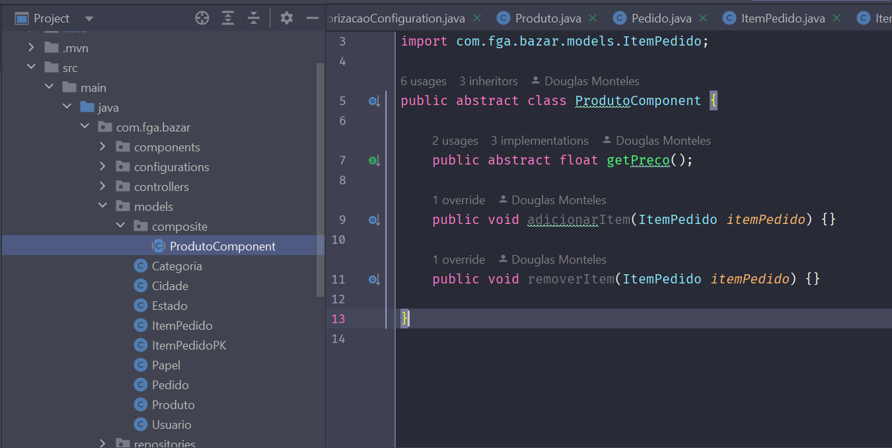
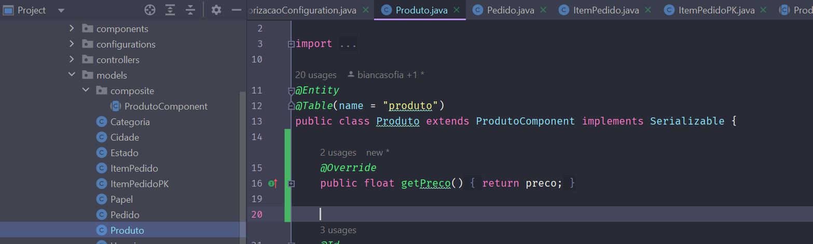
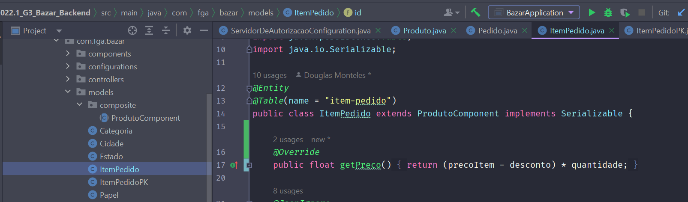
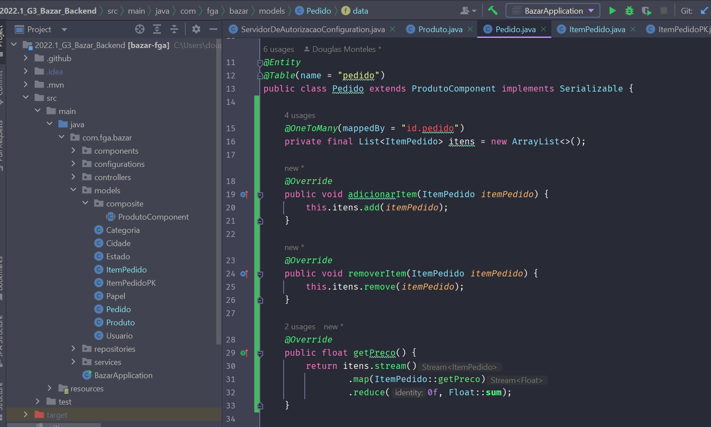

# GoFs - Composite

## 1. Introdução
[1] O Composite é um padrão de projeto estrutural que permite que você componha objetos em estruturas de árvores e então trabalhe com essas estruturas como se elas fossem objetos individuais.

## 2. Metologia
[1] Usar o padrão Composite faz sentido apenas quando o modelo central de sua aplicação pode ser representada como uma árvore. O padrão Composite sugere que você trabalhe com `Produtos` e `Caixas` através de uma interface comum que declara um método para a contagem do preço total.

[1] Para um produto, ele simplesmente retornaria o preço dele. Para uma caixa, ele teria que ver cada item que ela contém, perguntar seu preço e então retornar o total para essa caixa. Se um desses itens for uma caixa menor, aquela caixa também deve verificar seu conteúdo e assim em diante, até que o preço de todos os componentes internos sejam calculados. Uma caixa pode até adicionar um custo extra para o preço final, como um preço de embalagem.

<figure>
  <figcaption style="text-align: center !important">
    Figura 1: Diagrama do GoF de Composite
  </figcaption>

  

  

  

  <figcaption style="text-align: center !important">
    Fonte: <a href="https://github.com/luizomf/design-patterns-typescript/blob/master/src/structural/composite/diagramas/Composite.png">Design Patterns</a>
  </figcaption>
</figure>

## 3. Exemplos no código

<figure>
  <figcaption style="text-align: center !important">
    Figura 2: Abstração de ProdutoComponent
  </figcaption>

  

  <figcaption style="text-align: center !important">
    Fonte: Próprio autor
  </figcaption>
</figure>

<figure>
  <figcaption style="text-align: center !important">
    Figura 3: Produto Leaf
  </figcaption>

  

  

  

  <figcaption style="text-align: center !important">
    Fonte: Próprio autor
  </figcaption>
</figure>

<figure>
  <figcaption style="text-align: center !important">
    Figura 4: ItemPedido Leaf
  </figcaption>

  

  

  

  <figcaption style="text-align: center !important">
    Fonte: Próprio autor
  </figcaption>
</figure>

<figure>
  <figcaption style="text-align: center !important">
    Figura 5: Composite
  </figcaption>

  

  

  

  <figcaption style="text-align: center !important">
    Fonte: Próprio autor
  </figcaption>
</figure>

## 4. Conclusão
O maior benefício dessa abordagem é que você não precisa se preocupar sobre as classes concretas dos objetos que compõem essa árvore. Você não precisa saber se um objeto é um produto simples ou uma caixa sofisticada. Você pode tratar todos eles com a mesma interface. Quando você chama um método os próprios objetos passam o pedido pela árvore.

## 5. Bibliografia
> [1] Composite. Disponível em: <https://refactoring.guru/pt-br/design-patterns/composite>. Acesso em: 10 agosto 2022.

## 6. Histórico de versão
| Data | Versão | Autor | Descrição | Revisor |
| :-: | :-: | :-: | :-: | :-: |
| 10/08/2022 | 1.0 | [Douglas Monteles](https://github.com/DouglasMonteles) | Criação do documento do pattern Composite | Revisor |
