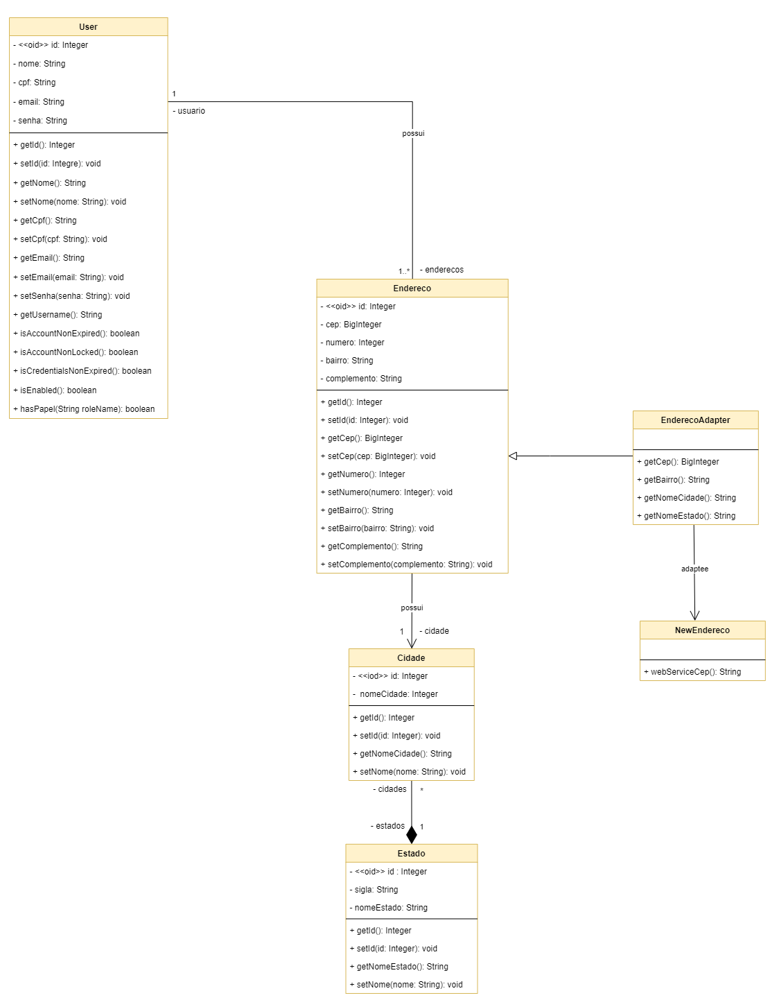

# GoFs - Adapter

## 1. Introdução
[1] O Padrão é um padrão de projeto estrutural que permite que uma objeto seja substituído por outro que, apesar de realizar a mesma tarefa, possui interfaces diferentes.

## 2. Metologia
[1] As principais intenções do adapter são:
- Converter a interface de uma classe em outra;
- Envolver uma classe existente em uma nova interface;
- Introduzir um componente legado em um novo sistema; 

[1] No projeto, podemos observar que a implementação de cidades e estado são eitas de modo a serem inderidas no banco de dados a medica que a plataforma forneça serviço para aquela regiao. Almejanto que a plataforma um dia possa um dia cobrir todo o território, seria possivel uma maneira mais direta para preencher os dados do endereço por meio do CEP, que já preenheria cidade, estado e bairro apenas com essa informação. Dessa forma o adapter apresentado aqui proprõe essa implementação. 

## 3. Exemplo na modelagem 
<figure>
  <figcaption style="text-align: center !important">
    Figura 1: Exemplo de modelagem para o Adapter.
  </figcaption>

  

  <figcaption style="text-align: center !important">
    Fonte: Próprio autor
  </figcaption>
</figure>

## 3. Exemplo no código

<figure>
  <figcaption style="text-align: center !important">
    Figura 2: Exemplo de suposta implementação do Padrão Adapter em Endereço.
  </figcaption>

  

  <figcaption style="text-align: center !important">
    Fonte: Próprio autor
  </figcaption>
</figure>

## 4. Conclusão
O benefício aqui obtido pelo padrão é uma evolução da implementação dos campos de endereço em que o Adapter auxiliaria nesse propósito de melhoria.  

## 5. Bibliografia
> C# -  Apresentando o Padrão Gof -  Adapter. Disponível em: <https://www.macoratti.net/21/08/c_adapter1.htm>. Acesso em: 11 ago. 2022.

## 6. Histórico de versão
| Data | Versão | Autor | Descrição | Revisor |
| :-: | :-: | :-: | :-: | :-: |
| 11/08/2022 | 1.0 | [Ugor Brandão](https://github.com/ubrando) | Criação do documento do pattern Adapter | Revisor |
