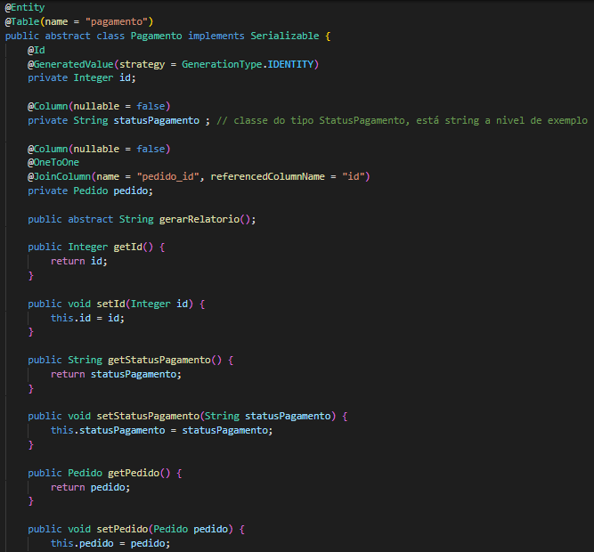
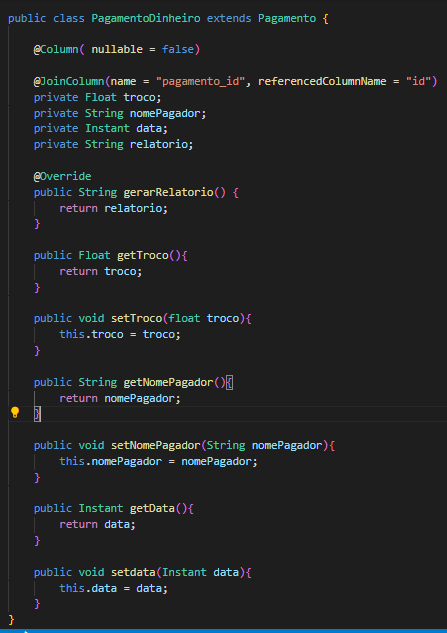

# GoFs - Strategy

## 1. Introdução
O padrão comportamental observa de que maneira as classes e os objetos podem reagir entre si. Ele age diretamente na delegação de responsabilidades, definindo como os objetos vão se comportar e se comunicar. O Strategy é um tipo de padrão comportamental que vamos tratar.

## 2. Metodologia 

O Strategy permite definir uma familía de algoritmos e colocar cada um deles em uma classe separada e tornar seus objetivos intercambiáveis, fazendo com que a família de algoritmos seja utilizada de forma independente e seletiva.

Resolvemos estudar as relações entre as classes pedido, pagamento, pagamento por dinheiro e pagamento por pix. Onde foi verificado que A classe pagamento não precisa carregar todas as informações de tipos de pagamento, já que cada tipo tem suas caracteríticas próprias de pagamento. Um método em comum entre essas classes seria a função gerar relatório, que geraria uma nota fiscal ao cliente. Esse método será realizado em pagamento por dinheiro e pagamento por pix, para que depois ela tenha q ser enviada para a classe pagamento e assim seja concluído, por fim, o pedido e as etapas de compra. 

## 3. Exemplo na modelagem 
<figure>
  <figcaption style="text-align: center !important">
    Figura 2: Diagrama de Classes
  </figcaption>

  <iframe 
    frameborder="1" 
    style="width:100%;height:920px;" 
    src="https://viewer.diagrams.net/?tags=%7B%7D&highlight=FFFFFF&edit=_blank&layers=1&nav=1&title=copia%20de%20classe.drawio#R7VzbbqM6FP2aSHMeEmFzf2yTzkXqdDptNZfzMnLBSdAQnAMkTefrjw12AtghpIG2oyJVTTDGMXstby9vthno48XmQ4yW88%2FEx%2BEAav5moE8GEEIAHfrBSh7zEtPgBbM48PMisCu4Df5gXqjx0lXg46RUMSUkTINludAjUYS9tFSG4pg8lKtNSVj%2B1SWaYang1kOhXPo98NN5XuqY2q78Iw5mc%2FHLQONn7pH3exaTVcR%2FLyIRzs8skGiGV03myCcPhSL9YqCPY0LS%2FNtiM8YhM6uwWH7d%2Bz1nt12OcZQ2ucCfrn%2F9WQ9%2FAQt8%2FxJfxMbkqzl09byZNQpX3Ba8t%2BmjMA67v6X8a2VI0L2ozm93jeMUbwpVea8%2BYLLAafxIq%2FCzQ13QQLBH0Olhh4UusJiXcOC9RRz%2F2bbxnSHoF26LI%2BziyHa5RjO0oHdPJAMlD8EiRBR4%2FXxKovSWn9HpMQqDWUS%2Fe%2FRCHNMCZpaAEu%2BMn0jJkpZ68yD0L9EjWbE7S1LKKnF0Pidx8Ic2i%2BgNTAAtoKfjlI8haJVq3LIrabFGS2Oc0DrXAjFQKfqMNqWKlyhJeYFHwhAtkyCHlF24QPEsiM5JmpIFrzQNwnBMQhJnNtCn0yn0vKx3MfmNC2d8694yWTdlCtVT8jCBOF%2BoESS6GAq6QFhDF976DeNyNKN3Xte8q2hd18qNo5AiHqEUnzP3kEiU3N7HCSw1JJYOB2wAWmGaGTz%2FJLQRaM14Ef%2FMWj6jn58oM2eUm1VWU%2BOnEp6ZfyuDz4sE00M8TffyPFkiL4hml1mdibErueF2ZEWEXjsNM1c5D3wfR4yjJEXCxzD2LUkQpZmhzXP6R295rI3MgUk7PqbHYHdM%2F1j1OB2TiN4LCjLyYcr2B5ykzWnpdEdLqyMn5qrpQf1Hukp27ixjwW2lsGdDy2ww4QuzwTEPT%2FVhkKGXoyyUEHgSxAsKVoh3mN4xyCdDIOGuy7jrCoxDdI%2FDa5IEaUBY%2B3Fet4L9i8FrKySLCl6nK3QtBbrMzVPXjuIbHKKUqgTy7p8BIxhTXNlkcMTXN%2BoQiooOdkYfp%2BlcYZzOn986GMOv38B58nmdwOkqPV9%2BGcL9%2FEk%2F%2BZQ2Za2gpgirn2T1K%2BKCX77OlUhPr2dwSEAsqg5RytK6opS9n1IVuSH41auQrllhN2RFGzJEzQpnDysSmRVNlGrJtfR0aZku7ouvYYByDbM85CLm6ULESw7GYLZSNYuE7IWIoYBWKUny0As4glkNAToi9CHOWu7Isbmy56ANgYRZk3jFUyD71w0v4Y%2Ff55sb9BXduP%2F9d%2FXhcigjth2skyCiXYgbh9AawfemQ2jgWMYMTa0cbXVceUqAtpIwXTEGKsc4tYLHff77kKC0IBfZ6Yj%2BOCOWT%2BLKGZ%2F62X4u2FKkdpCeEs1SssRqYYWi7HGDJxVvMHzRDrhNXUAL0Qtlh%2BVA5XalcMe8gFgfcD%2FQD%2B120ZdjV0r0u1sT7MM%2FEfhX54IGAQV%2B%2FdVumnjHpgyxiIgplsVWxnBwptW1NSu3xa9Vz0KqjkwoLd5lUxOPjFAREnm44Z3MeAO8ej7F1VWvRP0Kd92Pn5bHDxD8PTSAgN3CCFL2WY7tbzX3dbB5TXJb196W3IaggdxWJTd0J7dF1kRFb3tztMaMLSVfcZTm7uO5DX2M2ZhHj4INzVhjdkUaVTC3l9%2FtgOs0BLcr%2Bb0vJEtFx5g7hV5CdMsAhQRXMaA7Ca7KDuDKdcsB1QzRK%2FFTlHg%2FYXY1ogBQiHJlEqnTmShXPVMvp%2BbhaLWQc%2FO2rDj0PLRGxz9ZoBuvRaD7CDtTpUC3PAffT9sR6G5ZnrumYi62VLQBXc3Gpiy1VFmdOXVY%2FjVzX6kiw%2FP64mpycXV30ed5HuNorMYM4pQxGjKmjblb3WVZvz2NMN8oYT5NvvR86ZQvluJJyvPyxW2JL%2BOzq%2FHF5VnPmI4Z48LnY8z4Q3z%2FYzwhGzf6uErerz%2Fib5shbPDwDUf%2BGduKRY%2B8IPZCfB2ukoxG%2FvuA%2FVxmbnrEdQaAg1KaRraLCvvberTfP%2Fip7OAnO0OR4IeTTbHm5JEf7VUECVnFHm4AC5VCVOLXLZW4u8V%2BaVOZjF4BLiDgitlKIFjjUt9q9qNcM3oWwomgEk40qwGf%2FD75ZTvYpZbMA%2B3kZpDaoRCjx0I1Pnz2dni7H0wsdG2ttlvV%2BralV9ib96DdfTQNglsFenM%2FVeAuo4IQ39RBzMmMRCi82JXuY3eB0D9LfD6B3cpbtFyZ3bVJYgfZfSqTt7pJMBA8kclD50BDe6jcGntk%2BQVk%2BlBzXrIg5EBOM1Pkqu2Z%2B%2B75cqlxxh8ndgubNEFL%2FssoYQUrUJHpNMHdoCSLnpNRElHk1wNTSyhZJZBE6k2rIKmnVjl3cEmSZBXUItVRruezg6eNqE%2BEpyH4DBjJA6lusrwPCYsf7Vd6WeypMrVmZWXVqNaQlckUWnZZLroWPDClZkfXOA6oXRhjTlSR4u0FXYjIuud9bc%2FGtvvU2VhScEY3ynKoWxVpCeql5RA6x14AzLoLThajSmaIJ70vN77kB7h1I86sjDjHft4RZ%2F6lI06HcGSZrqvD%2FL8I%2B25TMl%2F9APw7hpPqIUxlOHX%2FhpPKFg0g2jgU0dE1ewR0YLgmc8muaXe1%2FxM0WALvMVOt2U83nqUwlfZMplLv0oHtmgqcLiBFkpAxchwb6i61BbBNS5FUoLIctCFVngY0TRdqDtRqfNlpOQZPN1wtECcY7gVMUxueKSZwYj%2Fw%2B51SraVu1lOyDapoI03TbB3Y2b%2BOmGLL8rB%2F509HG2a3o%2FKkXVLKyariqdtIDFfTRX5ys03XLWQ%2F9ZtqWqeCpakhfj3UkINtEgveYEpvS%2FC75si2DcN2LGDoJtDNZugDbWTrhkmvsOl1jtXZNKLSYvvf99I7h3bZATRrZGquBnTbMW261ocv5xzUixJVlLfZ%2B316rrTMFQOMdNeCpq650LVEnOjVUAXKilSZKd0rja4IYlsj6OiGCw1No2zRXx1DVOlDdcn4jfb3UtC9VYjuKGJhxrHqWyL69PouVzoAjPhKN%2F%2BnNyOd6Ywc%2FXSeqQNC6rXxUh1J%2BUveFPSELacQjMrxZgOqY6MFsNRvfDkaKHq4e6V5HsPfvTJev%2Fgf"
  ></iframe>

  <figcaption style="text-align: center !important">
    Fonte: Próprio autor
  </figcaption>
</figure>

## 3. Exemplo no código

<figure>
  <figcaption style="text-align: center !important">
    Figura 1: Classe pedido parte 1
  </figcaption>

  

  <figcaption style="text-align: center !important">
    Fonte: Próprio autor
  </figcaption>
</figure>

<figure>
  <figcaption style="text-align: center !important">
    Figura 1: Classe pedido parte 2
  </figcaption>

  

  <figcaption style="text-align: center !important">
    Fonte: Próprio autor
  </figcaption>
</figure>

<figure>
  <figcaption style="text-align: center !important">
    Figura 1: Classe pagamento
  </figcaption>

  

  <figcaption style="text-align: center !important">
    Fonte: Próprio autor
  </figcaption>
</figure>

<figure>
  <figcaption style="text-align: center !important">
    Figura 1: Classe pix
  </figcaption>

  

  <figcaption style="text-align: center !important">
    Fonte: Próprio autor
  </figcaption>
</figure>

<figure>
  <figcaption style="text-align: center !important">
    Figura 1: Classe pix
  </figcaption>

  

  <figcaption style="text-align: center !important">
    Fonte: Próprio autor
  </figcaption>
</figure>

## 4. Conclusão
O padrão strategy acaba simplificando a classe pagamento, tornando e dando as classes de pagamento de dinheiro e pix a função de gerar relatório de acordo com suas especificadades 

## 5. Bibliografia
> C# -  Apresentando o Padrão Gof -  Adapter. Disponível em: <https://www.macoratti.net/21/08/c_adapter1.htm>. Acesso em: 11 ago. 2022.

## 6. Referências
> Padrões Gof. Disponível em: <https://www.facom.ufu.br/~bacala/ESOF/05b-Padrões%20Gof.pdf>. Acesso em 11 de agosto de 2022.

> Design Patterns — Parte 2 — Os Padrões do GOF. Disponível em: <https://medium.com/xp-inc/desing-patterns-parte-2-2a61878846d>. Acesso em 11 de agosto de 2022.

> Design Patterns: Padrões “GoF”. Disponível em: <https://www.devmedia.com.br/design-patterns-padroes-gof/16781>. Acesso em 11 de agosto de 2022.

## 7. Histórico de versão
| Data | Versão | Autor | Descrição | Revisor |
| :-: | :-: | :-: | :-: | :-: |
| 11/08/2022 | 1.0 | [Laís Portela](https://github.com/laispa) | Documentando padrão strategy | [Bianca Sofia ](https://github.com/biancasofia) |
