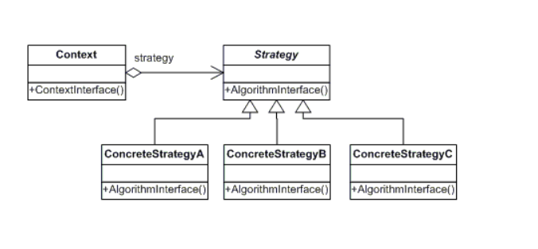

# GoFs - Comportamentais

## 1. Introdução

 Os padrões Comportamentais descrevem como as entidades se comportam
e quais são suas responsabilidades, descrevendo a forma de comunicação entre classes e objetos. Assim, oferecem uma estratégia para modelar como os objetos interagem
uns com os outros no sistema e sugerem comportamentos especiais para uma
grande variedade de aplicações. Alguns exemplos de padrões comportamentais são: Chain of Responsibility, Iterator, Mediator, Strategy e Template Method

## 2 Strategy
O padrão comportamental Strategy permite guardar um objeto estratégia que encapsula um algoritmo
responsável pelo comportamento da classe, em outras palavras, é utilizado  para  encapsular  algoritmos 
parecidos com a finalidade de definir  novas  operações sem mudar as classes dos elementos sobre os quais atua.
O padrão permite que o algoritmo mude independente do cliente que usa. Segundo Gamma et al.(1995),
a grande vantagem  do  uso  é  que  além  de permitir reutilização de código, as funcionalidades que compõem   
o projeto são  estendidas facilmente e as manutenções no projeto são mais simples.
A estrutura segue esse padrão:

## 2.1 Aplicabilidade no Projeto
Tendo em vista que na aplicação um cliente pode realizar o pagamento de seu pedido de duas maneiras, a Classe pedido é um context e o cliente
usaria a estratégia que escolhesse para pagar, podendo ser um pagamento em pix ou em dinheiro.

## Bibliografia

MATOS, Claudio Costa; BARBOSA, Fernando Kauffmann. O uso dos padrões de projeto GoF na análise e desenvolvimento de sistemas. UNILUS Ensino e Pesquisa, v. 13, n. 30, p. 41-53, 2016.
DA CRUZ, Caroline Teixeira; PAZOTI, Mario Augusto; MARACCI, Francisco Virginio. LEPATTERN-UMA FERRAMENTA PARA ENSINO DE PADRÕES DE PROJETO: IMPLEMENTAÇÃO DOS PADRÕES STRATEGY E FACADE. In: Colloquium Exactarum. ISSN: 2178-8332. 2016. p. 35-47.

### Histórico de revisão

| Data | Vers�o | Descrição | Autor(es)|Revisor(es)|
|:----:|:------:|:---------:|:--------:|:--------:|
| 09/08/22 | 1.0 | Criação do Documento e adição de conteúdo| [Bianca Sofia](https://github.com/biancasofia)| |
