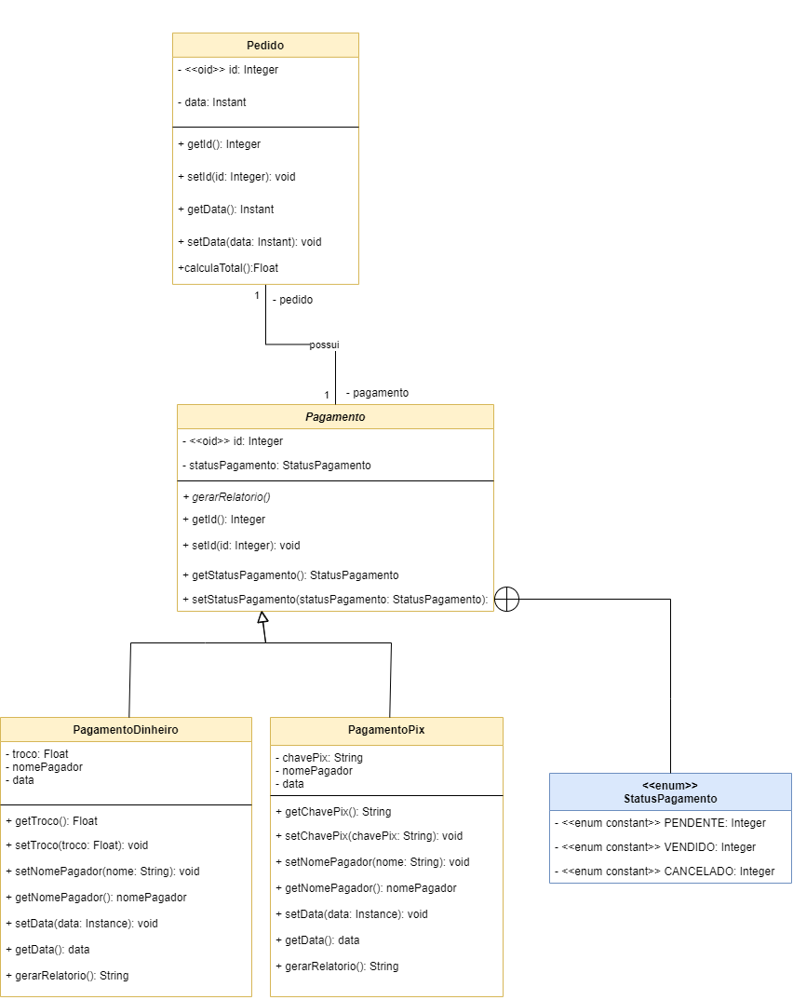
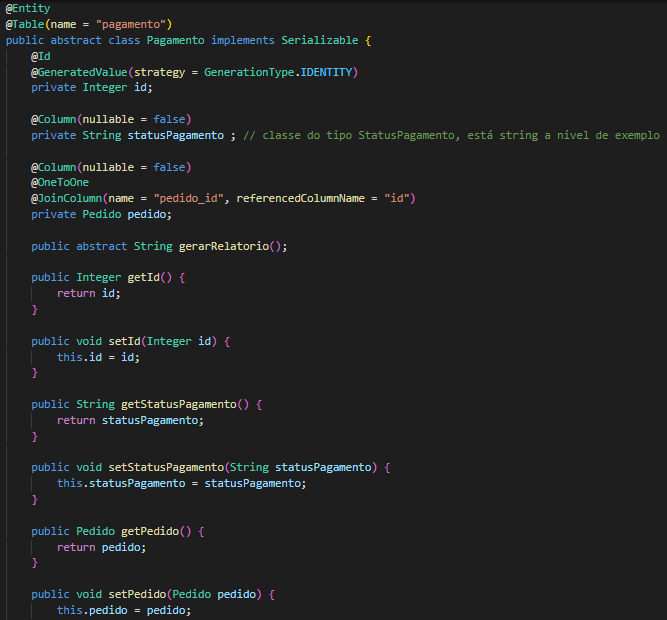
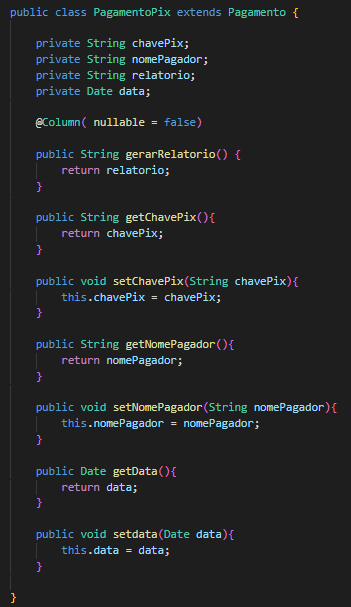
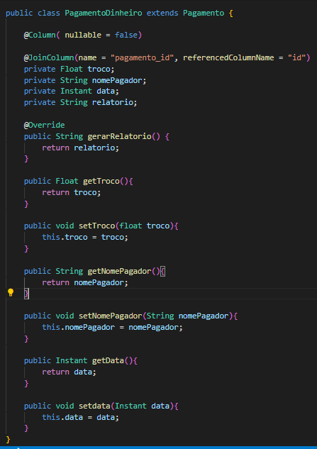
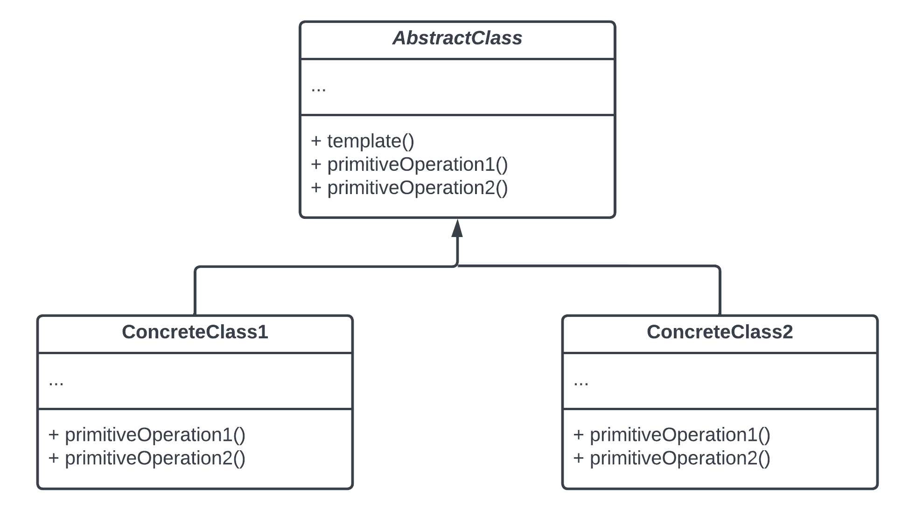
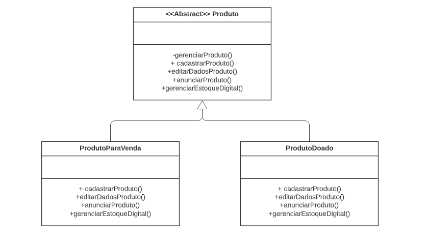

# GoFs - Comportamentais

## 1. Introdução

 Os padrões Comportamentais descrevem como as entidades se comportam
e quais são suas responsabilidades, descrevendo a forma de comunicação entre classes e objetos. Assim, oferecem uma estratégia para modelar como os objetos interagem
uns com os outros no sistema e sugerem comportamentos especiais para uma
grande variedade de aplicações. Alguns exemplos de padrões comportamentais são: Chain of Responsibility, Iterator, Mediator, Strategy e Template Method

## 2 Strategy
O padrão comportamental Strategy permite guardar um objeto estratégia que encapsula um algoritmo
responsável pelo comportamento da classe, em outras palavras, é utilizado  para  encapsular  algoritmos 
parecidos com a finalidade de definir  novas  operações sem mudar as classes dos elementos sobre os quais atua.
O padrão permite que o algoritmo mude independente do cliente que usa. Segundo Gamma et al.(1995),
a grande vantagem  do  uso  é  que  além  de permitir reutilização de código, as funcionalidades que compõem   
o projeto são  estendidas facilmente e as manutenções no projeto são mais simples. Assim, O Strategy permite definir uma familía de algoritmos e colocar cada um deles em uma classe separada e tornar seus objetivos intercambiáveis, fazendo com que a família de algoritmos seja utilizada de forma independente e seletiva.

A estrutura segue esse padrão:

## 2.1 Aplicabilidade no Projeto
Tendo em vista que na aplicação um cliente pode realizar o pagamento de seu pedido de duas maneiras, a Classe pedido é um context e o cliente
usaria a estratégia que escolhesse para pagar, podendo ser um pagamento em pix ou em dinheiro. Dessa forma, cada tipo de pagamento geraria um relatório
diferente, vale lembrar ser uma adaptação, já que o context possui uma relação que não é de agregação originalmente.
Assim, resolvemos estudar as relações entre as classes pedido, pagamento, pagamento por dinheiro e pagamento por pix. Onde foi verificado que A classe pagamento não precisa carregar todas as informações de tipos de pagamento, já que cada tipo tem suas caracteríticas próprias de pagamento. Um método em comum entre essas classes seria a função gerar relatório, que geraria uma nota fiscal ao cliente. Esse método será realizado em pagamento por dinheiro e pagamento por pix, para que depois ela tenha q ser enviada para a classe pagamento e assim seja concluído, por fim, o pedido e as etapas de compra. 

## 2.3 Aplicação no código

<figure>
  <figcaption style="text-align: center !important">
    Figura 1: Classe pedido parte 1
  </figcaption>

  

  <figcaption style="text-align: center !important">
    Fonte: Próprio autor
  </figcaption>
</figure>

<figure>
  <figcaption style="text-align: center !important">
    Figura 1: Classe pedido parte 2
  </figcaption>

  

  <figcaption style="text-align: center !important">
    Fonte: Próprio autor
  </figcaption>
</figure>

<figure>
  <figcaption style="text-align: center !important">
    Figura 1: Classe pagamento
  </figcaption>

  

  <figcaption style="text-align: center !important">
    Fonte: Próprio autor
  </figcaption>
</figure>

<figure>
  <figcaption style="text-align: center !important">
    Figura 1: Classe pix
  </figcaption>

  

  <figcaption style="text-align: center !important">
    Fonte: Próprio autor
  </figcaption>
</figure>

<figure>
  <figcaption style="text-align: center !important">
    Figura 1: Classe pix
  </figcaption>

  

  <figcaption style="text-align: center !important">
    Fonte: Próprio autor
  </figcaption>
</figure>

 

## 3 Template Method
O padrão comportamental Template Method permite a definição do esqueleto de um algoritmo (sequência de passos a serem seguidos para a solução de um problema) em ordem de execução na superclasse, ou classe abstrata, mas deixam as subclasses, ou classes concretas, sobrescreverem  etapas específicas do algoritmo sem modificar sua estrutura.

Sua estrutura segue o seguinte padrão: 

## 3.1 Aplicabilidade no Projeto
Levando-se em conta a presença de uma classe "Produto" da qual poderiam facilmente surgir uma subclasse para produtos a serem vendidos e outra para produtos a serem doados, o padrão Template Method poderia ser utilizado já que, apesar de possuírem uma ordem de execução a ser seguida, o resultado comportamental dos métodos a elas atribuídos iriam sofrer variações em consequência da classe concreta da qual fazem parte. 

## Bibliografia

MATOS, Claudio Costa; BARBOSA, Fernando Kauffmann. O uso dos padrões de projeto GoF na análise e desenvolvimento de sistemas. UNILUS Ensino e Pesquisa, v. 13, n. 30, p. 41-53, 2016.
DA CRUZ, Caroline Teixeira; PAZOTI, Mario Augusto; MARACCI, Francisco Virginio. LEPATTERN-UMA FERRAMENTA PARA ENSINO DE PADRÕES DE PROJETO: IMPLEMENTAÇÃO DOS PADRÕES STRATEGY E FACADE. In: Colloquium Exactarum. ISSN: 2178-8332. 2016. p. 35-47.
Padrões Gof. Disponível em: <https://www.facom.ufu.br/~bacala/ESOF/05b-Padrões%20Gof.pdf>. Acesso em 11 de agosto de 2022.

Design Patterns — Parte 2 — Os Padrões do GOF. Disponível em: <https://medium.com/xp-inc/desing-patterns-parte-2-2a61878846d>. Acesso em 11 de agosto de 2022.

Design Patterns: Padrões “GoF”. Disponível em: <https://www.devmedia.com.br/design-patterns-padroes-gof/16781>. Acesso em 11 de agosto de 2022.

### Histórico de revisão

| Data | Vers�o | Descrição | Autor(es)|Revisor(es)|
|:----:|:------:|:---------:|:--------:|:--------:|
| 09/08/22 | 1.0 | Criação do Documento e adição de conteúdo| [Bianca Sofia](https://github.com/biancasofia)| |
| 09/08/22 | 1.1 | Modelagem strategy_v1 | [Bianca Sofia](https://github.com/biancasofia), [Laís Portela](https://github.com/laispa)| |
| 11/08/22 | 1.2 | Modelagem Template Method | [Arthur Talles](https://github.com/art1505)| |
| 11/08/22 | 1.3| Implementação | [Bianca Sofia](https://github.com/biancasofia), [Laís Portela](https://github.com/laispa) | |
| 12/08/22 | 1.4 | Nova versão modelagem Template Method | [Arthur Talles](https://github.com/art1505)| |