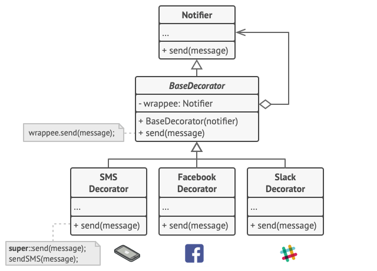
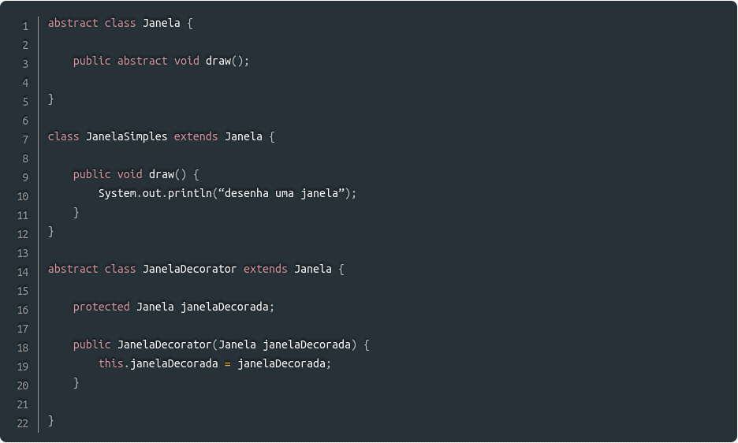
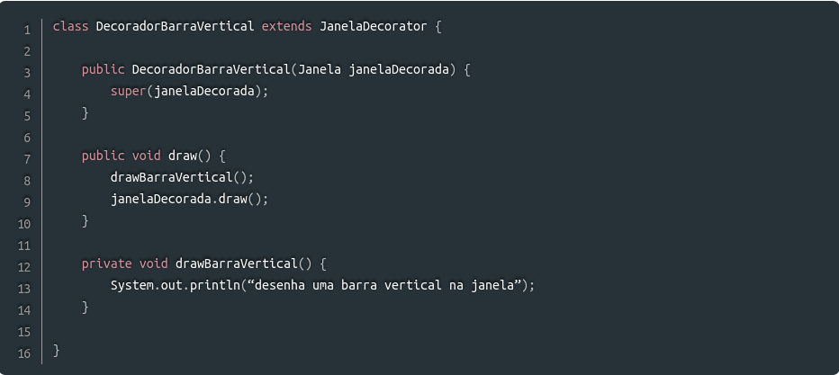
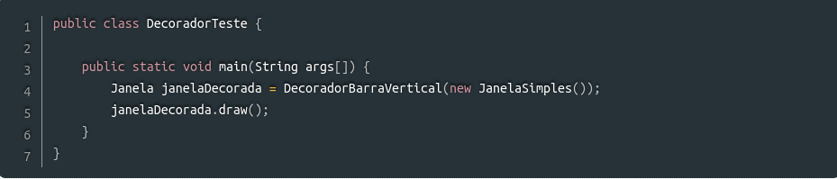

# GoFs - Decorator

## 1. Introdução

A palavra “decorator” remete a um sentido de decoração, que em termos gerais, é o que ocorre quando empregamos esse padrão de projeto.
É um padrão de projeto estrutural que permite adicionar responsabilidades a um objeto de maneira dinâmica, uma alternativa flexível de subclasse para estender a funcionalidade.

## 2. Metodologia

O Padrão Decorator tem como características:
- Os decoradores têm o mesmo supertipo que os objetos que eles decoram;
- Pode-se usar um ou mais decoradores para englobar um objeto;
- Uma vez que o decorador tem o mesmo supertipo que o objeto decorado, podemos passar um objeto decorado no lugar do objeto original (englobado);
- O decorador adiciona seu próprio comportamento antes e/ou depois de delegar o objeto que ele decora o resto do trabalho;
- Os objetos podem ser decorados a qualquer momento, então podemos decorar os objetos de maneira dinâmica no tempo de execução com quantos decoradores desejarmos.

## 3. Exemplos

### Exemplo de modelagem

<figure>
  <figcaption style="text-align: center !important">
    Figura 1: Exemplo de modelagem para o Decorator.
  </figcaption>

  

  <figcaption style="text-align: center !important">
    Fonte: <a href="https://refactoring.guru/pt-br/design-patterns/decorator#:~:text=O%20Decorator%20%C3%A9%20um%20padr%C3%A3o,objetos%20que%20cont%C3%A9m%20os%20comportamentos.">Design Patterns</a>
  </figcaption>
</figure>

### Exemplo de código

<figcaption style="text-align: center !important">
    Figura 2: Parte 1 do exemplo de código
  </figcaption>

  

  <figcaption style="text-align: center !important">
    Fonte: <a href="https://www.devmedia.com.br/padrao-de-projeto-decorator-em-java/26238">Padrão de Projeto Decorator em Java</a>
  </figcaption>
</figure>

<figcaption style="text-align: center !important">
    Figura 3: Parte 2 do exemplo de código
  </figcaption>

  

  <figcaption style="text-align: center !important">
    Fonte: <a href="https://www.devmedia.com.br/padrao-de-projeto-decorator-em-java/26238">Padrão de Projeto Decorator em Java</a>
  </figcaption>
</figure>

<figcaption style="text-align: center !important">
    Figura 4: Parte 3 do exemplo de código
  </figcaption>

  

  <figcaption style="text-align: center !important">
    Fonte: <a href="https://www.devmedia.com.br/padrao-de-projeto-decorator-em-java/26238">Padrão de Projeto Decorator em Java</a>
  </figcaption>
</figure>

<figcaption style="text-align: center !important">
    Figura 5: Parte 4 do exemplo de código
  </figcaption>

  

  <figcaption style="text-align: center !important">
    Fonte: <a href="https://www.devmedia.com.br/padrao-de-projeto-decorator-em-java/26238">Padrão de Projeto Decorator em Java</a>
  </figcaption>
</figure>

## 4. Conclusão

O padrão Decorator fornece muito mais flexibilidade para compor mais objetos sem alterar uma linha de código, tudo em tempo de execução e não em tempo de compilação como ocorre com a herança. É recomendado que, sempre que detectado um padrão de classes que permite a aplicação do Decorator, implemente-o. Mesmo que possa não parecer bom ter mais classes no projeto, essa implementação tende a facilitar a manutenção e evolução do software, além de evitar vários possíveis problemas.

## 5. Bibliografia
> Padrão de Projeto Decorator em Java. Disponível em: <https://www.devmedia.com.br/padrao-de-projeto-decorator-em-java/26238>. Acesso em: 11 ago. 2022.

> Padrão de Projeto: Decorator. Disponível em: <https://gabrielschade.github.io/2018/08/13/gof-decorator.html>. Acesso em: 11 ago. 2022.

> Decorator. Disponível em: <https://refactoring.guru/pt-br/design-patterns/decorator#:~:text=O%20Decorator%20%C3%A9%20um%20padr%C3%A3o,objetos%20que%20cont%C3%A9m%20os%20comportamentos.> Acesso em: 11 ago. 2022.

## 6. Histórico de versão
| Data | Versão | Autor | Descrição | Revisor |
| :-: | :-: | :-: | :-: | :-: |
| 11/08/2022 | 1.0 | [Iago Oliveira](https://github.com/iagoomr) | Criação do documento do padrão Decorator | Revisor |
| 12/08/2022 | 1.0 | [Iago Oliveira](https://github.com/iagoomr) | Correção na Conclusão | Revisor |
