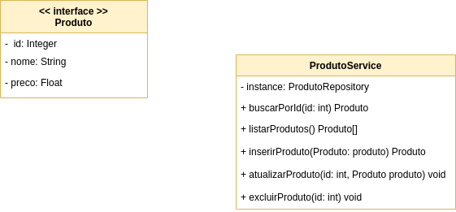

# GoF - Criacional

## 1. Introdução

 Na engenharia de software, os padrões de projeto criacionais são padrões que tem a função de lidar com os mecanismos de criação de objetos, sempre buscando criar objetos de maneira adequada ao contexto. A criação de objetos tem a possibilidade de gerar problemas no código e também uma complexidade adicional, os padrões criacionais ajudam fornecendo mecanismos para aumentar a flexibilidade e reutilização do código existente.

Existem 5 padrões de criação:

- <b>Singleton</b>: padrão de design que garante que uma classe tenha apenas uma instância, enquanto fornece um ponto de acesso global a essa instância.

- <b>Factory Method</b>: Permite a criação de familias de objetos relacionados ou dependentes, atraves de uma única interface e sem que a classe concreta seja especificada. Também permite que uma classe delegue a responsabilidade de instanciamento às subclasses

- <b>Abstract Factory</b>: É considerado uma fábrica de objetos que retorna uma das várias fábricas. Define e mantem relacionamentos entre objetos

- <b>Builder</b>: Permite a separação da construção de um objeto complexo da sua representação. 

- <b>Prototype</b>: Permite a criação de objetos a partir de um modelo original, ou protótipo.

## 2.  Exemplos

### 2.1 Builder
### Introdução

 O objetivo do GoF Builder é reunir instancias complexas, muito requisitadas e dividi-las em partes. Gerando uma instância intermediária para facilitar a construção. 

### 
2.2 Singleton 

#### 
 Aplicabilidade no código 

 O framework spring (utilizado no backend da aplicação) possui  a anotação @Service e ela por definição é um singleton. Essa anotação está sendo usada nos servicos do projeto em que são definidas as regras de negócio (criar, atualizar e deletar), no exemplo abaixo está o exemplo do service Produto: 

#### 
 Diagrama de Classe 

## 
3. Bibliografia 

- [Sourcemaking - Design Patterns](https://sourcemaking.com/design_patterns/creational_patterns), Acesso em: 11/08/2022

- [Slides - Faculdade de computação - UFU](https://www.facom.ufu.br/~bacala/ESOF/05b-Padr%C3%B5es%20Gof.pdf), Acesso em 11/08/2022

### Histórico de revisão

| Data | Versão | Descrição | Autor(es)|Revisor(es)|
|:----:|:------:|:---------:|:--------:|:--------:|
| 10/08/22 | 1.0 | Criação do Documento e adição de conteúdo| [Kevin Batista](https://github.com/k3vin-batista) e [Ailton Aires](https://github.com/ailtonaires) | |
| 11/08/22 | 1.1 | Adição do GoF Builder| [Eduardo Gurgel](https://github.com/EduardoGurgel) | |
| 11/08/22 | 1.1 | Adição do GoF Singleton | [Kevin Batista](https://github.com/k3vin-batista) e [Ailton Aires](https://github.com/ailtonaires) | |

