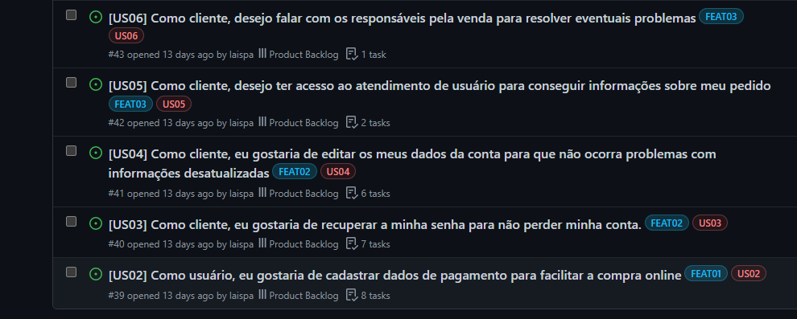
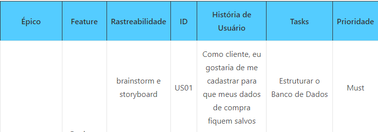
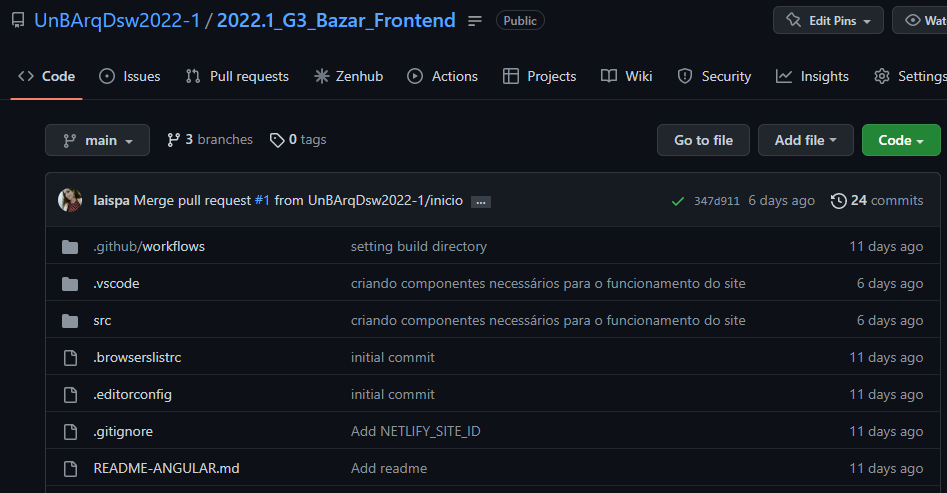
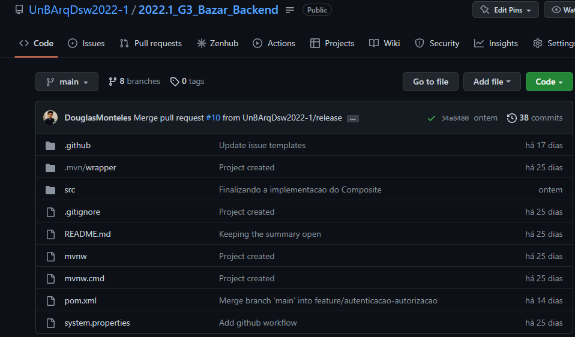
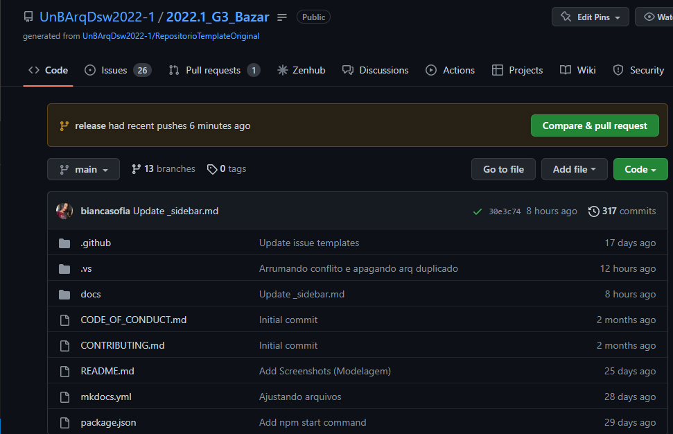

# 3.4. Iniciativas Extras - Padrões de Projeto
 
Nessa entrega o grupo fez atualizações em relação a organização do projeto. As issues e o ZenHub estão são usados no nosso repositório original, 2022.1_G3_Bazar.
 
## Uso de issues e zenHub
Nas issues estamos adicionando as histórias de usuário do nosso backlog, e usamos as tags para organizar e poder localizar melhor as US. O zenHub está sendo atualizado pelo Scrum Master para ajudar no controle do que fazemos.
 

 
## Backlog
 
O backlog foi atualizado, agora temos mais US, algumas tasks foram redefinidas e o backlog foi priorizado de acordo com o método MoScow
 

 
## Repositórios
A equipe tem três repositórios: o de documentação, o frontend e o do backend. Já estamos trabalhando na construção do aplicativo, por agora, o foco está no backend e a equipe faz reuniões constantes para implementar as classes, usando os padrões Grasp, Gofs e Injeção de dependência
 
Foi criada uma nova branch em todos os três repositórios. A branch release agora é usada como a homologação do nosso projeto. Antes de fazer merge com a main é preciso fazer merge na release para evitar futuros conflitos. Também é recomendado o uso contínuo do git pull origin, para sempre atualizar de acordo com o repositório local

## Histórico de versão
| Data | Versão | Autor | Descrição | Revisor |
| :-: | :-: | :-: | :-: | :-: |
| 11/08/2022 | 1.0 | [Laís Portela](https://github.com/laispa) | Documentação das iniciativas extras |  |

