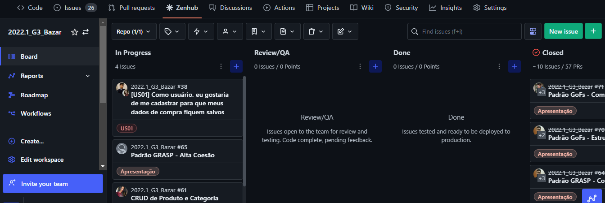

# 3.4. Iniciativas Extras - Padrões de Projeto

Nessa entrega o grupo fez atualizações em relação a organização do projeto. As issues e o ZenHub estão são usados no nosso repositório original, 2022.1_G3_Bazar.

