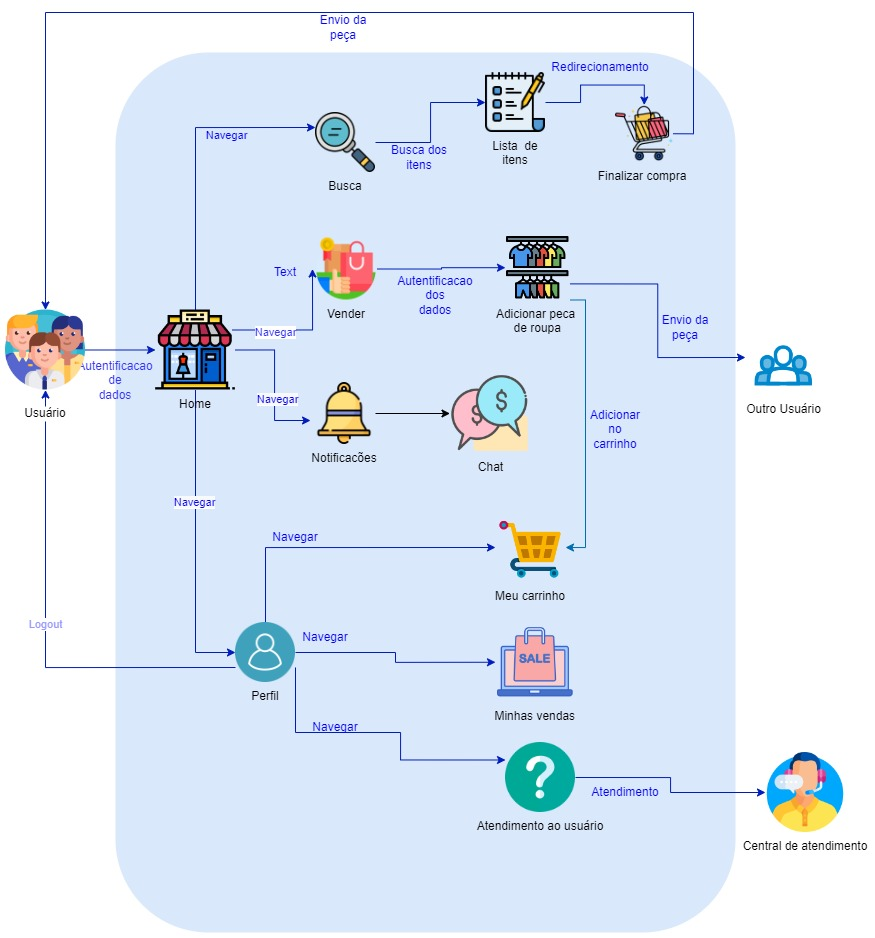
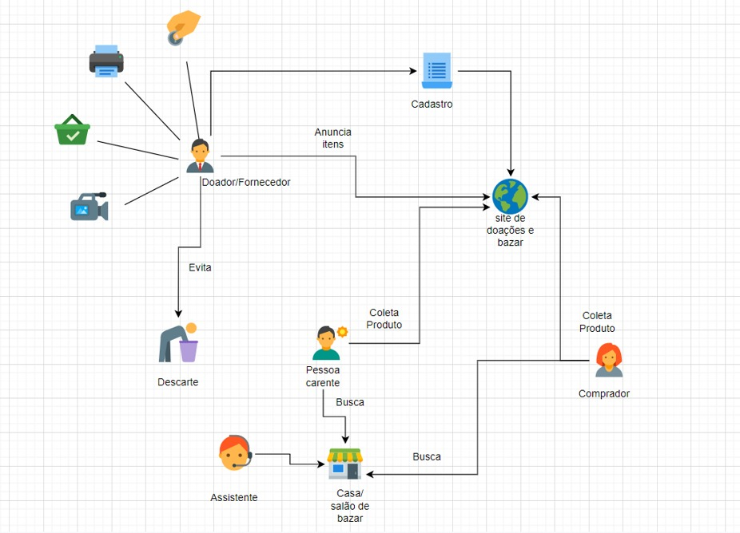
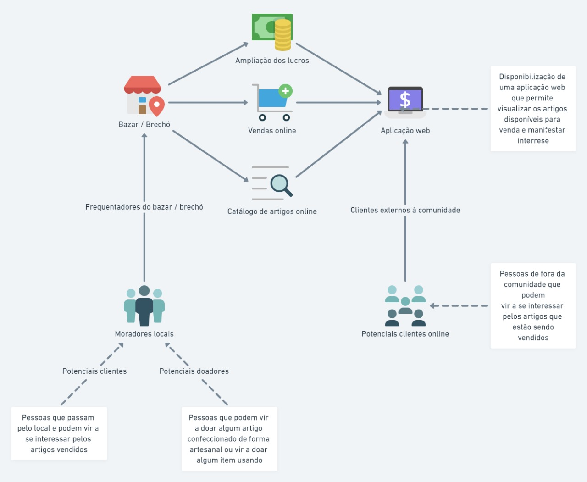
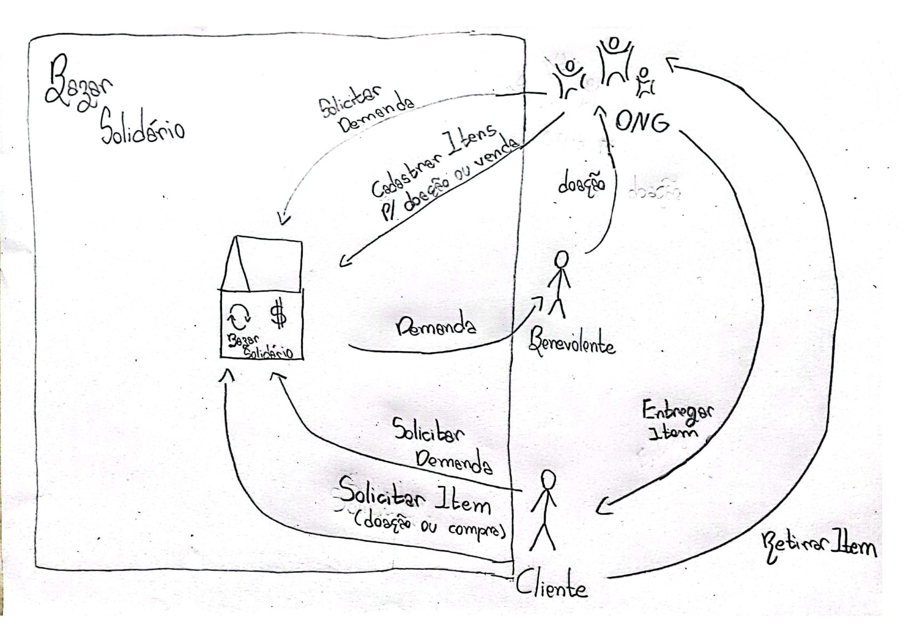

# RichPicture

## 1. Introdução

Um Rich Picture é um artefato utilizado a fim de demonstrar, através de um desenho, os elementos relacionados ao fluxo do processo descrito, que pode inclusive, vir a demonstrar problemas que devem ser solucionados. Neste desenho deve conter os principais elementos e relacionamentos, para auxiliar a representação do sistema.

  
## 2. Versões do Rich Picture

### 2.1 Ugor Marcilio Brandão Costa

  <figure>
    <figcaption>Figura 1: Rich Picture feito pelo estudante</figcaption>
    
    <figcaption>Fonte: Próprio autor</figcaption>
  </figure>

### 2.2 Bianca Sofia Brasil de Oliveira

  <figure>
    <figcaption>Figura 2: Rich Picture feito pelo estudante</figcaption>
      
    <figcaption>Fonte: Próprio autor</figcaption>
  </figure>

### 2.3 Douglas da Silva Monteles

<figure>
    <figcaption>Figura 3: Rich Picture feito pelo estudante</figcaption>
      
    <figcaption>Fonte: Próprio autor</figcaption>
  </figure>

### 2.4 Gabriel Costa de Oliveira

<figure>
    <figcaption>Figura 3: Rich Picture feito pelo estudante</figcaption>
      
    <figcaption>Fonte: Próprio autor</figcaption>
  </figure>

## 3. Referências

> MANK, Andrew; HOWARD, Steve. The Rich Picture: A Tool for Reasoning About Work Context. Oxford, 1998.

> REVADI, Chindy. CTEC2402 Rich Picture Guidelines. 

## 4. Histórico de Versionamento

|Versão|Data de modificação|Descrição da modificação|Autor(es)|Revisor(es)|
|-|-|-|-|-|
|1.0|24/06/2022|Adicionando os rich pictures produzidos pelo grupo|[Ugor Marcilio](https://github.com/ubrando), [Bianca Sofia](https://github.com/biancasofia), [Douglas Monteles](https://github.com/douglasmonteles)|[Gabriel Costa](https://github.com/GabrielCostaDeOliveira)|
|1.1|25/06/2022|Adicionando rich picture |[Gabriel Costa](https://github.com/GabrielCostaDeOliveira)|A definir|
